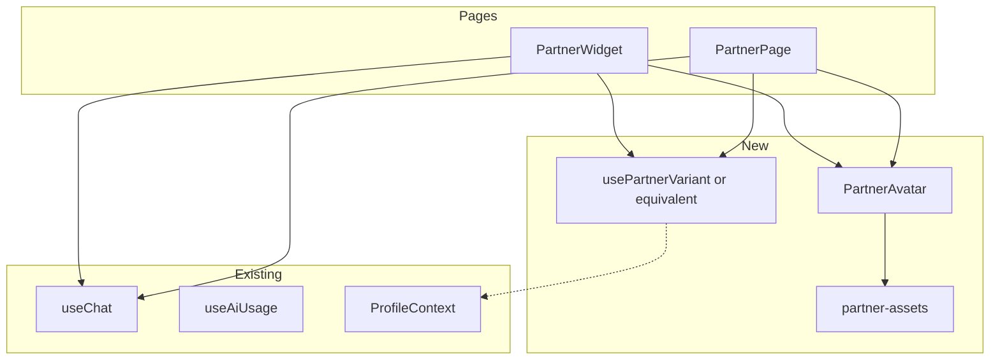
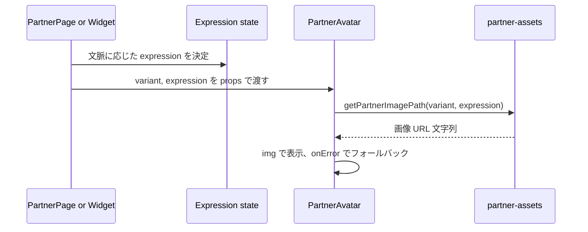

# Technical Design: ai-partner-visualization

---
**Purpose**: 実装の一貫性を保ち、解釈のぶれを防ぐために必要な設計判断を記述する。
---

## Overview

本機能は、EP-25「AIパートナーのビジュアル化」に基づき、テキストのみだったAIパートナーを立ち絵・表情差分付きのビジュアルで表示する。ペルソナ（責めない・応援・ゲーム感・親しみやすさ）に沿ったUI/UXを、既存の PartnerPage と PartnerWidget に追加する。

**Users**: 認証済みユーザーがパートナーチャット画面および浮動ウィジェットで、バリアント（default / male）に応じた同一キャラの立ち絵・表情を見る。会話やタスクの文脈に応じて表情が切り替わり、画像欠損時はフォールバック表示に切り替わる。

**Impact**: フロントエンドに新規コンポーネント（PartnerAvatar）とアセット参照用ユーティリティ（partner-assets）を追加し、PartnerPage と PartnerWidget でそれを利用する。バリアントは初版でフロントのみで保持（localStorage）。バックエンド・API・DB は変更しない。

### Goals

- パートナー画像を `public/images/partner/<variant>/` の規則で参照し、立ち絵・表情を表示する（要件 1, 2）。
- 文脈（通常/応援/喜び/困り）に応じて表情を切り替え、同一キャラの一貫性を保つ（要件 3）。
- ペルソナに沿った配置・レイアウト・トーンを維持する（要件 4）。
- バリアント（default / male）を選択・適用し、一画面内で単一バリアントに統一する（要件 5）。
- 画像欠損・読み込み失敗時はクラッシュせずフォールバック表示とする（要件 6）。

### Non-Goals

- アセットの制作手順（Gemini Nano Banana 等）はスコープ外。
- パートナーバリアントのプロフィールAPI・DB への永続化は初版スコープ外（将来対応可能なインターフェースのみ定義）。
- API が表情メタデータを返す拡張は今回行わない。文脈はフロントの状態から判定する。
- クエスト完了モーダル内でのパートナー「喜び」表示は、設計で接続ポイントを定義するが、実装はタスクで段階的に行う。
- **初版スコープ**: バリアント切り替え UI（設定画面やパートナー画面のドロップダウン等）は初版では含めない。usePartnerVariant の setVariant は将来の切り替え UI 用にインターフェースとして残す。初版では variant はデフォルト `'default'` のまま利用する。

---

## Architecture

### Existing Architecture Analysis

- **現状**: PartnerPage / PartnerWidget は useChat と useAiUsage のみに依存し、テキストチャットのみ表示。画像・バリアント・表情の概念は未実装。ProfileContext は CharacterProfile を保持するが、partnerVariant は持たない。
- **維持する境界**: 認証・プロフィール取得は既存のまま。API の generate-partner-message は変更しない。静的アセットは Vite の public 配下でルート相対参照。
- **拡張ポイント**: (1) 新規: 表示用コンポーネントとパス/型のユーティリティ、(2) 既存: PartnerPage / PartnerWidget へのコンポーネント配置と表情状態の供給、(3) オプション: バリアント用の localStorage 読み書きとデフォルト値。

### Architecture Pattern & Boundary Map

- **採用パターン**: ハイブリッド（gap-analysis Option C）。表示は新規コンポーネント＋lib に集約し、既存ページ・ウィジェットはそれを利用するだけにし、表情・バリアントの「決定」は呼び出し側または共有状態で行う。
- **境界**: アセット参照・表示・フォールバックは PartnerAvatar と partner-assets が担当。バリアントの取得・永続化は専用フックまたはユーティリティが担当。文脈→表情のマッピングは呼び出し元が持つ状態または共有 Context で行う。
- **Steering 準拠**: structure.md に従い components / lib に配置。TypeScript 厳格型、any 禁止。既存の @/ と @skill-quest/shared の利用を維持。

### Technology Stack

| Layer | Choice / Version | Role in Feature | Notes |
|-------|------------------|-----------------|-------|
| Frontend | React 19, Vite | PartnerAvatar の表示、パス組み立て、localStorage によるバリアント保持 | 既存スタックのまま。新規ライブラリは不要 |
| 静的アセット | public/images/partner | 立ち絵・表情 PNG。variant 別フォルダ | Vite の public をルート相対で参照 |
| Backend / Data | — | 本機能では変更なし | 画像配信は静的ファイルのみ |

---

## System Flows

### 表情の決定と表示フロー

- 文脈は呼び出し元（Page / Widget または共有 Context）が保持する。例: 待機＝default、送信中＝cheer または default、タスク完了モーダル表示中＝happy。詳細は Components の「表情状態」で定義する。
- バリアントは usePartnerVariant（または同等）で取得し、未設定時は `'default'` を使用する。

---

## Requirements Traceability

| Requirement | Summary | Components | Interfaces | Flows |
|-------------|---------|------------|------------|-------|
| 1.1 | パートナー画像を public/images/partner/<variant>/ で参照、variant は default または male | partner-assets, PartnerAvatar | PartnerVariant, getPartnerImagePath | — |
| 1.2 | 立ち絵は standing.png を参照 | partner-assets, PartnerAvatar | PARTNER_STANDING_FILE | — |
| 1.3 | 表情は expression-*.png のいずれか | partner-assets, PartnerAvatar | PartnerExpression, EXPRESSION_FILES | — |
| 1.4 | 参照パスを variant で組み立て、同一バリアントで一貫 | partner-assets | getPartnerImagePath | — |
| 2.1 | 画面描画時にバリアントに応じた画像を表示 | PartnerAvatar, PartnerPage, PartnerWidget | PartnerAvatarProps | System Flows |
| 2.2 | アスペクト比・レイアウトで読みやすさ・親しみやすさを維持 | PartnerAvatar | aspectRatio, className | — |
| 2.3 | 透過・単色背景を UI と調和して表示 | PartnerAvatar | 表示レイアウト仕様 | — |
| 3.1–3.5 | 文脈に応じた表情切り替え、同一キャラの一貫性 | 呼び出し元状態, PartnerAvatar | PartnerExpression, 文脈→表情マッピング | System Flows |
| 4.1–4.5 | 責めない・ゲーム感・親しみやすさ・一貫性・文言トーン一致 | PartnerAvatar, PartnerPage, PartnerWidget | レイアウト・フォールバック文言 | — |
| 5.1–5.4 | バリアントの決定・参照・切り替え・単一統一 | usePartnerVariant, partner-assets, PartnerAvatar | PartnerVariant, 永続化インターフェース | — |
| 6.1–6.3 | 画像欠損・読み込み失敗時のフォールバック、責めないトーン、バリアント不在時の代替 | PartnerAvatar, partner-assets | onError 処理、getPartnerImagePath のフォールバック | — |

---

## Components and Interfaces

### Summary

| Component | Domain/Layer | Intent | Req Coverage | Key Dependencies | Contracts |
|-----------|-------------|--------|--------------|------------------|-----------|
| partner-assets | lib | パス組み立て・variant/expression 型・定数・フォールバック用のデフォルト | 1.1–1.4, 6.3 | なし（純粋関数・定数） | State |
| PartnerAvatar | UI | 立ち絵/表情画像の表示・onError フォールバック・アスペクト比 | 2.1–2.3, 4.x, 6.1–6.2 | partner-assets (P0) | State |
| usePartnerVariant | hooks | バリアントの取得・保存（localStorage）、デフォルト値 | 5.1–5.4 | なし（localStorage） | State |
| PartnerPage | Page | パートナーチャット＋PartnerAvatar の配置・表情状態の供給 | 2.1, 3.x, 4.x, 5.x | useChat, useAiUsage, PartnerAvatar, usePartnerVariant (P0) | — |
| PartnerWidget | UI | 浮動チャット＋PartnerAvatar の配置・表情状態の供給 | 2.1, 3.x, 4.x, 5.x | useChat, useAiUsage, PartnerAvatar, usePartnerVariant (P0) | — |

### Frontend / lib

#### partner-assets

| Field | Detail |
|-------|--------|
| Intent | パートナー画像のパス組み立てと variant/expression の型・定数、および欠損時の安全なデフォルトを提供する |
| Requirements | 1.1, 1.2, 1.3, 1.4, 6.3 |

**Responsibilities & Constraints**

- パスは `/images/partner/${variant}/${filename}` 形式。variant は `'default' | 'male'` に限定する。
- 立ち絵は `standing.png`、表情は `expression-default.png` 等の定数で管理する。ファイル名は英小文字・ハイフンのみ（仕様準拠）。
- 存在しない variant が渡された場合は `'default'` にフォールバックする責務を持つ（6.3）。

**Dependencies**

- Inbound: なし（呼び出し元から variant / expression を受け取る）
- Outbound: なし（URL 文字列を返すだけ）
- External: なし

**Contracts**: State [x]

##### State / 型・定数

- `PartnerVariant`: `'default' | 'male'`
- `PartnerExpression`: `'standing' | 'default' | 'smile' | 'cheer' | 'happy' | 'worried'`（standing は立ち絵、それ以外は表情ファイル名の一部と対応）
- `PARTNER_BASE_PATH`: ベースパス文字列（例: `/images/partner`）
- `getPartnerImagePath(variant: PartnerVariant, expression: PartnerExpression): string` — 組み立てたパスを返す。variant が不正な場合は `'default'` で組み立てる。
- 定数: 立ち絵ファイル名、表情ファイル名の一覧（requirements 1.2, 1.3 に準拠）

**Implementation Notes**

- 実装時はファイル名を定数配列またはオブジェクトで管理し、型と整合させる。Vite の public はビルドに含まれるため、実行時には存在チェックしない。画像の存在は img onError で検知する。

---

#### PartnerAvatar

| Field | Detail |
|-------|--------|
| Intent | 指定された variant と expression に応じたパートナー画像を表示し、読み込み失敗時はフォールバック表示に切り替える |
| Requirements | 2.1, 2.2, 2.3, 4.1–4.5, 6.1, 6.2 |

**Responsibilities & Constraints**

- variant と expression を props で受け取り、partner-assets の getPartnerImagePath で URL を取得して `` で表示する。
- アスペクト比は縦長を目安（例: 3:4）にし、className でレイアウトを調整可能にする。透過画像は背景と調和するよう親要素の背景が継承される想定とする。
- `onError` でフォールバック表示に切り替える。フォールバックはアイコン（例: Lucide の MessageCircle）または「相棒がここにいる」など責めないトーンの短い文言とする（6.1, 6.2）。
- 同一バリアント内で standing と expression を切り替えても一貫したキャラに見えるよう、画像の差し替えのみで対応する（ポーズは standing、表情は expression-* で同一キャラ想定）。

**Dependencies**

- Inbound: 親から variant, expression を props で受け取る (P0)
- Outbound: partner-assets の getPartnerImagePath (P0)
- External: なし

**Contracts**: State [x]

##### State (Props Interface)

- `variant: PartnerVariant` — 表示するバリアント（default / male）
- `expression: PartnerExpression` — 立ち絵または表情（standing / default / smile / cheer / happy / worried）
- `className?: string` — ラッパーに付与するクラス（レイアウト・サイズ用）
- `aspectRatio?: string` — 例: `"3/4"`。未指定時はデフォルトの縦長比とする
- `alt?: string` — アクセシビリティ用。未指定時は「AIパートナー」などデフォルト文言

**Implementation Notes**

- img の key に `${variant}-${expression}` を指定し、切り替え時に再マウントしてキャッシュの影響を避けてもよい。フォールバック時は img を非表示にし、代替 UI を表示する。テストでは getPartnerImagePath をモックし、onError 時の表示を検証する。

---

#### usePartnerVariant

| Field | Detail |
|-------|--------|
| Intent | 現在のパートナーバリアントを取得し、変更時は永続化（初版は localStorage）して返す |
| Requirements | 5.1, 5.2, 5.3, 5.4 |

**Responsibilities & Constraints**

- 返却値: `{ variant: PartnerVariant; setVariant: (v: PartnerVariant) => void }`。未設定時は `'default'` を返す。
- 永続化: 初版は localStorage キー（例: `skill-quest:partnerVariant`）に `'default' | 'male'` を保存。将来的にプロフィール API に差し替え可能なように、取得/保存のインターフェースを分離しておく。
- 一画面・一セッションで単一バリアントに統一するため、このフックを PartnerPage と PartnerWidget の両方で利用する。
- **共有メカニズム**: usePartnerVariant は PartnerVariantProvider（または PartnerVariantContext）経由で提供する。Provider を App ルート付近に配置し、その中で state と localStorage を同期する。PartnerPage と PartnerWidget はともにこの Provider 内で usePartnerVariant を呼ぶことで同一 variant を参照し、片方で setVariant した際に他方も即時再レンダーされる（要件 5.4）。

**Dependencies**

- Inbound: なし（ルートで Provider または初期値で供給）
- Outbound: localStorage（P0）
- External: なし

**Contracts**: State [x]

##### State Management

- 状態: `PartnerVariant`。初期値は localStorage から読み、無ければ `'default'`。
- 永続化: setVariant 呼び出し時に localStorage に書き込む。
- 将来: プロフィール API に partnerVariant が追加された場合、useProfile の profile から読む実装に差し替え可能な関数名・型を維持する。

**Implementation Notes**

- localStorage はブラウザのみ。SSR 時は使わない。キー名は定数化し、型は PartnerVariant に限定する。テストでは localStorage をモックする。

---

### Frontend / Pages & Components (Summary + Implementation Note)

#### PartnerPage

- **Intent**: フルページのパートナーチャットに PartnerAvatar を配置し、バリアントと表情状態を渡す。
- **Requirements**: 2.1, 3.x, 4.x, 5.x
- **Implementation Note**: usePartnerVariant で variant を取得。表情は初版は `'default'` 固定でも可。isLoading 時に `'cheer'` にするなど、useChat の状態に応じて expression を決める。PartnerAvatar はチャット領域の上または横に「拠点で待ってくれる相棒」の世界観で配置する。レイアウトはペルソナに沿って読みやすさ・親しみやすさを損なわないよう余白とサイズを調整する。

#### PartnerWidget

- **Intent**: 浮動ウィジェット内のチャットに PartnerAvatar を配置し、バリアントと表情状態を渡す。
- **Requirements**: 2.1, 3.x, 4.x, 5.x
- **Implementation Note**: PartnerPage と同様に usePartnerVariant と表情状態を使用。ウィジェットの小さい領域に収まるよう、PartnerAvatar に className や aspectRatio でサイズを指定する。一画面内で PartnerPage と PartnerWidget が同時に表示される場合は、同じ variant が使われるようにする（usePartnerVariant が共有されている前提）。

---

## Data Models

### Domain Model

- **PartnerVariant**: 値オブジェクト。`'default' | 'male'`。アセットのフォルダ名と一致する。
- **PartnerExpression**: 値オブジェクト。`'standing' | 'default' | 'smile' | 'cheer' | 'happy' | 'worried'`。standing は立ち絵、それ以外は表情ファイルの識別子。
- **文脈（設計上の概念）**: 表情を決めるための状態。実装では呼び出し元の state または Context で `PartnerExpression` にマッピングする。例: 待機 → default、送信中 → default または cheer、タスク完了直後 → happy、未達フォロー → worried。
- **文脈→表情のマッピング**: どの UI 状態でどの PartnerExpression を使うかは、実装時の一貫性（要件 3.1–3.5）を保つため、**lib または hooks に「文脈（例: idle / loading / success / retry）から PartnerExpression へ変換する関数または定数」として定義する**。PartnerPage と PartnerWidget の両方でその関数・定数を参照し、待機＝default、送信中＝cheer、タスク完了直後＝happy、未達フォロー＝worried などのルールを一元化する。
- 永続化: 初版はバリアントのみ。localStorage に 1 キーで保存。プロフィール拡張時は CharacterProfile に `partnerVariant?: PartnerVariant` を追加する案を将来対応として残す。

### Logical Data Model

- **アセット参照**: 論理パスは `/images/partner/<variant>/<filename>.png`。variant は default または male。filename は standing.png または expression-*.png（仕様のファイル名一覧に準拠）。
- **整合性**: 同一バリアント内では同じキャラの画像のみ参照する。ファイル名規則は partner-assets の定数で保証する。

### Data Contracts & Integration

- 本機能では新規 API やイベントは定義しない。バリアントはフロントの localStorage のみ。将来的にプロフィール API に partnerVariant を追加する場合のリクエスト/レスポンスは、既存の updateProfileSchema の拡張（オプショナルフィールド）として扱う。

---

## Error Handling

### Error Strategy

- **画像読み込み失敗**: PartnerAvatar 内の img onError で検知し、即座にフォールバック表示に切り替える。クラッシュや未捕捉例外は発生させない（6.1）。
- **不正な variant**: partner-assets の getPartnerImagePath に不正値が渡された場合は、内部で `'default'` に正規化する（6.3）。型で `PartnerVariant` に限定すれば通常は発生しない。
- **localStorage 利用不可**: usePartnerVariant では localStorage が throw する環境（プライベートモード等）を try/catch で囲み、失敗時はメモリ上のデフォルト `'default'` のみで動作させる。

### Error Categories and Responses

- **User Errors**: 本機能では入力フォームは既存のチャットのみ。バリアント選択 UI を追加する場合は、選択肢を `default` / `male` に限定し、不正値を送らない。
- **System Errors**: 画像 404 やネットワークエラーは onError で捕捉し、フォールバック表示とする。文言は責めない・応援するトーンを維持する（6.2）。
- **Business Logic**: 表情の「未定義」状態は default にマッピングする。

### Monitoring

- 画像 onError が多発する場合は、コンソールに warn を出す程度でよい（本番では Sentry 等に送る選択肢は将来対応）。既存のフロントエンドロギング方針に従う。

---

## Testing Strategy

- **Unit (partner-assets)**: getPartnerImagePath の戻り値が variant/expression に応じて正しいパスになること。不正 variant で default にフォールバックすること。
- **Unit (usePartnerVariant)**: 初期値が localStorage から読めること、setVariant で localStorage が更新されること、localStorage が使えない場合にデフォルトが返ること。
- **Component (PartnerAvatar)**: variant/expression を渡すと対応する src が設定されること。onError 時にフォールバックが表示されること。alt や className が適用されること。
- **Integration**: PartnerPage / PartnerWidget に PartnerAvatar が表示され、usePartnerVariant で切り替えた variant が反映されること（モックで十分）。
- **E2E/UI**: 画像表示とフォールバックの手動確認。既存の Partner チャットフローが壊れていないこと。

---

## Supporting References

- 発見・判断の詳細: `.kiro/specs/ai-partner-visualization/research.md`
- パス・ファイル名規則・ペルソナ: `docs/product/ai-partner-visual-nanobanana.md`
- ギャップとオプション: `.kiro/specs/ai-partner-visualization/gap-analysis.md`
