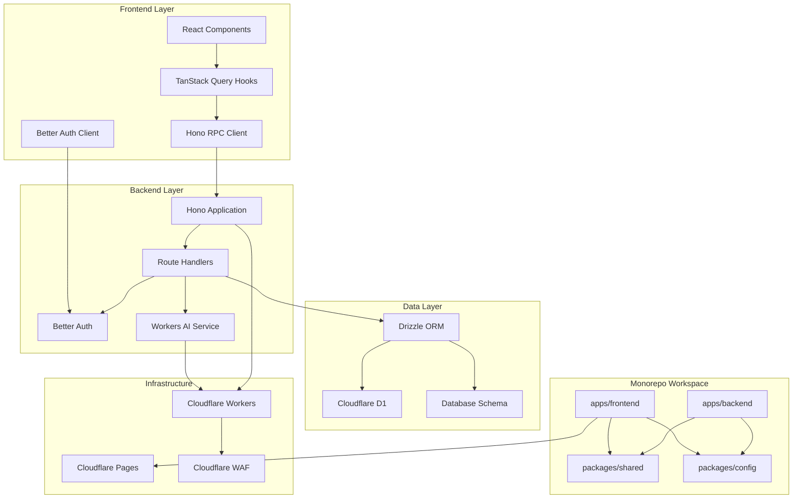
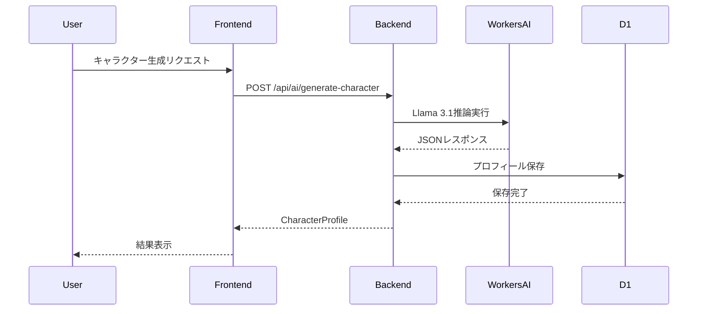
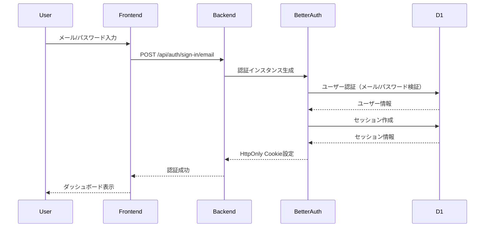
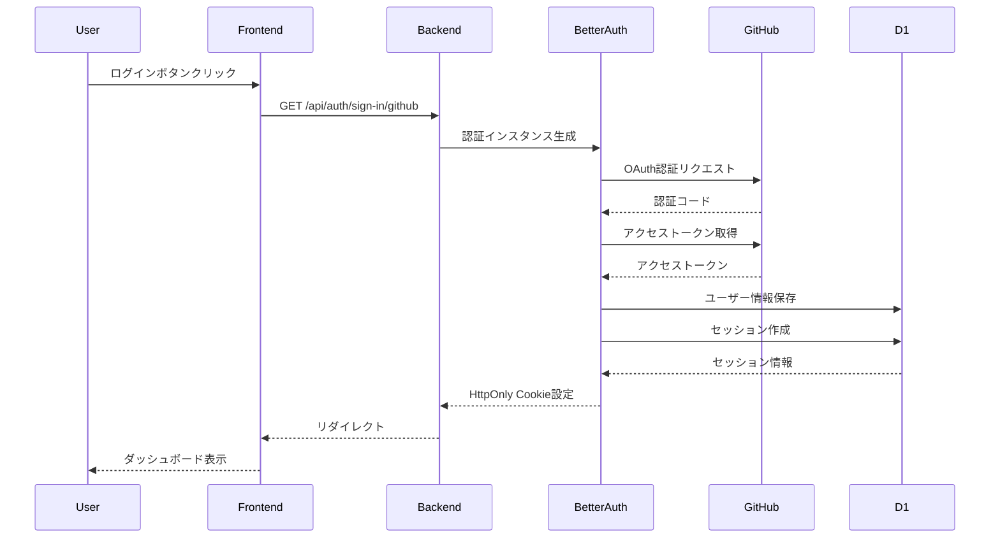
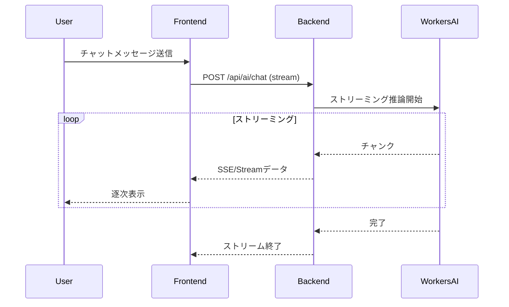

# Design Document

---
**Purpose**: Provide sufficient detail to ensure implementation consistency across different implementers, preventing interpretation drift.

**Approach**:
- Include essential sections that directly inform implementation decisions
- Omit optional sections unless critical to preventing implementation errors
- Match detail level to feature complexity
- Use diagrams and tables over lengthy prose
---

## Overview

本機能は、Skill Quest AIプロジェクトのアーキテクチャ設計に基づいて、既存のフロントエンド実装を拡張し、完全なフルスタックアプリケーションを構築するものです。Cloudflare Workers + D1 + Workers AIを中核としたエッジファーストの分散型アーキテクチャを実現し、モノレポ構成による型共有、Hono RPCによる型安全なAPI通信、Better Authによる認証、TanStack Queryによるサーバー状態管理を統合します。

**Users**: 開発者は型安全な開発環境で効率的に機能を実装でき、エンドユーザーは低レイテンシで高速なAI機能を利用できます。

**Impact**: 既存のスタンドアロンなフロントエンドアプリケーションを、完全なバックエンドインフラを持つフルスタックアプリケーションに変換します。既存のGemini API依存を排除し、エッジで動作するWorkers AIに移行することで、パフォーマンスとコスト効率を向上させます。

### Goals
- モノレポ構成による型共有と開発効率の向上
- Hono RPCによるエンドツーエンドの型安全性の実現
- Cloudflare Workers + D1 + Workers AIによるエッジファーストアーキテクチャの実現
- Better Authによるセキュアな認証システムの構築
- 既存フロントエンドコードの最大限の再利用

### Non-Goals
- 既存UIコンポーネントの完全な再設計（既存UIを維持）
- 複数のOAuthプロバイダー（GitHub以外）の追加
- リアルタイム通信機能（WebSocket等）
- モバイルアプリケーション対応

## Architecture

### Existing Architecture Analysis

**現在のアーキテクチャパターンと制約：**
- フロントエンドのみの実装（React + Vite）
- クライアントサイドの状態管理（`useState`）
- Gemini APIへの直接呼び出し（`geminiService.ts`）
- データ永続化なし（メモリ内のみ）
- 型定義はローカル（`types.ts`）

**既存のドメイン境界：**
- UIコンポーネント（`Dashboard.tsx`、`QuestBoard.tsx`など）は再利用可能
- 型定義（`types.ts`）は`packages/shared`に移動して共有
- `geminiService.ts`はバックエンドAPI呼び出しに置き換え

**統合ポイント：**
- 既存の統合ポイントなし（スタンドアロンアプリケーション）
- 新規にHono RPC、TanStack Query、Better Authクライアントを統合

**技術的負債への対応：**
- Gemini API依存をWorkers AIに置き換え
- ローカル状態管理をTanStack Queryに移行
- 型定義の共有メカニズムを確立

### Architecture Pattern & Boundary Map



**Architecture Integration**:
- **Selected pattern**: モノレポ + Hono RPC + エッジファーストアーキテクチャ
- **Domain/feature boundaries**: 
  - フロントエンド層（UI、状態管理、APIクライアント）
  - バックエンド層（API、ビジネスロジック、認証）
  - データ層（D1、Drizzle ORM、スキーマ）
  - インフラ層（Workers、Pages、WAF）
- **Existing patterns preserved**: 
  - Reactコンポーネント構造
  - TypeScript型定義
  - Viteビルド設定
- **New components rationale**: 
  - `apps/backend`: 新規バックエンド実装
  - `packages/shared`: 型定義とZodスキーマの共有
  - `packages/config`: 共有設定（ESLint、TypeScript）
- **Steering compliance**: アーキテクチャドキュメント（`docs/architecture/`）の設計方針に準拠

### Technology Stack

| Layer | Choice / Version | Role in Feature | Notes |
|-------|------------------|-----------------|-------|
| Frontend | React 19.2.4 | UIレンダリング | 既存実装を維持 |
| Frontend | Vite 6.2.0 | ビルドツール | 既存実装を維持 |
| Frontend | TanStack Query 5.x | サーバー状態管理 | 新規追加 |
| Frontend | Hono Client | RPCクライアント | 型安全なAPI通信 |
| Frontend | Better Auth Client | 認証クライアント | 新規追加 |
| Backend | Hono 4.x | Webフレームワーク | Cloudflare Workers最適化 |
| Backend | Cloudflare Workers | ランタイム環境 | エッジ実行 |
| Backend | Better Auth | 認証ライブラリ | オンデマンド初期化パターン |
| Backend | Workers AI | AI推論 | Llama 3.1/3.3 |
| Data | Cloudflare D1 | データベース | SQLiteベース |
| Data | Drizzle ORM | ORM | 軽量、Workers環境に最適 |
| Infrastructure | pnpm workspaces | パッケージマネージャー | モノレポ構成 |
| Infrastructure | Turborepo | ビルドパイプライン | 並列実行最適化 |
| Infrastructure | GitHub Actions | CI/CD | デプロイメント自動化 |
| Infrastructure | Cloudflare Pages | フロントエンドホスティング | 静的アセット配信 |
| Infrastructure | Cloudflare WAF | セキュリティ | レート制限、DDoS対策 |

## System Flows

### AI生成フロー（キャラクター生成）



### 認証フロー（メール/パスワード）



### 認証フロー（GitHub OAuth）



### ストリーミングAIチャットフロー



## Requirements Traceability

| Requirement | Summary | Components | Interfaces | Flows |
|-------------|---------|------------|------------|-------|
| 1.1 | pnpm-workspace.yaml作成 | MonorepoSetup | - | - |
| 1.2 | turbo.json設定 | MonorepoSetup | - | - |
| 1.3 | 型定義共有 | SharedPackage, TypeExports | AppType export | - |
| 1.4 | ワークスペース構成 | MonorepoSetup | - | - |
| 1.5 | 型インポート | FrontendClient, SharedPackage | import type | - |
| 2.1 | 環境変数注入 | HonoApp, Middleware | Bindings type | - |
| 2.2 | Zodバリデーション | RouteHandlers, SharedSchemas | zValidator | - |
| 2.3 | エラーレスポンス | ErrorHandler | ErrorResponse | - |
| 2.4 | AppTypeエクスポート | HonoApp | AppType | - |
| 2.5 | ルート定義 | RouteHandlers | /api/quests, /api/auth, /api/ai | - |
| 2.6 | 共通ミドルウェア | Middleware | Logging, ErrorHandling | - |
| 3.1 | Drizzleスキーマ定義 | DatabaseSchema | Schema types | - |
| 3.2 | マイグレーション生成 | MigrationTool | drizzle-kit generate | - |
| 3.3 | ローカルマイグレーション | MigrationTool | wrangler d1 migrations apply --local | - |
| 3.4 | 本番マイグレーション | CICDPipeline | wrangler d1 migrations apply | - |
| 3.5 | Better Authテーブル | DatabaseSchema | user, session, account, verification | - |
| 3.6 | アプリケーションテーブル | DatabaseSchema | skills, quests, user_progress, interaction_logs | - |
| 3.7 | 外部キー制約 | DatabaseSchema | PRAGMA foreign_keys | - |
| 3.8 | JSONカラム | DatabaseSchema | JSON type | - |
| 4.1 | オンデマンド初期化 | AuthService | auth(env) function | - |
| 4.2 | メール/パスワード認証 | AuthService | emailAndPassword | Email Auth Flow |
| 4.2a | GitHub OAuth | AuthService | socialProviders.github | OAuth Flow |
| 4.3 | HttpOnly Cookie | AuthService | Cookie settings | - |
| 4.4 | セッション検証 | AuthMiddleware | Session validation | - |
| 4.5 | 401レスポンス | AuthMiddleware | Unauthorized response | - |
| 4.6 | CORS設定 | CORSMiddleware | Access-Control-Allow-Credentials | - |
| 4.7 | CSRF対策 | AuthService | CSRF protection | - |
| 5.1 | キャラクター生成 | AIService | Llama 3.1 8B | AI Generation Flow |
| 5.2 | ナラティブ生成 | AIService | Llama 3.1 8B | - |
| 5.3 | パートナーメッセージ | AIService | Llama 3.1 8B | - |
| 5.4 | 複雑な推論 | AIService | Llama 3.3 70B | - |
| 5.5 | Function Calling | AIService | Function definitions | - |
| 5.6 | ストリーミング | AIService, StreamingHandler | streamText | Streaming Chat Flow |
| 5.7 | Gemini API置き換え | AIService | Workers AI migration | - |
| 6.1 | Hono RPCクライアント | FrontendClient | hc<AppType> | - |
| 6.2 | 型エラー検知 | TypeSystem | TypeScript compiler | - |
| 6.3 | 型推論 | FrontendClient | Response types | - |
| 6.4 | import type | FrontendClient | Type-only imports | - |
| 6.5 | クエリパラメータ | FrontendClient | Type-safe params | - |
| 7.1 | useQuery | TanStackQueryHooks | useQuests, useProfile | - |
| 7.2 | キャッシュ | TanStackQuery | Query cache | - |
| 7.3 | 自動リフェッチ | TanStackQuery | Stale-while-revalidate | - |
| 7.4 | ローディング状態 | TanStackQueryHooks | isLoading | - |
| 7.5 | エラー状態 | TanStackQueryHooks | isError | - |
| 7.6 | 型安全なフェッチ | TanStackQueryHooks, FrontendClient | Combined hooks | - |
| 8.1 | ストリーミング受信 | ChatUI, StreamingHook | useChat | Streaming Chat Flow |
| 8.2 | ローディング表示 | ChatUI | Loading indicator | - |
| 8.3 | 逐次表示 | ChatUI | Text streaming | - |
| 8.4 | useChatフック | StreamingHook | Custom hook | - |
| 8.5 | ストリームアダプタ | StreamingAdapter | Workers AI format | - |
| 9.1 | ログイン | AuthUI, AuthClient | signIn method | OAuth Flow |
| 9.2 | ログアウト | AuthUI, AuthClient | signOut method | - |
| 9.3 | セッション取得 | AuthClient | getSession method | - |
| 9.4 | クライアントライブラリ | AuthClient | auth-client.ts | - |
| 9.5 | メール認証フロー | AuthUI, AuthClient | Email/Password | Email Auth Flow |
| 9.5a | OAuthフロー | AuthUI, AuthClient | GitHub OAuth | OAuth Flow |
| 10.1 | wrangler.toml | InfrastructureConfig | Environment bindings | - |
| 10.2 | プレビュー環境 | InfrastructureConfig | Preview D1 | - |
| 10.3 | 本番環境 | InfrastructureConfig | Production D1 | - |
| 10.4 | PRチェック | CICDPipeline | ESLint, TypeScript, Tests | - |
| 10.5 | マイグレーション自動化 | CICDPipeline | Auto migration | - |
| 10.6 | 本番デプロイ | CICDPipeline | Production deploy | - |
| 10.7 | Pages/Workers統合 | InfrastructureConfig | Dual deployment | - |
| 11.1 | レート制限 | SecurityMiddleware | Rate limiting | - |
| 11.2 | Zodバリデーション | RouteHandlers | Input validation | - |
| 11.3 | プロンプトサニタイズ | AIService | Prompt sanitization | - |
| 11.4 | Llama Guard | AIService | Safety model | - |
| 11.5 | WAF設定 | InfrastructureConfig | Cloudflare WAF | - |

## Components and Interfaces

| Component | Domain/Layer | Intent | Req Coverage | Key Dependencies (P0/P1) | Contracts |
|-----------|--------------|--------|--------------|--------------------------|-----------|
| MonorepoSetup | Infrastructure | モノレポ構成のセットアップ | 1.1, 1.2, 1.4 | pnpm (P0), Turborepo (P0) | - |
| SharedPackage | Shared | 型定義とZodスキーマの共有 | 1.3, 1.5, 2.2 | TypeScript (P0) | Type exports |
| HonoApp | Backend | Honoアプリケーションの初期化 | 2.1, 2.4, 2.6 | Hono (P0), Bindings (P0) | AppType export |
| RouteHandlers | Backend | APIルートの定義とハンドリング | 2.2, 2.3, 2.5 | Hono (P0), Zod (P0) | API Contract |
| DatabaseSchema | Data | Drizzleスキーマ定義 | 3.1, 3.5, 3.6, 3.7, 3.8 | Drizzle ORM (P0) | Schema types |
| MigrationTool | Data | データベースマイグレーション管理 | 3.2, 3.3, 3.4 | drizzle-kit (P0), wrangler (P0) | - |
| AuthService | Backend | Better Authのオンデマンド初期化 | 4.1, 4.2, 4.3, 4.7 | Better Auth (P0), Drizzle (P0) | Auth handler |
| AuthMiddleware | Backend | 認証ミドルウェア | 4.4, 4.5, 4.6 | Better Auth (P0) | Middleware |
| AIService | Backend | Workers AI統合 | 5.1, 5.2, 5.3, 5.4, 5.5, 5.7 | Workers AI (P0) | AI API |
| StreamingHandler | Backend | ストリーミングレスポンス処理 | 5.6 | Hono (P0), Workers AI (P0) | Stream API |
| FrontendClient | Frontend | Hono RPCクライアント | 6.1, 6.3, 6.4, 6.5 | Hono Client (P0), AppType (P0) | RPC Client |
| TanStackQueryHooks | Frontend | サーバー状態管理フック | 7.1, 7.2, 7.3, 7.4, 7.5, 7.6 | TanStack Query (P0), FrontendClient (P0) | Query hooks |
| ChatUI | Frontend | AIチャットUI | 8.1, 8.2, 8.3 | StreamingHook (P0) | UI Component |
| StreamingHook | Frontend | ストリーミング処理フック | 8.1, 8.4, 8.5 | Fetch API (P0) | Custom hook |
| AuthUI | Frontend | 認証UIコンポーネント | 9.1, 9.2, 9.5 | AuthClient (P0) | UI Component |
| AuthClient | Frontend | Better Authクライアント | 9.1, 9.2, 9.3, 9.4 | Better Auth Client (P0) | Auth client |
| CICDPipeline | Infrastructure | CI/CDパイプライン | 10.4, 10.5, 10.6 | GitHub Actions (P0) | - |
| SecurityMiddleware | Backend | セキュリティ対策 | 11.1, 11.2, 11.3, 11.4 | Hono (P0), Zod (P0) | Middleware |
| InfrastructureConfig | Infrastructure | インフラ設定 | 10.1, 10.2, 10.3, 10.7, 11.5 | wrangler (P0) | Config files |

### Infrastructure Layer

#### MonorepoSetup

| Field | Detail |
|-------|--------|
| Intent | pnpm workspacesとTurborepoによるモノレポ構成のセットアップ |
| Requirements | 1.1, 1.2, 1.4 |

**Responsibilities & Constraints**
- ルートレベルに`pnpm-workspace.yaml`を作成し、`apps/`と`packages/`をワークスペースとして定義
- `turbo.json`でビルドパイプラインを設定し、依存関係に基づいて並列実行を最適化
- 既存の`apps/frontend`をワークスペースに統合

**Dependencies**
- Inbound: なし
- Outbound: pnpm (P0), Turborepo (P0)
- External: なし

**Implementation Notes**
- ルート`package.json`でワークスペースを定義
- `apps/frontend`、`apps/backend`、`packages/shared`、`packages/config`をワークスペースとして追加
- `turbo.json`でビルド、テスト、リントタスクを定義

#### InfrastructureConfig

| Field | Detail |
|-------|--------|
| Intent | Cloudflare WorkersとPagesの環境設定 |
| Requirements | 10.1, 10.2, 10.3, 10.7, 11.5 |

**Responsibilities & Constraints**
- `wrangler.toml`で環境ごとに異なるD1データベースと環境変数をバインド
- プレビュー環境と本番環境の分離
- Cloudflare WAF設定

**Dependencies**
- Inbound: なし
- Outbound: wrangler (P0), Cloudflare (P0)
- External: Cloudflare Dashboard (P1)

**Contracts**: Config [✓]

##### Config Contract
- `wrangler.toml`: 環境変数、D1バインディング、Workers設定
- 環境分離: `[env.preview]`セクションでプレビュー環境を定義
- WAF設定: Cloudflare Dashboardで設定

**Implementation Notes**
- 本番環境とプレビュー環境で異なるD1データベースIDを使用
- 環境変数は`wrangler secret put`で設定
- WAFルールはCloudflare Dashboardで管理

### Shared Layer

#### SharedPackage

| Field | Detail |
|-------|--------|
| Intent | 型定義とZodスキーマの共有 |
| Requirements | 1.3, 1.5, 2.2 |

**Responsibilities & Constraints**
- 既存の`apps/frontend/types.ts`を`packages/shared/src/index.ts`に移動
- Zodスキーマを定義してバックエンドとフロントエンドで共有
- 型定義をエクスポートして`apps/`からインポート可能にする

**Dependencies**
- Inbound: なし
- Outbound: TypeScript (P0), Zod (P0)
- External: なし

**Contracts**: Type exports [✓]

##### Type Exports
```typescript
// packages/shared/src/index.ts
export * from './types';
export * from './schemas';
```

**Implementation Notes**
- 既存の型定義（`CharacterProfile`、`Task`、`GrimoireEntry`など）を移動
- Zodスキーマ（`createQuestSchema`、`updateProfileSchema`など）を追加
- `package.json`で`@skill-quest/shared`として公開

### Backend Layer

#### HonoApp

| Field | Detail |
|-------|--------|
| Intent | Honoアプリケーションの初期化とAppTypeのエクスポート |
| Requirements | 2.1, 2.4, 2.6 |

**Responsibilities & Constraints**
- Honoアプリケーションを初期化し、環境変数とバインディングをコンテキストに注入
- 共通ミドルウェア（ロギング、エラーハンドリング）を適用
- `AppType`をエクスポートしてフロントエンドで型推論を可能にする

**Dependencies**
- Inbound: RouteHandlers (P0), Middleware (P0)
- Outbound: Hono (P0), Cloudflare Workers (P0)
- External: なし

**Contracts**: Service [✓]

##### Service Interface
```typescript
// apps/backend/src/index.ts
type Bindings = {
  DB: D1Database;
  AI: Ai;
  BETTER_AUTH_SECRET: string;
  GITHUB_CLIENT_ID: string;
  GITHUB_CLIENT_SECRET: string;
};

const app = new Hono<{ Bindings: Bindings }>();

// ルート定義
const routes = app
  .route('/api/quests', questRouter)
  .route('/api/auth', authRouter)
  .route('/api/ai', aiRouter);

export type AppType = typeof routes;
export default app;
```

**Implementation Notes**
- `apps/backend/src/index.ts`にHonoアプリケーションを定義
- 共通ミドルウェアを`app.use('*', ...)`で適用
- `AppType`をエクスポートして`packages/shared`または直接エクスポート

#### RouteHandlers

| Field | Detail |
|-------|--------|
| Intent | APIルートの定義とハンドリング |
| Requirements | 2.2, 2.3, 2.5 |

**Responsibilities & Constraints**
- `/api/quests`、`/api/auth`、`/api/ai`ルートを定義
- Zodバリデーターを使用して入力を検証
- 適切なエラーレスポンスを返す

**Dependencies**
- Inbound: HonoApp (P0), SharedSchemas (P0)
- Outbound: DatabaseSchema (P0), AIService (P0), AuthService (P0)
- External: なし

**Contracts**: API [✓]

##### API Contract
| Method | Endpoint | Request | Response | Errors |
|--------|----------|---------|----------|--------|
| GET | /api/quests | - | Quest[] | 401, 500 |
| POST | /api/quests | CreateQuestRequest | Quest | 400, 401, 500 |
| PUT | /api/quests/:id | UpdateQuestRequest | Quest | 400, 401, 404, 500 |
| DELETE | /api/quests/:id | - | - | 401, 404, 500 |
| POST | /api/ai/generate-character | GenesisFormData | CharacterProfile | 400, 500 |
| POST | /api/ai/generate-narrative | NarrativeRequest | NarrativeResult | 400, 500 |
| POST | /api/ai/chat | ChatRequest | Stream | 400, 500 |
| POST | /api/auth/sign-up | SignUpRequest | User | 400, 409, 500 |
| POST | /api/auth/sign-in/email | SignInRequest | Session | 400, 401, 500 |
| GET | /api/auth/sign-in/github | - | Redirect | 302 |

**Implementation Notes**
- `apps/backend/src/routes/`にルートハンドラを分離
- `zValidator`ミドルウェアで入力検証
- エラーハンドリングミドルウェアで統一的なエラーレスポンスを返す

#### DatabaseSchema

| Field | Detail |
|-------|--------|
| Intent | Drizzleスキーマ定義とマイグレーション管理 |
| Requirements | 3.1, 3.5, 3.6, 3.7, 3.8 |

**Responsibilities & Constraints**
- Better Auth用テーブル（`user`、`session`、`account`、`verification`）を定義
- アプリケーション用テーブル（`skills`、`quests`、`user_progress`、`interaction_logs`）を定義
- 外部キー制約を有効化
- JSONカラムを活用

**Dependencies**
- Inbound: なし
- Outbound: Drizzle ORM (P0), D1 (P0)
- External: なし

**Contracts**: Schema [✓]

##### Schema Definition
```typescript
// apps/backend/src/db/schema.ts
import { sqliteTable, text, integer, json } from 'drizzle-orm/sqlite-core';
import { relations } from 'drizzle-orm';

export const user = sqliteTable('user', {
  id: text('id').primaryKey(),
  name: text('name').notNull(),
  email: text('email').notNull().unique(),
  // ... Better Auth標準カラム
});

export const quests = sqliteTable('quests', {
  id: text('id').primaryKey(),
  skillId: text('skill_id').references(() => skills.id),
  title: text('title').notNull(),
  scenario: text('scenario'),
  difficulty: integer('difficulty').notNull(),
  winCondition: json('win_condition'),
});

export const interactionLogs = sqliteTable('interaction_logs', {
  id: text('id').primaryKey(),
  progressId: text('progress_id').references(() => userProgress.id),
  role: text('role').notNull(), // 'user' | 'assistant'
  content: json('content').notNull(),
  createdAt: integer('created_at').notNull(),
});
```

**Implementation Notes**
- `apps/backend/src/db/schema.ts`にスキーマを定義
- Better Auth用テーブルはBetter Authのスキーマ定義を参照
- マイグレーションは`drizzle-kit generate`で生成
- 外部キー制約はマイグレーションSQLで`PRAGMA foreign_keys = ON;`を設定

#### AuthService

| Field | Detail |
|-------|--------|
| Intent | Better Authのオンデマンド初期化と認証処理 |
| Requirements | 4.1, 4.2, 4.3, 4.7 |

**Responsibilities & Constraints**
- リクエストごとに`auth(env)`関数を呼び出してBetter Authインスタンスを生成
- メール/パスワード認証の設定（主要な認証方式）
- GitHub OAuth設定（オプション）
- HttpOnly CookieとCSRF対策

**Dependencies**
- Inbound: HonoApp (P0)
- Outbound: Better Auth (P0), Drizzle (P0), D1 (P0)
- External: GitHub OAuth (P0)

**Contracts**: Service [✓]

##### Service Interface
```typescript
// apps/backend/src/auth.ts
export const auth = (env: Bindings) => {
  const db = drizzle(env.DB, { schema });
  return betterAuth({
    database: drizzleAdapter(db, { provider: 'sqlite' }),
    secret: env.BETTER_AUTH_SECRET,
    emailAndPassword: {
      enabled: true,
      requireEmailVerification: false, // 初期実装ではメール確認を省略可能
    },
    socialProviders: {
      github: {
        clientId: env.GITHUB_CLIENT_ID,
        clientSecret: env.GITHUB_CLIENT_SECRET,
      },
    },
    trustedOrigins: [env.FRONTEND_URL || 'http://localhost:5173'],
  });
};
```

**Implementation Notes**
- `apps/backend/src/auth.ts`にオンデマンド初期化関数を実装
- `emailAndPassword`を有効化してメール/パスワード認証を設定（主要な認証方式）
- GitHub OAuthはオプションとして設定（`socialProviders.github`）
- Honoルートハンドラで`auth(c.env)`を呼び出し
- CORS設定を適切に構成

#### AIService

| Field | Detail |
|-------|--------|
| Intent | Workers AI統合とAI機能の実装 |
| Requirements | 5.1, 5.2, 5.3, 5.4, 5.5, 5.7 |

**Responsibilities & Constraints**
- Llama 3.1 8Bを通常の会話に使用
- Llama 3.3 70Bを複雑な推論に使用
- Function Callingの実装
- 既存のGemini API機能を置き換え

**Dependencies**
- Inbound: RouteHandlers (P0)
- Outbound: Workers AI (P0), D1 (P1)
- External: Cloudflare Workers AI (P0)

**Contracts**: Service [✓]

##### Service Interface
```typescript
// apps/backend/src/services/ai.ts
interface AIService {
  generateCharacter(data: GenesisFormData): Promise<CharacterProfile>;
  generateNarrative(request: NarrativeRequest): Promise<NarrativeResult>;
  generatePartnerMessage(context: PartnerContext): Promise<string>;
  chat(messages: ChatMessage[], tools?: ToolDefinition[]): Promise<Stream>;
}
```

**Implementation Notes**
- `apps/backend/src/services/ai.ts`にAIサービスを実装
- Function CallingのJSONスキーマ定義を実装
- プロンプトサニタイズとセーフティチェックを追加

#### StreamingHandler

| Field | Detail |
|-------|--------|
| Intent | ストリーミングレスポンスの処理 |
| Requirements | 5.6 |

**Responsibilities & Constraints**
- Honoの`streamText`ヘルパーを使用
- Workers AIのストリーム形式を処理
- エラーハンドリングとフォールバック

**Dependencies**
- Inbound: RouteHandlers (P0), AIService (P0)
- Outbound: Hono (P0), Workers AI (P0)
- External: なし

**Contracts**: API [✓]

##### API Contract
| Method | Endpoint | Request | Response | Errors |
|--------|----------|---------|----------|--------|
| POST | /api/ai/chat | ChatRequest | Stream (SSE/ReadableStream) | 400, 500 |

**Implementation Notes**
- `streamText`を使用してServer-Sent EventsまたはReadableStreamで送信
- ストリームエラー時の適切な処理

### Frontend Layer

#### FrontendClient

| Field | Detail |
|-------|--------|
| Intent | Hono RPCクライアントの初期化 |
| Requirements | 6.1, 6.3, 6.4, 6.5 |

**Responsibilities & Constraints**
- `hc<AppType>`を使用して型安全なクライアントを生成
- `import type`で型のみをインポート
- 環境変数からAPI URLを取得

**Dependencies**
- Inbound: なし
- Outbound: Hono Client (P0), AppType (P0)
- External: なし

**Contracts**: Service [✓]

##### Service Interface
```typescript
// apps/frontend/src/lib/client.ts
import { hc } from 'hono/client';
import type { AppType } from '@skill-quest/backend';

const apiUrl = import.meta.env.VITE_API_URL || '/';
export const client = hc<AppType>(apiUrl);
```

**Implementation Notes**
- `apps/frontend/src/lib/client.ts`にクライアントを実装
- `@skill-quest/backend`から`AppType`を型のみインポート
- 環境変数でAPI URLを設定可能にする

#### TanStackQueryHooks

| Field | Detail |
|-------|--------|
| Intent | TanStack Queryフックによるサーバー状態管理 |
| Requirements | 7.1, 7.2, 7.3, 7.4, 7.5, 7.6 |

**Responsibilities & Constraints**
- `useQuery`フックを作成してデータフェッチング
- キャッシュ、自動リフェッチ、ローディング状態の管理
- Hono RPCクライアントと組み合わせて型安全なデータフェッチ

**Dependencies**
- Inbound: FrontendClient (P0)
- Outbound: TanStack Query (P0)
- External: なし

**Contracts**: State [✓]

##### State Management
```typescript
// apps/frontend/src/hooks/useQuests.ts
export const useQuests = () => {
  return useQuery({
    queryKey: ['quests'],
    queryFn: async () => {
      const res = await client.api.quests.$get();
      if (!res.ok) throw new Error('Failed to fetch');
      return await res.json();
    },
  });
};
```

**Implementation Notes**
- `apps/frontend/src/hooks/`にカスタムフックを作成
- 既存の`useState`ベースの状態管理を段階的に移行
- エラーハンドリングとローディング状態の適切な表示

#### StreamingHook

| Field | Detail |
|-------|--------|
| Intent | ストリーミングレスポンスの処理フック |
| Requirements | 8.1, 8.4, 8.5 |

**Responsibilities & Constraints**
- ストリーミングデータを受信して逐次表示
- Workers AIのストリーム形式に合わせたアダプタ
- エラー時のフォールバック

**Dependencies**
- Inbound: FrontendClient (P0)
- Outbound: Fetch API (P0)
- External: なし

**Contracts**: State [✓]

##### State Management
```typescript
// apps/frontend/src/hooks/useChat.ts
export const useChat = () => {
  const [messages, setMessages] = useState<ChatMessage[]>([]);
  const [isLoading, setIsLoading] = useState(false);
  
  const sendMessage = async (content: string) => {
    // ストリーミング処理
  };
  
  return { messages, isLoading, sendMessage };
};
```

**Implementation Notes**
- `apps/frontend/src/hooks/useChat.ts`にカスタムフックを実装
- Server-Sent EventsまたはReadableStreamを処理
- 既存の`PartnerWidget`を拡張

#### AuthClient

| Field | Detail |
|-------|--------|
| Intent | Better Authクライアントライブラリ |
| Requirements | 9.1, 9.2, 9.3, 9.4 |

**Responsibilities & Constraints**
- Better Authのクライアントライブラリを初期化
- ログイン、ログアウト、セッション取得のメソッドを提供

**Dependencies**
- Inbound: なし
- Outbound: Better Auth Client (P0)
- External: なし

**Contracts**: Service [✓]

##### Service Interface
```typescript
// apps/frontend/src/lib/auth-client.ts
import { createAuthClient } from 'better-auth/react';

export const authClient = createAuthClient({
  baseURL: import.meta.env.VITE_API_URL || '/',
});

export const { signIn, signOut, getSession } = authClient;
```

**Implementation Notes**
- `apps/frontend/src/lib/auth-client.ts`にクライアントを実装
- Better AuthのReact用クライアントライブラリを使用

## Data Models

### Domain Model

**Aggregates and transactional boundaries:**
- `User` aggregate: ユーザー情報、セッション、アカウント連携
- `Quest` aggregate: クエスト定義、ユーザー進捗、インタラクションログ
- `Skill` aggregate: スキル定義、関連クエスト

**Entities, value objects, domain events:**
- `CharacterProfile`: キャラクター情報（値オブジェクト）
- `Task`: タスク情報（エンティティ）
- `GrimoireEntry`: 冒険ログエントリ（エンティティ）
- `QuestCompleted`: クエスト完了イベント（ドメインイベント）

**Business rules & invariants:**
- キャラクターのステータス合計は250
- クエストの難易度は1-5の範囲
- ユーザーは自分のクエストのみアクセス可能

### Logical Data Model

**Structure Definition:**
- `user` (1) ──< (N) `session`: 1ユーザーは複数セッションを持つ
- `user` (1) ──< (N) `account`: 1ユーザーは複数OAuthアカウントを持つ
- `skill` (1) ──< (N) `quest`: 1スキルは複数クエストを持つ
- `user` (1) ──< (N) `user_progress`: 1ユーザーは複数の進捗を持つ
- `quest` (1) ──< (N) `user_progress`: 1クエストは複数のユーザー進捗を持つ
- `user_progress` (1) ──< (N) `interaction_logs`: 1進捗は複数のインタラクションログを持つ

**Consistency & Integrity:**
- 外部キー制約により参照整合性を保証
- トランザクション境界は各APIリクエスト
- カスケード削除は設定しない（論理削除を検討）

### Physical Data Model

**Table Definitions:**

```sql
-- Better Auth用テーブル
CREATE TABLE user (
  id TEXT PRIMARY KEY,
  name TEXT NOT NULL,
  email TEXT NOT NULL UNIQUE,
  image TEXT,
  createdAt INTEGER NOT NULL
);

CREATE TABLE session (
  id TEXT PRIMARY KEY,
  userId TEXT NOT NULL REFERENCES user(id),
  token TEXT NOT NULL UNIQUE,
  expiresAt INTEGER NOT NULL,
  ipAddress TEXT
);

CREATE TABLE account (
  id TEXT PRIMARY KEY,
  userId TEXT NOT NULL REFERENCES user(id),
  providerId TEXT NOT NULL,
  accountId TEXT NOT NULL,
  UNIQUE(providerId, accountId)
);

-- アプリケーション用テーブル
CREATE TABLE skills (
  id TEXT PRIMARY KEY,
  slug TEXT NOT NULL UNIQUE,
  name TEXT NOT NULL,
  description TEXT
);

CREATE TABLE quests (
  id TEXT PRIMARY KEY,
  skillId TEXT REFERENCES skills(id),
  title TEXT NOT NULL,
  scenario TEXT,
  difficulty INTEGER NOT NULL CHECK(difficulty BETWEEN 1 AND 5),
  winCondition JSON
);

CREATE TABLE user_progress (
  id TEXT PRIMARY KEY,
  userId TEXT NOT NULL REFERENCES user(id),
  questId TEXT NOT NULL REFERENCES quests(id),
  status TEXT NOT NULL CHECK(status IN ('not_started', 'in_progress', 'completed')),
  score INTEGER,
  completedAt INTEGER,
  UNIQUE(userId, questId)
);

CREATE TABLE interaction_logs (
  id TEXT PRIMARY KEY,
  progressId TEXT NOT NULL REFERENCES user_progress(id),
  role TEXT NOT NULL CHECK(role IN ('user', 'assistant')),
  content JSON NOT NULL,
  createdAt INTEGER NOT NULL
);
```

**Indexes:**
- `user.email`: UNIQUE制約により自動インデックス
- `session.token`: UNIQUE制約により自動インデックス
- `user_progress(userId, questId)`: UNIQUE制約により自動インデックス
- `interaction_logs(progressId, createdAt)`: クエリパフォーマンス向上

**Performance Optimizations:**
- JSONカラムはSQLiteのJSON関数で効率的にクエリ可能
- 外部キー制約は`PRAGMA foreign_keys = ON;`で有効化

### Data Contracts & Integration

**API Data Transfer:**
- Request/responseはJSON形式
- Zodスキーマでバリデーション
- 型定義は`packages/shared`で共有

**Event Schemas:**
- ドメインイベントは現時点では実装しない（将来の拡張用）

**Cross-Service Data Management:**
- 単一のD1データベースを使用するため、分散トランザクションは不要
- データ整合性は外部キー制約で保証

## Error Handling

### Error Strategy

**Error Categories and Responses:**

**User Errors (4xx):**
- `400 Bad Request`: 不正な入力 → Zodバリデーションエラーメッセージを返す
- `401 Unauthorized`: 認証が必要 → ログインページへのリダイレクトを提案
- `404 Not Found`: リソースが見つからない → 適切なエラーメッセージを返す

**System Errors (5xx):**
- `500 Internal Server Error`: サーバーエラー → ログに記録し、汎用的なエラーメッセージを返す
- `503 Service Unavailable`: Workers AIの一時的な障害 → リトライ可能なエラーとして返す

**Business Logic Errors (422):**
- `422 Unprocessable Entity`: ビジネスルール違反 → 具体的な理由を説明

### Monitoring

- Cloudflare Dashboardでリクエスト数、エラー率、レイテンシを監視
- Workers AI GatewayでAIリクエストのログとコストを追跡
- エラーログはCloudflareのログストリームで確認

## Testing Strategy

### Unit Tests
- Honoルートハンドラのバリデーションロジック
- Drizzleスキーマの型安全性
- Zodスキーマのバリデーション
- Better Authのオンデマンド初期化関数
- AIサービスのプロンプト生成ロジック

### Integration Tests
- 認証フロー（GitHub OAuth）
- データベース操作（CRUD）
- AI生成機能（キャラクター生成、ナラティブ生成）
- ストリーミングレスポンス

### E2E/UI Tests
- キャラクター生成フロー
- タスク管理（作成、完了、削除）
- 認証フロー（ログイン、ログアウト）
- AIチャット（ストリーミング表示）

### Performance/Load Tests
- 同時リクエスト処理（Workersの並列実行）
- AI推論のレイテンシ
- データベースクエリのパフォーマンス

## Security Considerations

### Authentication and Authorization
- Better AuthによるHttpOnly Cookieベースのセッション管理
- CSRF対策（Better Authデフォルト）
- GitHub OAuthによる認証

### Data Protection
- 入力サニタイズ（Zodバリデーション）
- プロンプトインジェクション対策（Llama Guard等のセーフティモデル検討）
- SQLインジェクション対策（Drizzle ORMによるパラメータ化クエリ）

### Rate Limiting
- Cloudflare WAFによるレート制限
- Workers内での追加レート制限（AIエンドポイント）
- DDoS対策

## Performance & Scalability

### Target Metrics
- APIレスポンス時間: < 200ms（AI推論を除く）
- AI推論レイテンシ: < 2s（Llama 3.1 8B）
- 同時ユーザー数: 1,000人（月間アクティブ）

### Scaling Approaches
- 水平スケーリング: Cloudflare Workersの自動スケーリング
- データベース: D1の読み取りレプリカ（将来の拡張）

### Caching Strategies
- TanStack Queryによるクライアントサイドキャッシュ
- Workers AI GatewayによるAIレスポンスキャッシュ（同じ質問への回答）

## Migration Strategy

### Phase 1: モノレポ構成のセットアップ
- ルート`package.json`、`pnpm-workspace.yaml`、`turbo.json`を作成
- `packages/shared`と`packages/config`を作成
- 既存の`apps/frontend`をワークスペースに統合

### Phase 2: バックエンド基盤の構築
- `apps/backend`プロジェクトを作成
- Honoアプリケーションと基本ルートを実装
- Drizzleスキーマとマイグレーションを設定

### Phase 3: 認証とデータ層の実装
- Better Auth統合
- 基本的なCRUDエンドポイント
- Hono RPCクライアントの統合

### Phase 4: AI統合
- Workers AI統合（非ストリーミング）
- 既存のGemini API呼び出しの置き換え
- ストリーミング対応

### Phase 5: フロントエンド統合
- TanStack Queryの統合
- 既存コンポーネントのAPI統合
- 認証UIの実装

### Phase 6: インフラとセキュリティ
- CI/CDパイプライン
- セキュリティ対策
- 環境分離とデプロイメント設定

**Rollback Strategy:**
- 各フェーズで機能フラグを使用
- 既存のGemini APIを一時的に保持（フォールバック）
- データベースマイグレーションは可逆的に設計
