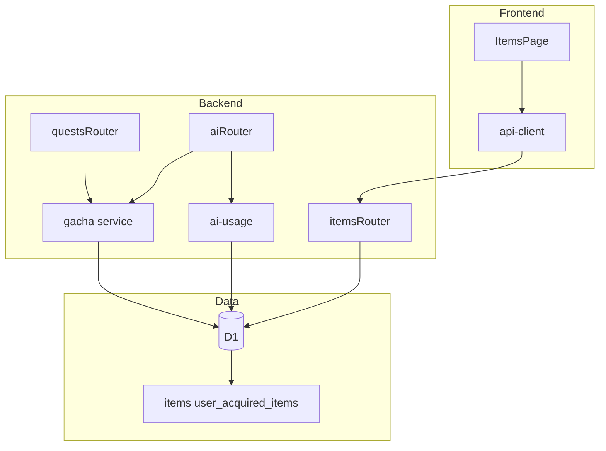
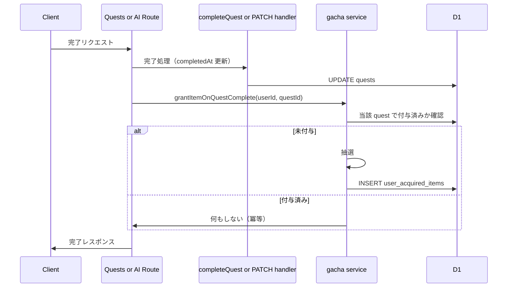

# ガチャ機能 技術設計書

---
**目的**: 実装の一貫性を保つため、アーキテクチャとインターフェースを定義する。
**注意**: 本設計は WHAT に焦点を当て、実装の HOW はタスクフェーズに委ねる。
---

## Overview

本機能は、クエスト（タスク）完了をトリガーに1回の抽選で1個のアイテムをユーザーに付与し、所持一覧で永続的に確認できる基盤を提供する。アイテムマスタとレアリティ別確率に基づく抽選、および「1クエスト1回付与」の冪等な付与と所持一覧 API を実現する。

**対象ユーザー**: クエストを完了する登録ユーザー。所持一覧は認証済みユーザー本人のみが参照する。

**影響**: 既存のクエスト完了フロー（generate-narrative と PATCH complete/status）の「完了確定後」にガチャ付与の1回呼び出しを追加する。新規テーブル（items, user_acquired_items）、新規サービス（gacha）、新規ルート（items）を追加する。既存の completeQuest や quests の API 契約は変更しない。

### Goals

- アイテムマスタで一意ID・カテゴリ・レアリティ・表示情報を管理し、抽選と表示で一貫して利用する（1.1〜1.4, 5.1〜5.3）。
- クエスト完了ごとにレアリティに基づく確率で1個を抽選し、droppable なアイテムのみ対象とする（2.1〜2.4）。
- 完了時に1回だけアイテムを付与し、二重付与を防ぐ冪等設計とする（3.1〜3.4）。
- 所持を永続化し、認証ユーザー本人のみが一覧を取得できるようにする（4.1〜4.4）。
- レアリティの順序とカテゴリの閉集合を型・仕様で保証する（5.1〜5.3）。

### Non-Goals

- アイテム獲得演出・アニメーション・詳細なフロント表示は EP-27 のスコープとする。
- 管理画面でのマスタ編集・確率変更 UI は本設計のスコープ外（将来拡張で対応可能）。
- 画像アセットのホスティング方式はデプロイ・フロント側の責務とし、本設計ではパス規則のみ定義する。

---

## Architecture

### Existing Architecture Analysis

- **現状**: バックエンドは Hono ルート＋services、D1＋Drizzle、Better Auth。クエスト完了は (1) POST /api/ai/generate-narrative 内で completeQuest を呼び completedAt を更新、(2) PATCH /api/quests/:id/complete または PATCH /api/quests/:id/status で completedAt を更新。いずれもガチャ付与は未実装。
- **維持する境界**: ルートは薄く、ビジネスロジックは services に集約。共有型・スキーマは @skill-quest/shared。認証は authMiddleware で c.get('user') を利用。
- **統合方針**: 新規に gacha サービスと items ルートを追加し、完了が確定した「後」に両経路から共通の付与関数を1回呼ぶ。既存の completeQuest はそのまま利用し、付与は呼び出し元で行う。

### Architecture Pattern & Boundary Map

- **選定パターン**: 既存の「routes + services + D1」パターンを拡張。ガチャ・所持は新規サービスと新規ルートに閉じる。
- **境界**: gacha サービスは「抽選」と「付与1回（冪等）」を担当。items ルートは「所持一覧取得」のみ。マスタ読み取りは gacha サービス内で実施。
- **既存パターン**: 認証必須ルート、Drizzle schema、@skill-quest/shared の型・Zod スキーマを維持。
- **Steering 準拠**: structure.md の routes/services 分離、tech.md の D1/Drizzle/TypeScript を踏襲。

### Technology Stack

| Layer | Choice / Version | Role in Feature | Notes |
|-------|------------------|-----------------|-------|
| Backend / Services | TypeScript, Hono, D1 | 抽選・付与・所持一覧 | 既存スタック。新規は gacha サービス・items ルートのみ |
| Data / Storage | D1, Drizzle ORM | items, user_acquired_items テーブル | 既存マイグレーション手順に従う |
| Shared | @skill-quest/shared, Zod | Rarity/Category 列挙、Item/AcquiredItem 型・スキーマ | 新規追加。API 契約とバリデーション |
| Frontend | React, api-client | 所持一覧表示（ItemsPage 差し替え） | 既存。新規 API 呼び出しと表示のみ |

---

## System Flows

### クエスト完了時の付与フロー

- **ゲート条件**: 認証済みかつクエストのオーナーであること。付与は「完了が成功した後」に1回だけ呼ぶ。抽選結果が「アイテムなし」（マスタ空や droppable 0 件）の場合は INSERT せず正常終了とする。

---

## Requirements Traceability

| Requirement | Summary | Components | Interfaces | Flows |
|-------------|---------|------------|------------|-------|
| 1.1 | マスタで一意ID・1カテゴリ・1レアリティ | items テーブル, shared 型 | Data Model | — |
| 1.2 | 各アイテムに id, name, category, rarity, description 等 | items テーブル, shared 型 | API Response | — |
| 1.3 | 画像パスを category と id から解決可能に | 共有規則, API で id/category 返却 | 規則文書化 | — |
| 1.4 | カテゴリ・レアリティを仕様の閉集合でサポート | shared Rarity/Category, items 制約 | 型・スキーマ | — |
| 2.1 | 1回の抽選で1個をマスタから選択 | gacha サービス | Service Interface | 付与フロー |
| 2.2 | レアリティ別確率（common > rare > … の順序維持） | gacha サービス | 内部定数/設定 | 付与フロー |
| 2.3 | マスタに存在し droppable なもののみ対象 | gacha サービス, items.enabled_for_drop | Service Interface | 付与フロー |
| 2.4 | マスタ空・droppable 0 のとき定義済み挙動（付与なし） | gacha サービス | Service Interface | 付与フロー |
| 3.1 | クエスト完了時に1回抽選・付与 | quests/ai ルート, gacha サービス | Service Interface | 付与フロー |
| 3.2 | 付与時に user, item, 取得時刻を記録 | user_acquired_items, gacha サービス | Data Model | 付与フロー |
| 3.3 | 重複完了イベントに対して冪等 | gacha サービス（quest_id で1回のみ） | Service Interface | 付与フロー |
| 3.4 | 未認証・非オーナーでは付与しない | ルート層の認証・オーナーチェック | API Contract | — |
| 4.1 | 付与を永続化し後で一覧取得可能に | user_acquired_items, items ルート | API Contract | — |
| 4.2 | 一覧に item id, 取得時刻, 表示用 name/category/rarity を含む | items ルート, shared 型 | API Contract | — |
| 4.3 | 所持は認証ユーザー本人のみ | items ルート, authMiddleware | API Contract | — |
| 4.4 | 同一アイテム複数回は複数行で表現 | user_acquired_items 設計 | Data Model | — |
| 5.1 | レアリティを順序集合として扱う | shared Rarity, 一覧のソート | 型・API | — |
| 5.2 | カテゴリを閉集合として扱う | shared Category, バリデーション | 型・スキーマ | — |
| 5.3 | マスタ・確率の設定値を文書化または制約 | 定数・スキーマ・コメント | 実装時ドキュメント | — |

---

## Components and Interfaces

### コンポーネント概要

| Component | Domain/Layer | Intent | Req Coverage | Key Dependencies | Contracts |
|-----------|--------------|--------|--------------|------------------|-----------|
| gacha サービス | Backend / Services | 抽選1回・付与1回（冪等） | 2.1〜2.4, 3.1〜3.3 | D1 (P0), items マスタ (P0) | Service |
| items ルート | Backend / Routes | 所持一覧 GET、認証スコープ | 4.1〜4.4, 3.4 | authMiddleware (P0), D1 (P0) | API |
| shared 型・スキーマ | Shared | Rarity/Category/Item/AcquiredItem | 1.1〜1.4, 5.1〜5.3 | — | 型・Zod |
| items テーブル | Data | アイテムマスタ | 1.1, 1.2, 1.4, 2.3 | — | — |
| user_acquired_items テーブル | Data | ユーザー所持履歴 | 3.2, 4.1, 4.4 | user, quests, items | — |
| ItemsPage（フロント） | Frontend | 所持一覧表示 | 4.2 | api-client, 新規 API | 既存ページ差し替え |

### Backend / Services

#### gacha サービス

| Field | Detail |
|-------|--------|
| Intent | レアリティに基づく1回抽選と、クエスト単位で1回だけの付与（冪等） |
| Requirements | 2.1, 2.2, 2.3, 2.4, 3.1, 3.2, 3.3 |

**Responsibilities & Constraints**

- 抽選: マスタから enabled_for_drop なアイテムのみを対象に、レアリティ別確率（common 50%, rare 30%, super-rare 13%, ultra-rare 5%, legend 2% の目安、相対順序は固定）で1個を選ぶ。
- 付与: grantItemOnQuestComplete(db, userId, questId) は、当該 (userId, questId) で既に user_acquired_items に1件以上あれば何もせず、なければ抽選→1件 INSERT（quest_id を格納）。マスタが空または droppable が0件の場合は「付与なし」とし、例外は投げない。
- データ所有: 抽選と付与のトランザクション境界は1回の付与試行（SELECT で付与済み確認 → 必要なら抽選 → INSERT）。既存の completeQuest や PATCH のトランザクションとは別とする。

**Dependencies**

- Inbound: なし（ルートから直接呼ばれる）
- Outbound: D1 — マスタ取得・付与済み確認・所持 INSERT (P0)
- External: なし

**Contracts**: Service [x]

##### Service Interface

- `drawItem(db: D1Database): Promise<{ item: Item | null }>`  
  - 前提: DB 接続が有効。  
  - 事後: マスタに droppable が1件以上あれば確率に従い1個返す。0件なら item は null。  
  - 不変: 返却は最大1件。any は使用しない。

- `grantItemOnQuestComplete(db: D1Database, userId: string, questId: string): Promise<{ granted: boolean; item: Item | null }>`  
  - 前提: userId と questId は認証・オーナーチェック済みとする（呼び出し元の責務）。  
  - 事後: 当該 quest で既に付与済みなら granted false, item null。未付与なら抽選し、結果が null でなければ INSERT して granted true とその item を返す。結果が null（マスタ空等）なら INSERT せず granted false, item null。  
  - 不変: 同一 (userId, questId) に対して user_acquired_items の挿入は高々1件。

**Implementation Notes**

- 抽選はレアリティを先に確率で決め、そのレアリティの droppable アイテムから1つ選ぶ方式でよい。確率は定数で保持し、順序 common > rare > super-rare > ultra-rare > legend を保つ。
- 冪等性は、grant の冒頭で `SELECT FROM user_acquired_items WHERE user_id = ? AND quest_id = ?` で確認するか、INSERT 時に (user_id, quest_id) のユニーク制約で重複を防ぐ。設計上は「先に存在チェックし、なければ INSERT」でよい。
- リスク: マスタ未投入時は常に item null。マイグレーションまたはシードで初期データを入れるタスクを設ける。

### Backend / Routes

#### items ルート

| Field | Detail |
|-------|--------|
| Intent | 認証ユーザー本人の所持アイテム一覧を返す |
| Requirements | 4.1, 4.2, 4.3, 4.4 |

**Responsibilities & Constraints**

- GET /api/items（または /api/items/me）: 認証必須。c.get('user').id のユーザーの user_acquired_items を item 情報と結合し、取得時刻の降順で返す。他人の所持は返さない。
- ルートは薄くし、一覧取得のクエリはサービスに委譲してもよい（一覧専用の軽い関数を gacha サービスまたは items 用サービスに置く）。

**Dependencies**

- Inbound: authMiddleware — 認証 (P0)
- Outbound: D1 — 所持＋マスタの SELECT (P0)
- External: なし

**Contracts**: API [x]

##### API Contract

| Method | Endpoint | Request | Response | Errors |
|--------|----------|---------|----------|--------|
| GET | /api/items | なし（認証ヘッダ） | { items: AcquiredItemView[] } | 401 Unauthorized |

AcquiredItemView: 少なくとも itemId, acquiredAt, name, category, rarity を含む。同一 item の複数回取得は複数要素で返す（要件 4.4）。

**Implementation Notes**

- 既存の app に `/api/items` をマウントし、authMiddleware を適用する。Bindings 型に DB のみでよい（AI は不要）。
- 画像パスはクライアントで `/images/items/{category}/{id}.png` と組み立てる。API では id と category を返せば足りる。

### Shared

#### 型・スキーマ（@skill-quest/shared）

- **Rarity**: 列挙型。common, rare, super-rare, ultra-rare, legend。表示・ソート用の順序は common < rare < super-rare < ultra-rare < legend として文書化する（5.1）。
- **Category**: 列挙型。drink, chip, badge, tool, artifact, android, mythical。閉集合として扱い、追加は変更プロセスによる（5.2）。
- **Item**: 少なくとも id, name, category, rarity, description? を持つ型。画像パスはクライアント組み立てのため、id と category があればよい。
- **AcquiredItemView**（一覧用）: itemId, acquiredAt, name, category, rarity を必須とする。必要に応じて description を含めてもよい。
- **Zod**: 一覧 API のレスポンス用スキーマがあれば、バリデーションと型推論に利用する。マスタはバックエンドのみなので、必要なら backend 内の型のみでも可。

---

## Data Models

### Domain Model

- **集約**: (1) アイテムマスタ（Item の集合）、(2) ユーザー所持（User に紐づく AcquiredItem の履歴）。トランザクション境界は「1回の付与」と「一覧取得」。
- **エンティティ**: Item（マスタ）、UserAcquiredItem（取得1件）。値オブジェクト: Rarity, Category。
- **不変条件**: 1クエストあたり付与は高々1件。所持はユーザー本人にのみ紐づく。

### Logical Data Model

- **items**: 1件のアイテム。id（PK）, category, rarity, name, description（NULL 可）, enabled_for_drop（boolean, デフォルト true）, 必要なら created_at/updated_at。category と rarity は仕様の閉集合に制約する。
- **user_acquired_items**: 1件の取得履歴。id（PK）, user_id（FK user.id）, item_id（FK items.id）, quest_id（FK quests.id, NULL 可とするか必須とするかは実装で決定。設計上は必須で「1クエスト1付与」を表現）, acquired_at（timestamp）。同一 (user_id, quest_id) の組み合わせは高々1件（ユニーク制約推奨）。
- **整合性**: user 削除時は user_acquired_items を CASCADE で削除。items 削除時は参照整合（付与履歴は残す場合は item_id を SET NULL や履歴保持のポリシーに従う）。quest 削除時は user_acquired_items の quest_id をどうするか（CASCADE で消すか SET NULL か）は実装で決定してよい。

### Physical Data Model（D1 / SQLite）

- **items**:  
  - id TEXT PRIMARY KEY  
  - category TEXT NOT NULL（CHECK またはアプリで Category に限定）  
  - rarity TEXT NOT NULL（同様 Rarity に限定）  
  - name TEXT NOT NULL  
  - description TEXT  
  - enabled_for_drop INTEGER (boolean) NOT NULL DEFAULT 1  
  - created_at INTEGER (timestamp), updated_at INTEGER (timestamp)（必要なら）

- **user_acquired_items**:  
  - id TEXT PRIMARY KEY  
  - user_id TEXT NOT NULL REFERENCES user(id) ON DELETE CASCADE  
  - item_id TEXT NOT NULL REFERENCES items(id)  
  - quest_id TEXT NOT NULL REFERENCES quests(id) ON DELETE …（方針に応じて SET NULL または CASCADE）  
  - acquired_at INTEGER NOT NULL (timestamp)  
  - UNIQUE(user_id, quest_id)

- **インデックス**: user_acquired_items の一覧取得は user_id で検索し acquired_at 降順とするため、(user_id, acquired_at) のインデックスを検討する。既存プロジェクトのインデックス方針に合わせる。

### Data Contracts & Integration

- **所持一覧 API**: レスポンスは JSON。AcquiredItemView の配列。日時は ISO 8601 または Unix 秒のいずれかに統一する（既存 API に合わせる）。
- **マスタ**: マイグレーションまたはシードで投入。本設計では「投入方法」はタスクで定義し、確率値やカテゴリ・レアリティの許容値はコードまたはコメントで文書化する（5.3）。

---

## Error Handling

### Strategy

- **ユーザーエラー（4xx）**: 未認証は 401。他ユーザーのクエスト操作・所持参照は 403 または 404。不正なパラメータは 400。既存の authMiddleware とオーナーチェックで担保する。
- **業務ロジック**: マスタ空・droppable 0 は「付与なし」として正常終了。例外にしない（2.4）。
- **システムエラー（5xx）**: D1 障害等は既存のエラーハンドリングに委ねる。付与の INSERT 失敗時は呼び出し元にエラーを返し、リトライは呼び出し元の判断とする（冪等なのでリトライ可能）。

### Monitoring

- 既存のロギング・監視に従う。付与回数や「付与なし」の発生は必要に応じてメトリクスやログに出す程度とする。

---

## Testing Strategy

- **単体**: (1) 抽選が droppable のみから選ばれること、(2) 確率の相対順序が保たれていること（サンプル数はテストで許容範囲）、(3) grantItemOnQuestComplete が同一 quest で2回呼ばれたときに2件目を挿入しないこと、(4) マスタ空で draw が null を返すこと、(5) 所持一覧が認証ユーザー本人のデータのみ返すこと。
- **統合**: (1) PATCH complete 成功後に GET /api/items で1件増えていること、(2) generate-narrative 成功後に同様に1件増えていること、(3) 同じクエストで再度完了操作をしても付与が増えないこと、(4) 未認証で GET /api/items が 401 になること。
- **E2E（任意）**: ログイン→クエスト完了→獲得アイテム画面で新規取得が表示される流れ。EP-27 で演出を入れる前に最小限の表示確認でも可。

---

## Supporting References

- 詳細な調査・判断は `.kiro/specs/gacha/research.md` に記載する。本設計はそれらを要約し、コンポーネント・インターフェース・データモデルとして固定している。
