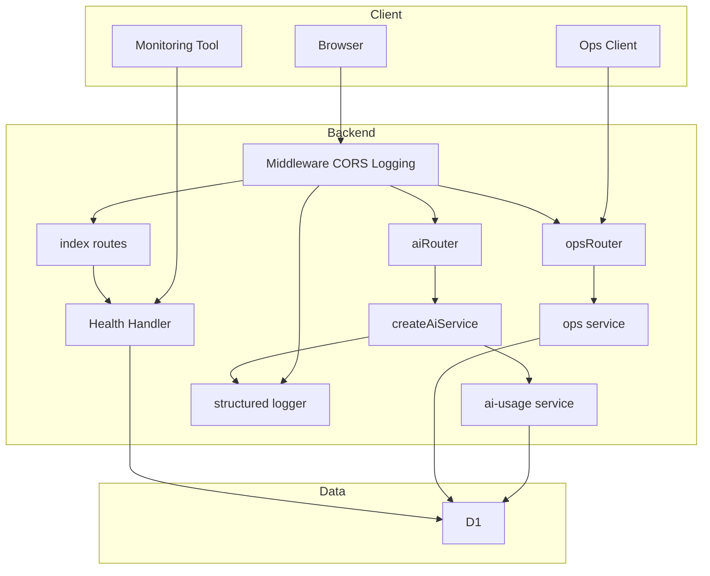

# Technical Design: infra-stability-cost

---
**Purpose**: フェーズ3（インフラ安定化とコスト管理）の要件を、アーキテクチャとインターフェースに落とし込み、実装の一貫性を保つ。

---

## Overview

本機能は、運用者およびシステムが「インフラの安定性」と「AI コスト」を把握・制御できるようにする。具体的には、(1) AI 利用量（Neurons 相当）の計測・集計・可視化、(2) 無料枠到達時のスタブフォールバック、(3) 本番向け CORS・機密の明文化、(4) ヘルスチェックエンドポイント、(5) 構造化ログと Cloudflare 連携、(6) ユーザー数・アクティブ数の取得 API を提供する。

**対象ユーザー**: 運用者（ダッシュボードまたは API で利用量・ユーザー数を確認）、外形監視ツール（/api/health）、開発・運用（構造化ログによる障害追跡）。

**影響**: 既存のバックエンドに新規ルート（/api/health, /api/ops/*）と、ai-usage の拡張（Neurons 概算）、createAiService のフォールバック分岐、ロギングミドルウェアの構造化出力を追加する。既存のユーザー向け API の契約は変更しない。

### Goals

- AI 利用量を Neurons 相当で計測し、日次・ユーザー単位で集計可能にする。
- 無料枠閾値超過時に Workers AI を呼ばずスタブ応答に切り替え、意図しない課金を防ぐ。
- 本番環境で許可オリジンを明示した CORS と、機密情報のランタイム参照を維持する。
- `/api/health` で稼働状態を返し、外形監視の受け口とする。
- 重要な操作・エラーを構造化ログで出力し、Cloudflare の observability と連携する。
- 登録ユーザー数・アクティブユーザー数を認可付き API で取得可能にする。

### Non-Goals

- フロントエンドの運用者向けダッシュボード UI の実装（API を提供し、外部ツールや将来の UI で利用する）。
- Cloudflare ダッシュボード以外での「実測 Neurons」の取得（API で Neurons が返らないため、概算のみ）。
- Better Auth への管理者ロール追加（運用者認可は API キーで行う）。
- マイグレーションの自動ロールバック戦略の詳細（既存 D1 マイグレーション手順に従う）。

---

## Architecture

### Existing Architecture Analysis

- バックエンドは Hono + Bindings（D1, AI, BETTER_AUTH_SECRET, FRONTEND_URL）。ルートは薄く、ビジネスロジックは services に集約。
- ai_daily_usage はユーザー別・日次で「回数」のみ保持。createAiService は env のみ受け取り、INTEGRATION_TEST_AI_STUB でスタブに切り替わる。
- CORS は middleware/index.ts で FRONTEND_URL と localhost を許可リスト化。機密はすべて c.env 経由。
- 維持する統合面: 既存 /api/ai/* の契約、既存 ai-usage の回数記録、Better Auth のセッション認証。

### Architecture Pattern & Boundary Map

**選定パターン**: ハイブリッド。既存コンポーネントの拡張（ヘルス、CORS、フォールバック判定）と、新規コンポーネント（運用者 API、Neurons 概算レイヤー、構造化ログヘルパー）を組み合わせる。



- **Domain boundaries**: 通常 API（/api/ai, /api/quests 等）と運用者 API（/api/ops）はルートで分離。Neurons 概算は ai-usage 内で記録し、フォールバック判定は createAiService 内で行う。
- **Preserved patterns**: ルート → サービス → D1、機密は Bindings、型は @skill-quest/shared と types.ts。
- **Steering compliance**: routes + services の分離、Bindings による環境依存の注入、既存テストパターン（Vitest, モック D1）を維持。

### Technology Stack & Alignment

| Layer | Choice | Role in Feature | Notes |
|-------|--------|-----------------|-------|
| Backend | Hono, Cloudflare Workers | 新規ルート /api/health, /api/ops/*、既存 ai ルートから createAiService に db を渡す | 既存スタックのまま |
| Data | D1, Drizzle | ai_daily_usage に neurons_estimate 追加、既存 user/session でユーザー数・アクティブ集計 | 新規カラムのみ、新テーブルなし |
| Observability | console + JSON 文字列 | 構造化ログは console.log(JSON.stringify(...))、wrangler observability で取り込み | 新規ライブラリ不要 |
| Config | wrangler.toml, Bindings | OPS_API_KEY, AI_NEURONS_DAILY_LIMIT, AI_NEURONS_FALLBACK_THRESHOLD をオプションで追加 | 既存 vars/secrets 方針 |

---

## Requirements Traceability

| Requirement | Summary | Components | Interfaces | Flows |
|-------------|---------|------------|------------|-------|
| 1.1 | Workers AI 呼び出し時に Neurons 相当を計測・記録 | ai-usage | record* + neurons 加算 | AI ルート → record* → D1 |
| 1.2 | 計測結果を集計可能に保持 | ai-usage, D1 | ai_daily_usage スキーマ | 日次・ユーザー別は既存 + neurons_estimate |
| 1.3 | ダッシュボードで指定期間の利用量表示 | ops サービス, ops ルート | GET /api/ops/ai-usage | 運用者 API で集計返却 |
| 1.4 | 計測ロジックを課金単位に整合 | ai-usage | 係数定数・ドキュメント | 係数は Cloudflare 料金表に合わせて更新 |
| 2.1 | 無料枠到達時にスタブに切り替え | createAiService, ai-usage | createAiService(env, options?) | 閾値取得 → スタブ or 実 AI |
| 2.2 | フォールバック時にスタブであることが分かる応答 | AiService スタブ | 既存 createStubAiService のメッセージ | 固定文または「AI 利用一時制限中」 |
| 2.3 | 閾値超過時は Workers AI を呼ばない | createAiService | 同上 | スタブ返却時は env.AI を叩かない |
| 2.4 | 無料枠判定条件を設定可能に | Bindings, ai-usage | AI_NEURONS_* 環境変数 | 閾値・上限を env で指定 |
| 3.1 | 本番で許可オリジンを明示した CORS | middleware/index.ts | 既存 cors() | FRONTEND_URL と localhost、ドキュメントで明文化 |
| 3.2–3.4 | 機密をコード・クライアントに露出しない、環境別設定、ランタイム限定 | Bindings, wrangler | 既存パターン | 設計でドキュメント化 |
| 4.1–4.3 | /api/health 提供、200 とステータス、外形監視が叩ける | Health Handler, index | GET /api/health | 認証なし 200 + JSON |
| 4.4 | 依存リソース（D1）の健全性をオプションで含める | Health Handler | checks.db | SELECT 1 で確認 |
| 5.1–5.4 | 構造化ログ、追跡可能、Analytics 連携、機密を含めない | structured logger, logging ミドルウェア | logStructured() | JSON フィールドは level, msg, path, status, duration 等 |
| 6.1–6.4 | 登録数・アクティブ数集計、ダッシュボード用 API、認可限定 | ops サービス, ops ルート | GET /api/ops/stats | X-Ops-API-Key 照合 |

---

## Components and Interfaces

### コンポーネント概要

| Component | Domain/Layer | Intent | Req | Key Dependencies | Contracts |
|-----------|--------------|--------|-----|------------------|-----------|
| Health Handler | Backend | /api/health で稼働状態とオプションで D1 健全性を返す | 4.x | D1 (P1) | API |
| ops router | Backend | 運用者向け API のルーティングと API キー認可 | 1.3, 6.x | ops service (P0), Bindings (P0) | API |
| ops service | Backend | AI 利用量集計・ユーザー数・アクティブ数の取得 | 1.3, 6.x | D1 (P0) | Service |
| ai-usage (extended) | Backend | Neurons 概算の記録と日次合計取得、既存回数記録は維持 | 1.1, 1.2, 2.4 | D1 (P0) | Service |
| createAiService (extended) | Backend | 閾値超過時はスタブを返し、そうでなければ実 AI | 2.1–2.3 | env, ai-usage (P0) | Service |
| structured logger | Backend | JSON 形式でログ出力し、機密を含めない | 5.x | なし | Service |
| middleware (CORS) | Backend | 本番オリジン明示の維持とドキュメント | 3.x | Bindings (P1) | 既存 |

---

### Backend

#### Health Handler

| Field | Detail |
|-------|--------|
| Intent | GET /api/health で 200 と status を返し、オプションで D1 健全性を含める |
| Requirements | 4.1, 4.2, 4.3, 4.4 |

**Responsibilities & Constraints**

- 認証なしで呼び出し可能。レスポンスに機密を含めない。
- 通常時は `{ status: "ok" }`。オプションで `checks: { db: "ok" | "unhealthy" }` を付与する場合は、D1 に対して軽いクエリ（例: SELECT 1）を実行し、成功時 "ok"、失敗時 "unhealthy" とする。

**Dependencies**

- Inbound: index（ルート登録）(P0)
- Outbound: D1（オプション）(P1)

**Contracts**: API [x]

##### API Contract

| Method | Endpoint | Request | Response | Errors |
|--------|----------|---------|----------|--------|
| GET | /api/health | なし | { status: "ok" } または { status: "ok", checks: { db: "ok" \| "unhealthy" } } | 500 は D1 必須時のみ |

**Implementation Notes**

- index.ts に `app.get('/api/health', ...)` を追加。ハンドラは別モジュール（例: routes/health.ts）に切り出してよい。
- D1 チェックを行う場合は、タイムアウトを短くし、失敗しても status は "ok" のまま checks.db のみ "unhealthy" とするか、設計で決定する。

---

#### ops router

| Field | Detail |
|-------|--------|
| Intent | /api/ops/* のルーティングと X-Ops-API-Key による認可 |
| Requirements | 1.3, 6.1–6.4 |

**Responsibilities & Constraints**

- すべての /api/ops/* で Bindings の OPS_API_KEY とリクエストヘッダ X-Ops-API-Key を照合。一致しなければ 401。
- **OPS_API_KEY 未設定時**: 当該環境では /api/ops 配下のルートを登録せず、/api/ops/* へのアクセスは 404 を返す（実装は index.ts で OPS_API_KEY の有無を見て opsRouter を登録するかどうかを分岐する）。
- 認可後に ops service を呼び出し、結果を JSON で返す。

**Dependencies**

- Inbound: index（app.route('/api/ops', opsRouter)）(P0)
- Outbound: ops service (P0), Bindings (P0)

**Contracts**: API [x]

##### API Contract

| Method | Endpoint | Request | Response | Errors |
|--------|----------|---------|----------|--------|
| GET | /api/ops/ai-usage | クエリ: from, to（日付 YYYY-MM-DD、オプション）。**日付範囲は最大 90 日**。超過時は 400 | { byDate: [...], totalNeuronsEstimate } 等、集計結果 | 400, 401, 404 |
| GET | /api/ops/stats | なし | { totalUsers, activeUsers }（アクティブの定義は設計で固定、例: 直近 30 日に session あり） | 401, 404 |

**Implementation Notes**

- 新規ファイル routes/ops.ts。index.ts では OPS_API_KEY が未設定なら /api/ops を登録せず、該当パスは 404。

---

#### ops service

| Field | Detail |
|-------|--------|
| Intent | AI 利用量の日次集計・ユーザー数・アクティブユーザー数の取得 |
| Requirements | 1.3, 6.1, 6.2 |

**Responsibilities & Constraints**

- D1 に対してのみ読み取り。集計クエリは重くならないようにインデックス・日付範囲制限を考慮する。
- **日付範囲制限**: getAiUsageAggregation の from/to の差は**最大 90 日**とする。呼び出し元（ops router）で検証し、超過時は 400 を返す。
- アクティブユーザー定義: 例として「直近 30 日以内に session が存在する user の数」とする。設計で固定し、ドキュメントに明記する。

**Dependencies**

- Inbound: ops router (P0)
- Outbound: D1 (P0)

**Contracts**: Service [x]

##### Service Interface

```typescript
interface OpsService {
  getAiUsageAggregation(db: D1Database, from: string, to: string): Promise<AiUsageAggregationResult>;
  getTotalUserCount(db: D1Database): Promise<number>;
  getActiveUserCount(db: D1Database, withinDays: number): Promise<number>;
}
```

- Preconditions: from, to は YYYY-MM-DD、from <= to。**to と from の差は 90 日以内**（超過時は呼び出し元で 400 を返す）。withinDays > 0。
- Postconditions: 集計結果は既存データに基づく読み取りのみ。
- Invariants: 機密情報（トークン、パスワード）を返さない。

**Implementation Notes**

- 新規ファイル services/ops.ts。getAiUsageAggregation は ai_daily_usage の SUM(neurons_estimate) と日別内訳を返す。getTotalUserCount は user の COUNT。getActiveUserCount は session の expiresAt と createdAt を利用して「直近 N 日以内に有効なセッションがあった user_id の distinct 数」を返す。

---

#### ai-usage (extended)

| Field | Detail |
|-------|--------|
| Intent | Neurons 概算の記録と日次合計取得。既存の回数記録はそのまま維持する |
| Requirements | 1.1, 1.2, 2.4 |

**Responsibilities & Constraints**

- 各 AI 操作（generate-character, narrative, partner, chat, grimoire, goal-update）に対して、既存の record* に加え、操作種別ごとの係数で neurons_estimate を加算する。係数は定数または Bindings のオプションで持つ。
- **スタブ応答時は neurons_estimate を加算しない**: record* は**実際に Workers AI を実行したリクエスト**でのみ呼び出される想定とする。閾値超過でスタブを返した場合はルート側で record* を呼ばないため、当該リクエストでは neurons_estimate は加算されない（要件 2.3 と 1.1 の一貫性）。
- 日次合計は「指定 date_utc の SUM(neurons_estimate)」で取得する関数を追加する。閾値判定は createAiService 側で利用する。

**Dependencies**

- Inbound: routes/ai.ts, createAiService (P0)
- Outbound: D1 (P0)

**Contracts**: Service [x]

##### Service Interface (追加分)

```typescript
// 既存 getDailyUsage 等は変更しない。以下を追加。
function getGlobalNeuronsEstimateForDate(db: D1Database, dateUtc: string): Promise<number>;
// record* 系の呼び出し時に、対応する neurons 係数を加算して UPDATE/INSERT する。
// 係数: character 19, narrative 20, partner 20, chat 20, grimoire 20, goalUpdate 20 等（設計で確定）
```

- Preconditions: dateUtc は YYYY-MM-DD。
- Postconditions: **実 AI を実行した場合のみ** ai_daily_usage の neurons_estimate が加算される。既存の *Count カラムの挙動は変わらない。スタブ応答時は record* が呼ばれないため加算されない。
- Invariants: 係数は正の整数。機密は扱わない。

**Implementation Notes**

- ai_daily_usage に neurons_estimate カラムを追加（Drizzle スキーマ + マイグレーション）。既存 record* の INSERT/UPDATE に neurons_estimate の加算を含める。ルートでは「createAiService が返すサービスで実 AI を実行したパス」でのみ record* を呼び、スタブの場合は呼ばない。新規関数 getGlobalNeuronsEstimateForDate は SELECT SUM(neurons_estimate) FROM ai_daily_usage WHERE date_utc = ? で実装。

---

#### createAiService (extended)

| Field | Detail |
|-------|--------|
| Intent | 閾値超過時はスタブを返し、そうでなければ実 Workers AI を返す。INTEGRATION_TEST_AI_STUB は従来どおり最優先 |
| Requirements | 2.1, 2.2, 2.3 |

**Responsibilities & Constraints**

- シグネチャを createAiService(env: Bindings, options?: { db: D1Database; getTodayUtc: () => string }) のように拡張。options が渡され、かつ env に AI_NEURONS_FALLBACK_THRESHOLD（および必要なら AI_NEURONS_DAILY_LIMIT）が設定されている場合、getGlobalNeuronsEstimateForDate(db, getTodayUtc()) を取得し、閾値以上なら createStubAiService(env) を返す。それ以外は従来どおり env.AI を使うサービスを返す。
- スタブ応答は既存の「スタブであることが分かる」メッセージ（固定文または「AI 利用一時制限中」）を返す。既存 createStubAiService を拡張してメッセージを差し替え可能にしてもよい。
- **閾値超過でスタブを返した場合**: 当該リクエストでは Workers AI を呼んでいないため、ルート側で record* を呼ばず、neurons_estimate は加算されない（要件 2.3 と計測の一貫性）。

**Dependencies**

- Inbound: routes/ai.ts, routes/grimoire.ts (P0)
- Outbound: env.AI (P0), ai-usage getGlobalNeuronsEstimateForDate (P0), Bindings (P0)

**Contracts**: Service [x]

##### Service Interface

- 既存 createAiService(env): AiService を、createAiService(env, options?) に拡張。戻り値は AiService のまま。options 省略時は従来どおり（閾値チェックなし）。

**Implementation Notes**

- INTEGRATION_TEST_AI_STUB === '1' のときは従来どおり即スタブ。次に options が渡されていれば閾値取得 → 比較 → スタブ or 実 AI。ルートでは createAiService(c.env, { db: c.env.DB, getTodayUtc }) のように渡す。

---

#### structured logger

| Field | Detail |
|-------|--------|
| Intent | 重要な操作・エラーを JSON 形式で console に出力し、機密を含めない |
| Requirements | 5.1, 5.2, 5.4 |

**Responsibilities & Constraints**

- フィールド例: level, msg, path, method, status, durationMs, userId（オプション、ID のみ）、timestamp。トークン・パスワード・メール本文は含めない。
- 既存 logging ミドルウェアから呼び出し、エラーハンドラからも呼び出す。console.log(JSON.stringify({ ... })) で十分。

**Dependencies**

- Inbound: logging middleware, error handler, 必要に応じて ai ルート (P1)
- Outbound: なし（console のみ）

**Contracts**: Service [x]

##### Service Interface

```typescript
function logStructured(fields: Record<string, unknown>): void;
// 渡された fields をサニタイズ（機密キー名の除外）し、JSON で console.log する。
```

**Implementation Notes**

- 新規ファイル lib/structured-log.ts または middleware/structured-log.ts。キー名が token, password, authorization 等の場合は値を含めないか、マスキングする。wrangler.toml に [observability] enabled=true を追加し、Cloudflare 側でログを利用可能にする。

---

## Data Models

### Domain Model

- **Aggregates**: AI 利用は「ユーザー・日付」を単位に ai_daily_usage で集約。Neurons 概算はその属性として追加する。運用者向けの「日次集計」は読み取り専用のクエリ結果である。
- **Invariants**: neurons_estimate >= 0。日次合計は全ユーザーの合計として一貫して定義される。

### Logical Data Model

- **ai_daily_usage**: 既存カラムに neurons_estimate (integer, default 0) を追加。(user_id, date_utc) は PK のまま。集計は SUM(neurons_estimate) WHERE date_utc = ? で日次合計を取得する。
- **user, session**: 変更なし。登録ユーザー数は COUNT(*) FROM user。アクティブユーザー数は「直近 N 日以内に session が存在する user_id の distinct 数」で定義する。

### Physical Data Model

**ai_daily_usage**

- 追加カラム: neurons_estimate integer NOT NULL DEFAULT 0。
- 既存 PK・FK は変更しない。インデックスは date_utc による集計が多ければ date_utc の単独インデックスを検討する（既存で date_utc が WHERE に含まれるため）。

### Data Contracts & Integration

- **GET /api/health**: Response body { status: string, checks?: { db: string } }。
- **GET /api/ops/ai-usage**: Response body { byDate: Array<{ date: string, totalNeuronsEstimate: number }>, totalNeuronsEstimate?: number }。日付範囲はクエリで指定。**from と to の差は最大 90 日**。超過時は 400。
- **GET /api/ops/stats**: Response body { totalUsers: number, activeUsers: number }。
- 機密: いずれの API もトークン・パスワード・メール本文を返さない。

---

## Error Handling

### Strategy

- ヘルス: D1 チェック失敗時は checks.db = "unhealthy" とし、status は "ok" のまま（サービスは稼働しているとみなす）。D1 必須とする場合は 503 を返す設計も可。
- 運用者 API: OPS_API_KEY 未設定は 404 または 501。キー不一致は 401。集計クエリ失敗は 500。
- フォールバック: 閾値取得失敗時は「安全側」に倒す（スタブを返す）か、実 AI を試すかを設計で決定。推奨は失敗時はスタブ。

### Monitoring

- 構造化ログで path, status, durationMs を記録。エラー時は level: "error" と msg を付与。Cloudflare Workers の Logs と observability で確認可能とする。

---

## Testing Strategy

- **Unit**: getGlobalNeuronsEstimateForDate、係数付き record* の neurons_estimate 加算、logStructured の出力形式・機密マスキング、createAiService の閾値分岐（env と options の組み合わせ）。
- **Integration**: GET /api/health が 200 を返すこと、D1 障害時に checks.db が "unhealthy" になること（オプション実装時）。GET /api/ops/ai-usage および GET /api/ops/stats が OPS_API_KEY 一致時のみ 200 を返し、キー不一致で 401 になること。閾値超過時に AI ルートがスタブ応答を返すこと（既存スタブテストと同様）。
- **E2E**: /api/health をプレビュー環境で叩いて 200 が返ることを確認（オプション）。

---

## Security Considerations

- CORS: 本番では FRONTEND_URL を明示し、localhost は開発用のみ。許可リストをドキュメントに記載する。
- 機密: BETTER_AUTH_SECRET, OPS_API_KEY は Bindings または wrangler secret で注入し、コード・ログに含めない。構造化ログでは authorization, cookie 等の値を出力しない。
- 運用者 API: OPS_API_KEY は推測困難な長い文字列とし、必要に応じて Cloudflare の IP 制限や WAF で保護する。

---

## Supporting References

- research.md: Neurons 概算方針、フォールバック判定、運用者認可、構造化ログの調査と決定理由。
- 06_AI設計.md: 閾値フォールバックと 1 リクエストあたりの Neurons 概算。
- gap-analysis.md: 既存資産とギャップの対応表。
