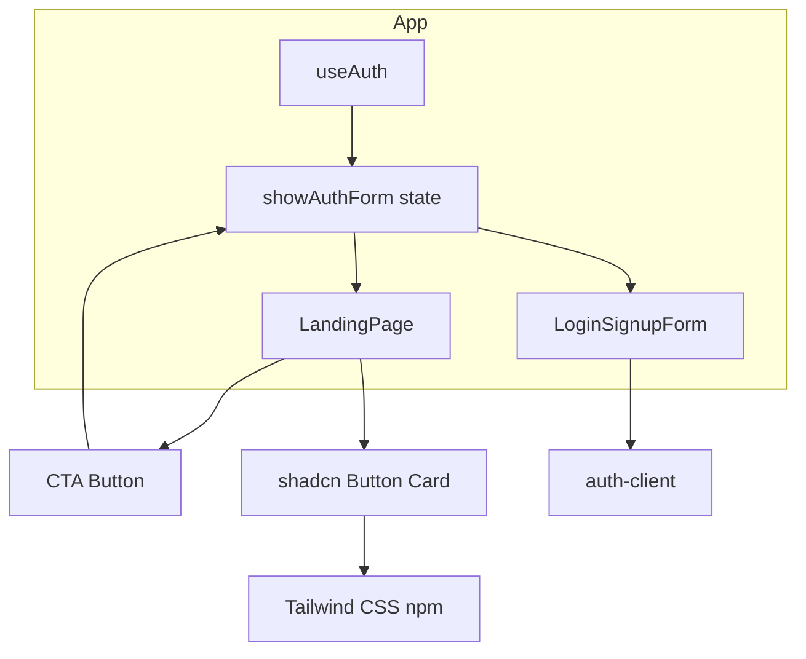
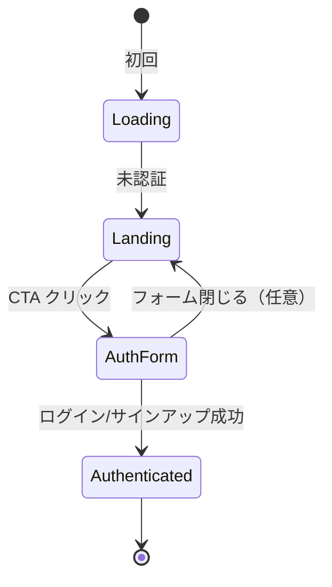

# Technical Design: persona-landing-page

---
**Purpose**: ペルソナに刺さるランディングページを、Tailwind CSS と shadcn/ui で実装するための技術方針とコンポーネント境界を定義する。
---

## Overview

本機能は、未認証訪問者向けに単一のランディングページを提供する。Tailwind CSS と shadcn/ui を用い、RPG風タスク管理アプリ（Skill Quest AI / Skill Quest）の価値提案を、20代〜30代のデジタルネイティブでゲーム・サブカルに親和性が高く「続かない自分」に悩むペルソナに届ける。

**Users**: 未認証の訪問者が、ランディングで価値を把握したうえで CTA からサインアップ/ログインに進む。

**Impact**: 現在の未認証時表示（タイトル + LoginSignupForm のみ）を、ランディングビューを挟んだフローに変更する。あわせて Tailwind を CDN から npm 化し、shadcn/ui を導入する。

### Goals

- 未認証時にランディングを表示し、CTA で既存のログイン/サインアップフォームへ導線を提供する（1.3, 5.x）。
- ランディングのレイアウト・スタイルを Tailwind CSS で行い、再利用 UI は shadcn/ui またはそれに準拠したコンポーネントで構成する（1.1, 1.2）。
- ペルソナに沿ったメッセージ・ビジュアル・体験（価値提案、ヒーロー、励ましトーン、レスポンシブ・アクセシビリティ）を満たす（2.x, 3.x, 4.x）。

### Non-Goals

- クライアントルーターの導入や、ランディング/フォームの URL 分離は行わない。
- バックエンド・API・認証ロジックの変更は行わない。Better Auth と既存 LoginSignupForm をそのまま利用する。
- 既存の認証済みフロー（Genesis → Dashboard）や、他画面の機能追加は本設計のスコープ外とする。

---

## Architecture

### Existing Architecture Analysis

- **フロント**: React 19 + Vite。ルーターなし。`App.tsx` が認証状態（useAuth）と Genesis 状態で分岐し、未認証時は現状「Skill Quest AI」タイトル + `LoginSignupForm` のみ表示。
- **Tailwind**: index.html で Play CDN を読み込み。tailwind.config や PostCSS は未導入。
- **UI**: Lucide React、Recharts。shadcn/ui は未導入。コンポーネントは `src/components/`、パスエイリアスは `@/`。
- **維持するパターン**: 1 ファイル 1 コンポーネント（PascalCase）、未認証時の分岐は App 内で完結、CTA 先は既存 `LoginSignupForm`。

### Architecture Pattern & Boundary Map

- **Selected pattern**: 既存の状態分岐型 SPA に、未認証時の「ランディング表示 / フォーム表示」の 2 状態を追加する。新規コンポーネントはランディング専用に限定する。
- **Domain boundaries**: ランディングはプレゼンテーションのみ。認証は既存の auth-client と LoginSignupForm に閉じる。
- **New components**: `LandingPage`（ランディング全体）、必要に応じて `LandingHero` / `LandingValue` 等のサブコンポーネント。shadcn の `Button`, `Card` 等は `src/components/ui/` に配置する。
- **Steering compliance**: フロントは `apps/frontend/src`、コンポーネントは `components/`、`@/` でインポート。型は TypeScript で明示し、any は使用しない。

### Technology Stack

| Layer | Choice / Version | Role in Feature | Notes |
|-------|------------------|-----------------|-------|
| Frontend | Tailwind CSS (npm) | ランディングおよび既存画面のレイアウト・スタイル | CDN を廃止し、Vite プラグインでバンドルに組み込む。research.md 参照。 |
| Frontend | shadcn/ui | ボタン・カード等の再利用 UI。要件 1.2 対応。 | `npx shadcn@latest init` で導入。ランディングで利用するコンポーネントを追加。 |
| Frontend | React 19 + Vite | 既存のまま。ランディングは React コンポーネントとして実装。 | 変更なし。 |
| Frontend | Lucide React | 既存のまま。ランディングのアイコンにも利用可能。 | 変更なし。 |

---

## System Flows

未認証時の表示切替は state のみで完結するため、フローは簡潔である。

- **Loading**: useAuth の isLoading が true の間。既存どおり「読み込み中」を表示。
- **Landing**: 未認証かつ showAuthForm === false。`LandingPage` を表示。CTA で showAuthForm を true に更新。
- **AuthForm**: 未認証かつ showAuthForm === true。既存の `LoginSignupForm` を表示。成功時に refetch で認証状態が変わり Authenticated へ。
- 「フォーム閉じる」でランディングに戻すかは任意（実装でボタンやリンクを用意するかどうかはタスクで定義する）。

---

## Requirements Traceability

| Req | Summary | Components | Interfaces | Flows |
|-----|---------|------------|------------|-------|
| 1.1 | Tailwind でレイアウト・ビジュアル | Tailwind (npm), LandingPage, ui/* | — | — |
| 1.2 | 再利用 UI は shadcn または準拠 | LandingPage, components/ui (Button, Card 等) | shadcn コンポーネントの props | — |
| 1.3 | 未認証向け単一エントリページ | App, LandingPage, LoginSignupForm | App の state（showAuthForm） | 未認証フロー |
| 2.1 | 価値提案をペルソナ目的に紐づけて表示 | LandingPage（コピー・セクション） | — | — |
| 2.2 | ゲーム感覚で自己研鑽を続けられることを伝える | LandingPage | — | — |
| 2.3 | 続かない/動機のメッセージは励まし・共感トーン | LandingPage（コピー） | — | — |
| 3.1 | デジタルネイティブ・ゲーム寄りのビジュアル | LandingPage, スタイル・テーマ | — | — |
| 3.2 | ヒーロー等で短時間で価値把握できるフック | LandingPage（Hero 等） | — | — |
| 3.3 | 色・イラスト・軽いアニメーション（任意） | LandingPage | — | — |
| 4.1 | レスポンシブ | LandingPage, Tailwind, shadcn | — | — |
| 4.2 | アクセシビリティ | LandingPage, shadcn, セマンティクス | — | — |
| 5.1 | 明確な CTA を少なくとも 1 つ | LandingPage（CTA）, App | onStartClick 等 | 未認証フロー |
| 5.2 | プライマリ CTA はファーストビュー付近 | LandingPage | — | — |
| 5.3 | CTA 選択でサインアップ/ログインへ導線 | App（state 切替）, LoginSignupForm | — | 未認証フロー |

---

## Components and Interfaces

### Summary

| Component | Domain/Layer | Intent | Req Coverage | Key Dependencies | Contracts |
|-----------|--------------|--------|--------------|------------------|-----------|
| App | UI (root) | 認証・Genesis・未認証時のランディング/フォーム切替 | 1.3, 5.1, 5.3 | useAuth (P0), LandingPage (P0), LoginSignupForm (P0) | State |
| LandingPage | UI | ランディング全体。ヒーロー・価値提案・CTA。 | 1.1, 1.2, 2.x, 3.x, 4.x, 5.1, 5.2 | shadcn ui (P0), Tailwind (P0) | State (callback) |
| LoginSignupForm | UI (existing) | ログイン/サインアップ。変更なし。 | 5.3 | auth-client (P0) | — |
| components/ui (Button, Card 等) | UI (shadcn) | 再利用可能な shadcn コンポーネント | 1.2, 4.2 | Tailwind, Radix 等 (P0) | — |

### Frontend / UI

#### App（変更）

| Field | Detail |
|-------|--------|
| Intent | 未認証時にランディング表示とフォーム表示を state で切替える。 |
| Requirements | 1.3, 5.1, 5.3 |

**Responsibilities & Constraints**

- 既存の認証・Genesis 分岐は維持する。未認証時のブロック内でのみ、`showAuthForm`（または同等の boolean）を導入し、false のとき `LandingPage`、true のとき `LoginSignupForm` を表示する。
- CTA からフォーム表示に移行するためのコールバックを `LandingPage` に渡す。

**Dependencies**

- Inbound: useAuth — 認証状態・ローディング (P0)
- Outbound: LandingPage — ランディング表示 (P0)、LoginSignupForm — フォーム表示 (P0)

**Contracts**: State

##### State Management

- **State model**: 未認証時用に `showAuthForm: boolean`（初期値 false）。true でフォーム表示。
- **Persistence**: なし。セッション単位でリロードでリセット。

**Implementation Notes**

- 既存の `if (!isAuthenticated) { return ( ... LoginSignupForm ... ); }` を、`if (!isAuthenticated) { return showAuthForm ? <LoginSignupForm ... /> : <LandingPage onStartClick={...} />; }` のような形に変更する。Tailwind 移行後も既存の class 名は維持し、スタイルの差分が出ないか確認する。

---

#### LandingPage

| Field | Detail |
|-------|--------|
| Intent | 未認証訪問者向けのランディングビュー。ヒーロー・価値提案・CTA を表示する。 |
| Requirements | 1.1, 1.2, 2.1–2.3, 3.1–3.3, 4.1, 4.2, 5.1, 5.2 |

**Responsibilities & Constraints**

- 単一のプレゼンテーションコンポーネント。認証 API は呼ばない。CTA クリック時は親から渡されたコールバックを実行する。
- スタイルは Tailwind のユーティリティクラスと、shadcn の Button / Card 等で構成する。既存世界観（スレート・インディゴ、Cinzel・Zen Kaku Gothic）を踏襲する（research.md の Design Decision 参照）。
- ヒーローまたは同等のセクションで短時間で価値が伝わるコピーを置く（3.2）。「続かない」や動機に関する文言は励まし・共感・前向きなトーンにする（2.3）。

**Dependencies**

- Inbound: App — onStartClick（CTA クリック時にフォーム表示に切替える）(P0)
- Outbound: components/ui（Button, Card 等）— 表示 (P0)、Tailwind — レイアウト・スタイル (P0)、Lucide React — アイコン（任意）(P2)

**Contracts**: State（callback のみ）

##### State Management（Props）

- **Props**: `onStartClick: () => void` を必須とする。CTA クリック時に呼び出す。その他の props は必要に応じて拡張する。
- **Invariants**: 子コンポーネントは表示とアクセシビリティ（フォーカス、セマンティックな HTML）を満たす。

**Implementation Notes**

- ファイル配置: `src/components/LandingPage.tsx` または `src/components/landing/LandingPage.tsx`。サブセクション（Hero, ValueProposition 等）は同一ディレクトリに分割してもよい。structure.md の PascalCase・1 ファイル 1 コンポーネントに従う。
- レスポンシブ: Tailwind の `sm:`, `md:`, `lg:` 等でビューポートに応じたレイアウトを指定する。shadcn はデフォルトでアクセシビリティを考慮しているため、フォーカス順序とセマンティックなマークアップを維持する。

---

#### components/ui（shadcn）

| Field | Detail |
|-------|--------|
| Intent | shadcn/ui で追加する Button, Card 等の再利用 UI。ランディングおよび今後の画面で利用する。 |
| Requirements | 1.2, 4.2 |

**Responsibilities & Constraints**

- shadcn の公式手順（`npx shadcn@latest init`, `npx shadcn@latest add button` 等）で `src/components/ui/` に配置する。Tailwind と Radix ベースのプリミティブに依存する。
- ランディングでは少なくとも Button（CTA）、必要に応じて Card や見出し用のスタイルを利用する。詳細なコンポーネントリストはタスク生成時に確定する。

**Dependencies**

- Outbound: tailwindcss (P0)、tailwind-merge, class-variance-authority, @radix-ui/* 等 (P0)

**Implementation Notes**

- components.json のスタイル（New York / Default）とベースカラーは、既存のダークテーマ（スレート/インディゴ）に合わせて選択する。実装時に既存画面との視覚的一貫性を確認する。

---

## Data Models

本機能では新規の永続データは不要。ドメインモデル・論理/物理データモデルはスキップする。

### 状態（UI のみ）

- **App**: `showAuthForm: boolean` — 未認証時にランディングとフォームのどちらを表示するか。クライアントのみで保持し、永続化しない。

---

## Error Handling

- ランディングは静的なプレゼンテーションのため、特段のエラー処理は不要。認証エラーは既存の `LoginSignupForm` が扱う。
- CTA のコールバックが未定義の場合は呼び出さない（型で `onStartClick` を必須にすることで防止）。

---

## Testing Strategy

- **Unit**: LandingPage をレンダリングし、CTA クリックで `onStartClick` が呼ばれることを検証する。shadcn コンポーネントは必要に応じてモックまたはラップしてテストする。
- **Unit**: App の未認証分岐で、showAuthForm が false のとき LandingPage、true のとき LoginSignupForm が表示されることを検証する。
- **Visual / Manual**: Tailwind npm 移行後、既存画面（Genesis、Dashboard、LoginSignupForm）のスタイルが変わっていないことを確認する。
- **Accessibility**: ランディングのキーボード操作とフォーカス順序、必要に応じてスクリーンリーダーでの確認を手動で行う。

---

## Supporting References

- 技術調査と設計判断の詳細: `.kiro/specs/persona-landing-page/research.md`
- ギャップと実装オプション: `.kiro/specs/persona-landing-page/gap-analysis.md`
- ステアリング: `.kiro/steering/product.md`, `structure.md`, `tech.md`
