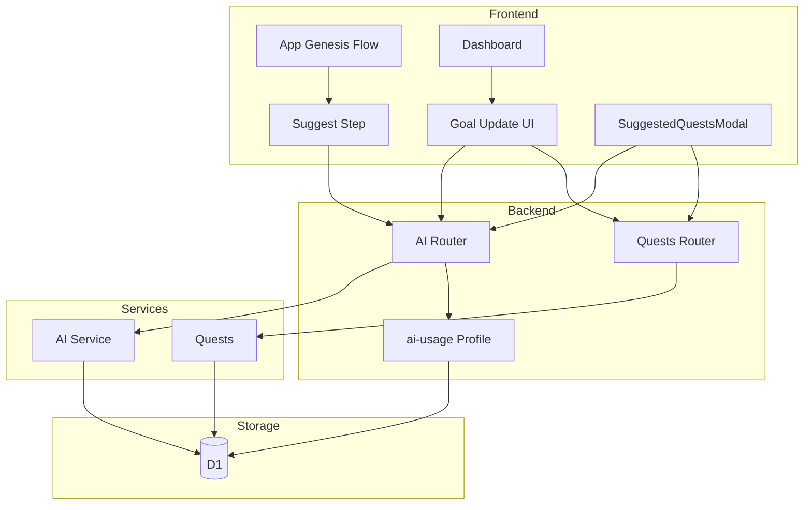
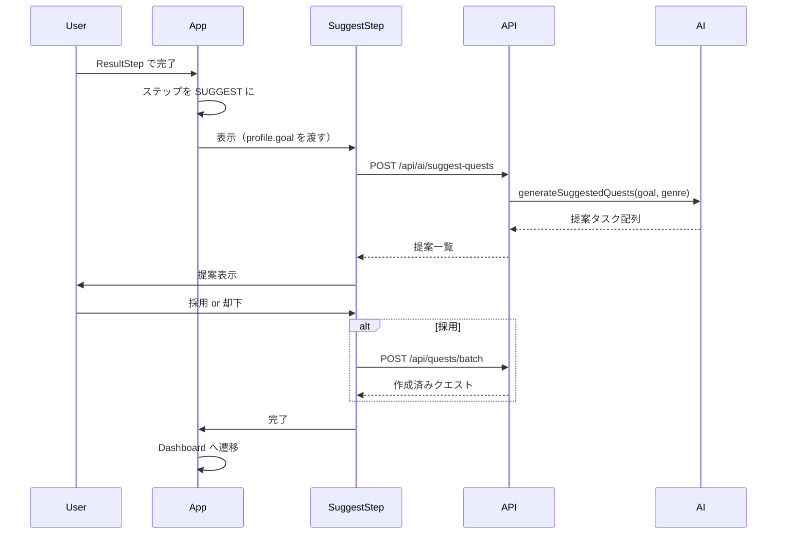
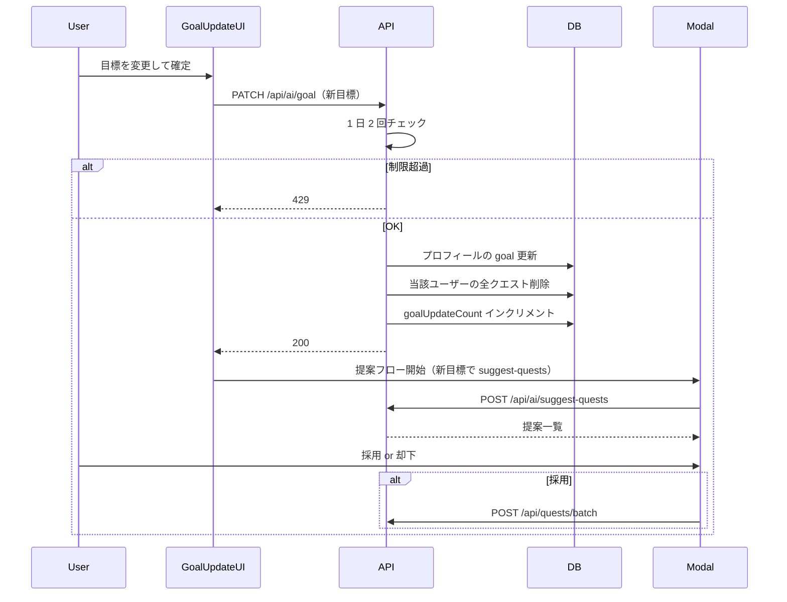

# Technical Design: quest-auto-generation

---
**Purpose**: 目標入力から初期タスクを AI が提案するオンボーディング機能の実装に必要なアーキテクチャとインターフェースを定義する。

---

## Overview

本機能は、ユーザーが入力した目標を AI が実行可能な初期クエスト（タスク）に分解し、提案する。ユーザーが採用・却下した結果を Quest Board に反映し、初回利用時および目標変更時の心理的ハードルを下げる。

**ユーザー**: 新規ユーザー（Genesis 直後の提案）と、既存ユーザー（ダッシュボードで目標を変更した際の提案）の両方。

**影響**: (1) プロフィール JSON に `goal` を追加し永続化する。(2) Genesis フローに「タスク提案」ステップを挿入する。(3) ダッシュボードに目標表示・更新 UI を追加し、目標変更時に既存クエストをリセットしたうえで提案フローを開始する。(4) クエスト一括登録用のバッチ API を新設する。

### Goals

- 目標をプロフィールに保存し、Genesis 完了直後および目標更新時の 2 トリガーでクエスト提案を提供する。
- AI が目標を 3〜7 件の実行可能タスクに分解し、既存クエスト形式（title, type, difficulty）で返す。
- 提案タスクの確認・採用/却下のうえ、採用分を一括で Quest Board に登録する。
- 目標変更は 1 日 2 回に制限し、変更時は当該ユーザーの全クエストを削除する。

### Non-Goals

- 提案タスクの登録前編集（タイトル・種別・難易度の編集）はスコープ外とする。必要であれば将来拡張する。
- クエスト提案の「1 アカウント 1 回」などの追加制限は行わない（目標変更のみ 1 日 2 回）。

---

## Architecture

### Existing Architecture Analysis

- バックエンド: Hono ルートは薄く、サービス層（ai.ts, ai-usage.ts）で AI・D1 を呼ぶ。認証は `authMiddleware`、検証は `zValidator` と Zod スキーマ。
- フロント: API は `lib/api-client.ts` に集約。TanStack Query で一覧・mutation。Genesis は App.tsx でステップ状態を管理。
- プロフィール: キャラクター用は `user_character_profile.profile`（JSON）。取得は GET /ai/character、更新は `updateCharacterProfile`（XP/レベル等の部分更新）。Better Auth の user プロフィール（name, image）は PATCH /api/profile で別管理。
- クエスト: POST /api/quests で 1 件作成のみ。一括作成・一括削除は未実装。

### Architecture Pattern & Boundary Map

- **採用パターン**: 既存の「ルート薄く・サービス層でロジック」を維持。新規は「提案用 UI コンポーネント」「目標更新 API」「suggest-quests API」「quests batch API」。
- **境界**: 提案生成は AI ルート＋AI サービス。目標更新・クエストリセットは AI ルート（または専用ルート）＋ai-usage＋quests。一括登録は quests ルート＋既存 quests サービス（または同スキーマでバッチ処理）。
- **Steering 準拠**: 型・スキーマは `@skill-quest/shared` で共有。API クライアントは `api-client.ts` に集約。

### Technology Stack & Alignment

| Layer | Choice | 本機能での役割 | 備考 |
|-------|--------|----------------|------|
| Frontend | React 19, Vite | Genesis に SUGGEST ステップ追加、Dashboard に目標更新 UI、提案モーダル | 既存パターンに従う |
| Backend | Hono, Cloudflare Workers | suggest-quests エンドポイント、目標更新エンドポイント、quests/batch | 既存ルートと同様 |
| AI | Workers AI Llama 3.1 8B | 目標→タスクリスト生成 | 既存 generateCharacter 等と同様のプロンプト＋JSON 抽出 |
| Data | D1, user_character_profile, ai_daily_usage, quests | goal を profile JSON に保存、goalUpdateCount で 1 日 2 回、クエスト一括削除・一括挿入 | マイグレーションで ai_daily_usage に列追加 |
| Shared | Zod, @skill-quest/shared | 提案リクエスト/レスポンス、バッチリクエスト、CharacterProfile に goal 追加 | 後方互換のため goal はオプショナル |

---

## System Flows

### Genesis 完了直後の提案フロー（1.2, 4.1, 4.2, 4.3）

- Genesis 完了後、ResultStep の次に SUGGEST ステップを表示する。表示時に profile に含まれる goal を使って suggest-quests を呼ぶ（goal が無い場合はフォールバックで入力フォームを表示）。採用時は batch で登録し、完了後に Dashboard へ遷移する。

### ダッシュボードでの目標更新と提案フロー（1.2, 5.3）

- 目標更新 API は「1 日 2 回」をチェックし、成功時に profile.goal 更新・クエスト全削除・goalUpdateCount のインクリメントを行う。クライアントは成功後に提案モーダルを開き、suggest-quests → 採用時は batch で登録する。

---

## Requirements Traceability

| Requirement | Summary | Components | Interfaces | Flows |
|-------------|---------|------------|------------|-------|
| 1.1 | 目標をクエスト生成の入力として利用可能にする | CharacterProfile（goal 追加）, saveCharacterProfile, GET /ai/character | CharacterProfile 型, profile JSON | Genesis 保存時・目標更新時に goal を保存 |
| 1.2 | 目標に基づく提案開始トリガーを提供 | SuggestStep, GoalUpdateUI, suggest-quests API | トリガー 2 種 | Genesis 直後フロー, 目標更新フロー |
| 1.3 | クエスト 0 件時に案内/CTA（オプション） | QuestBoard または Dashboard | - | 空状態で目標から提案する案内を表示可能 |
| 2.1 | 目標を AI に渡しタスクリストを生成 | AI Service, suggest-quests ルート | generateSuggestedQuests, POST /ai/suggest-quests | 上記シーケンス |
| 2.2 | 生成タスクがクエスト形式と整合 | 提案レスポンススキーマ, CreateQuestRequest 互換 | SuggestedQuestItem 型 | AI 出力の正規化 |
| 2.3 | 3〜7 件の妥当な件数 | プロンプト指示 | - | プロンプトで制御 |
| 2.4 | 空・極端に短い目標はスキップ/エラー | suggest-quests バリデーション | goal の min/max, prepareUserPrompt | 400 返却 |
| 3.1 | 提案タスク一覧を表示 | SuggestedQuestsModal, SuggestStep | 提案一覧 UI 契約 | モーダル/ステップで一覧表示 |
| 3.2 | 採用タスクを Quest Board に登録 | quests batch, useQuests または addQuestsBatch | POST /api/quests/batch | バッチ登録フロー |
| 3.3 | 却下時は何も追加しない | クライアントで採用時のみ batch 呼び出し | - | 却下時は API 呼び出しなし |
| 3.4 | 登録前編集（オプション） | スコープ外 | - | - |
| 4.1 | Genesis の目標を利用 | profile.goal, SuggestStep | GET /ai/character に goal 含む | Genesis 直後は profile の goal を使用 |
| 4.2 | 生成中ローディング表示 | SuggestStep, Modal | ローディング状態 | suggest-quests 呼び出し中に表示 |
| 4.3 | 登録完了後 Quest Board に表示 | invalidateQuests, Dashboard | - | バッチ成功後に invalidate |
| 5.1 | AI 失敗・タイムアウト時のメッセージ | suggest-quests ルート, フロント | エラーレスポンス, 再試行案内 | 5xx/タイムアウト時にユーザーに表示 |
| 5.2 | 目標制約未達時は修正を促す | suggest-quests バリデーション | 400 + message | クライアントで表示 |
| 5.3 | レート制限・AI 利用量ポリシーに従う | ai_daily_usage, goal 更新 1 日 2 回 | goalUpdateCount, 429 | 目標更新 API で適用 |

---

## Components & Interfaces

### クイック参照

| Component | Domain/Layer | Intent | Req | Key Dependencies | Contracts |
|-----------|--------------|--------|-----|------------------|-----------|
| CharacterProfile（拡張） | Shared | goal を追加したプロフィール型 | 1.1, 4.1 | - | 型・スキーマ |
| AI Service（拡張） | Backend | 目標→タスク提案生成 | 2.1, 2.2, 2.3 | runWithLlama31_8b, Bindings | Service |
| suggest-quests ルート | Backend | 提案生成 API、目標バリデーション | 2.1, 2.4, 5.1, 5.2 | AiService, getCharacterProfile, prepareUserPrompt | API |
| goal 更新ルート | Backend | 目標更新・1 日 2 回・クエスト全削除 | 1.2, 5.3 | ai-usage, quests 削除 | API |
| quests batch ルート | Backend | クエスト一括作成 | 3.2 | createQuestSchema, D1 | API |
| SuggestStep | Frontend | Genesis 直後の提案ステップ | 1.2, 3.1, 4.2, 4.3 | profile, suggestQuests, createQuestsBatch | State, API クライアント |
| GoalUpdateUI | Frontend | 目標表示・編集・確定 | 1.2, 5.3 | updateGoal, suggestQuests | API クライアント |
| SuggestedQuestsModal | Frontend | 提案一覧・採用/却下・ローディング・エラー | 3.1, 3.2, 3.3, 5.1 | useSuggestQuests, addQuestsBatch | Props |
| useSuggestQuests | Frontend | 提案 API 呼び出しと状態 | 2.1, 4.2 | api-client | Hook 契約 |

### Backend

#### AI Service（拡張）

| Field | Detail |
|-------|--------|
| Intent | 目標とオプションの genre を受け取り、実行可能なタスクの配列を生成する。 |
| Requirements | 2.1, 2.2, 2.3 |

**Responsibilities & Constraints**

- 既存 `runWithLlama31_8b` を用い、プロンプトで「3〜7 件、各要素は title, type（TaskType）, difficulty（Difficulty）」の JSON 配列を指示する。
- 出力をパースし、既存 CreateQuestRequest に変換可能な形で返す。不正な要素はスキップまたはデフォルト値で補正する。
- フォールバック: AI 失敗時は空配列またはエラーを呼び出し元に返す。

**Contracts**: Service [x]

##### Service Interface

- `generateSuggestedQuests(goal: string, genre?: Genre): Promise<SuggestedQuestItem[]>`  
  - 事前条件: goal は呼び出し元で長さ検証済み（1〜500 文字など）。  
  - 事後条件: 返却配列の各要素は title, type, difficulty を持ち、既存 createQuestSchema で検証可能。  
  - 例外: AI タイムアウトやパース失敗時は空配列またはエラー。

#### suggest-quests ルート

| Field | Detail |
|-------|--------|
| Intent | 認証ユーザーの目標に基づき AI でタスク提案を生成し、JSON で返す。 |
| Requirements | 2.1, 2.4, 5.1, 5.2 |

**Contracts**: API [x]

##### API Contract

| Method | Endpoint | Request | Response | Errors |
|--------|----------|---------|----------|--------|
| POST | /api/ai/suggest-quests | SuggestQuestsRequest（goal 必須、genre 任意。goal は 1〜500 文字） | { suggestions: SuggestedQuestItem[] } | 400（目標不正）, 429（他制限）, 500/502（AI 失敗） |

- 認証必須。body の goal を prepareUserPrompt でサニタイズし、長さチェック。プロフィールから genre を取得して AI に渡す。AI 失敗時は 500 または 502 とメッセージを返し、クライアントで再試行案内を表示する。

#### goal 更新ルート

| Field | Detail |
|-------|--------|
| Intent | キャラクター用プロフィールの goal を更新し、当該ユーザーの全クエストを削除する。1 日 2 回まで。 |
| Requirements | 1.1, 1.2, 5.3 |

**Contracts**: API [x]

##### API Contract

| Method | Endpoint | Request | Response | Errors |
|--------|----------|---------|----------|--------|
| PATCH | /api/ai/goal | { goal: string }（1〜500 文字） | { ok: true } または 更新後 profile の一部 | 400（目標不正）, 429（本日 2 回まで更新済み） |

- 認証必須。ai_daily_usage の goalUpdateCount を確認し、2 以上なら 429。2 未満なら profile の goal を updateCharacterProfile で更新し、当該 userId の quests を全削除し、goalUpdateCount をインクリメントする。

**Implementation Notes（原子性）**: 実装時に、profile 更新・クエスト全削除・goalUpdateCount インクリメントの 3 操作は、D1 トランザクション内で実行するか、いずれか失敗時は 500 を返してクライアントのリトライを可能にすること。部分完了（例: 目標だけ更新されクエストが残る）を避ける。

#### quests batch ルート

| Field | Detail |
|-------|--------|
| Intent | 複数クエストを一括作成する。 |
| Requirements | 3.2 |

**Contracts**: API [x]

##### API Contract

| Method | Endpoint | Request | Response | Errors |
|--------|----------|---------|----------|--------|
| POST | /api/quests/batch | { quests: CreateQuestRequest[] }（配列長は上限あり、例: 最大 20） | 作成されたクエスト一覧（既存 toQuestResponse 形式の配列） | 400（バリデーション）, 413（件数超過） |

- 認証必須。各要素を createQuestSchema で検証し、順次 INSERT してから一覧を返す。トランザクションは実装方針で決定（部分失敗を許容するかは設計では指定しない）。

### Frontend

#### SuggestStep

| Field | Detail |
|-------|--------|
| Intent | Genesis 直後に表示され、profile.goal で提案を取得し、採用/却下後に Dashboard へ進む。 |
| Requirements | 1.2, 3.1, 4.2, 4.3 |

**Dependencies**

- Inbound: App — profile（goal 含む）を渡す (P0)。  
- Outbound: api-client（suggestQuests, createQuestsBatch）(P0)。

**Implementation Notes**

- goal が無い場合は簡易入力フォームを表示し、入力後に suggestQuests を呼ぶ。ローディング中は 4.2 に従い表示。採用時は createQuestsBatch を呼び、成功後に invalidateQuests してから Dashboard へ遷移する。

#### GoalUpdateUI

| Field | Detail |
|-------|--------|
| Intent | ダッシュボード上で現在の目標を表示し、編集・確定する。確定時に目標更新 API を呼び、成功したら提案モーダルを開く。 |
| Requirements | 1.2, 5.3 |

**Dependencies**

- Inbound: Dashboard — profile（goal 含む）(P0)。  
- Outbound: api-client（updateGoal, suggestQuests）(P0)。

**Implementation Notes**

- 1 日 2 回制限超過時は 429 を受け取り、メッセージを表示する。配置は StatusPanel 付近や設定風モーダルなど実装時に決定する。

#### SuggestedQuestsModal

| Field | Detail |
|-------|--------|
| Intent | 提案タスク一覧を表示し、採用・却下を選択させる。採用時は batch で登録し、閉じた後に Quest Board を更新する。 |
| Requirements | 3.1, 3.2, 3.3, 5.1 |

**Contracts**: State [x] — 開閉状態、提案一覧、ローディング、エラー文言を親が管理するか、フックに委譲するかは実装で決定。

**Implementation Notes**

- エラー時は 5.1 に従い再試行または後で試す案内を表示する。

### Shared

#### 型・スキーマ

- **CharacterProfile**: 既存に `goal?: string` を追加。後方互換のためオプショナル。
- **SuggestedQuestItem**: `{ title: string; type: TaskType; difficulty: Difficulty }`。CreateQuestRequest の部分集合。
- **SuggestQuestsRequest**: `{ goal: string; genre?: Genre }`。Zod で goal を 1〜500 に制限。
- **createQuestBatchSchema**: `z.object({ quests: z.array(createQuestSchema).min(1).max(20) })`。型は `CreateQuestBatchRequest` としてエクスポート。

---

## Data Models

### Domain Model

- **Aggregate**: ユーザーに紐づくキャラクター用プロフィール（goal 含む）と、そのユーザーのクエスト一覧。
- **Invariant**: 目標更新は 1 日 2 回まで。目標更新が成功した時点で、そのユーザーの既存クエストはすべて削除される。

### Logical Data Model

- **user_character_profile.profile**: JSON に `goal` フィールドを追加。既存レコードには無くてもよい（undefined 扱い）。**Genesis 時の保存**: generate-character ハンドラ内で、AI が返した profile にリクエスト body の goal をマージしてから saveCharacterProfile を呼ぶこと。これにより GET /ai/character および SuggestStep で profile.goal を参照できる（4.1, 1.1）。
- **ai_daily_usage**: 列 `goal_update_count`（integer, default 0）を追加。同一 (userId, dateUtc) で目標更新時にインクリメント。2 未満なら許可、2 以上ならその日は更新不可（429）。
- **quests**: 変更なし。目標更新時に当該 userId の行を一括 DELETE する。

### Data Contracts & Integration

- **GET /ai/character**: レスポンスの profile に `goal?: string` が含まれる。
- **PATCH /ai/goal**: リクエスト `{ goal: string }`。Zod で 1〜500 文字。
- **POST /ai/suggest-quests**: リクエスト `SuggestQuestsRequest`。レスポンス `{ suggestions: SuggestedQuestItem[] }`。
- **POST /quests/batch**: リクエスト `{ quests: CreateQuestRequest[] }`。レスポンスは既存クエスト 1 件取得と同形式の配列。

---

## Error Handling

### Error Strategy

- **入力エラー**: goal の長さ・内容不正 → 400 とフィールドレベルのメッセージ。
- **制限超過**: 目標更新の 1 日 2 回超過 → 429 と「本日は目標の変更回数（2回）に達しています」などのメッセージ。
- **AI 失敗・タイムアウト**: suggest-quests で 500/502 を返し、クライアントで「しばらく経ってから再試行してください」を表示。
- **バッチ登録のバリデーションエラー**: 400。クライアントでは提案一覧の再表示や部分採用は実装方針に委ねる。

### Monitoring

- 既存ロギング・エラーハンドラに従う。suggest-quests の AI 失敗、目標更新の 429 はログに残す。

---

## Testing Strategy

- **Unit**: (1) generateSuggestedQuests のプロンプト構築とパース（モック AI）。(2) 目標更新時の 1 日 2 回チェックとクエスト削除のモック。(3) バッチ作成のバリデーション（createQuestBatchSchema）。
- **Integration**: (1) POST /ai/suggest-quests の認証・バリデーション・スタブ AI での応答。(2) PATCH /ai/goal の 1 日 2 回・profile 更新・クエスト削除。(3) POST /quests/batch の複数件作成と GET /quests での取得。
- **E2E/UI**: (1) Genesis 完了 → SUGGEST 表示 → 採用 → Dashboard でクエストが表示される。(2) ダッシュボードで目標変更 → 提案表示 → 採用でクエストが差し替わる。(3) 目標を 3 回変更しようとして 3 回目が 429 で案内が出る。

---

## Supporting References

- 調査・判断の詳細: `research.md`
- 既存 AI 利用制限: `apps/backend/src/services/ai-usage.ts`
- 既存クエストスキーマ: `packages/shared/src/schemas.ts`（createQuestSchema）
