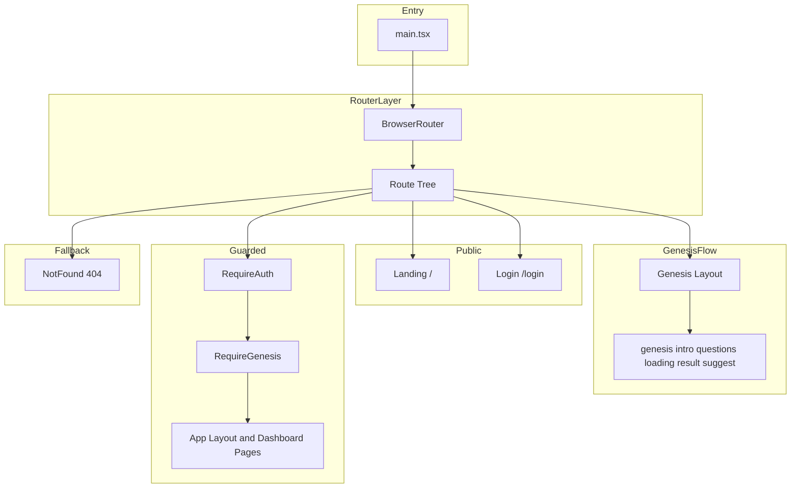

# 技術設計: routing-seo-ux

---

## Overview

本機能は、ルーティング戦略により UI/UX と SEO を一体的に改善する。現状は認証済みかつ Genesis 完了後のダッシュボードのみ URL が付いており、ランディング・ログイン・Genesis は状態駆動で URL が無い。**Option B（トップレベル単一路由＋ガード）** を採用し、アプリ最上位で単一のルーターを配置し、全画面に一意の URL を割り当てる。未認証時はログイン URL へリダイレクトし行き先（returnUrl）を保持、Genesis 未完了時は Genesis 用 URL へリダイレクトする。あわせてルート別のページタイトル・メタタグと 404 画面を導入する。

**対象ユーザー**: 一般利用者（ブックマーク・共有・ブラウザ戻るで期待どおりに動作する体験）、検索・SNS クローラー（公開ページで適切なメタが得られる）。

**影響**: フロントエンドのエントリ（main.tsx）でルーターをマウントし、App.tsx はルートツリーから参照される画面のオーガナイザーに縮小する。既存の useAuth / useGenesisOrProfile / ProfileProvider / 各 Page は維持し、ガードとルート定義を新規コンポーネントで追加する。

### Goals

- 全主要画面に一意の URL を付与し、ブックマーク・共有・リロード・戻るで一貫した体験を提供する（1.x, 2.x）。
- 認証／Genesis 完了状態に応じたガードとリダイレクト、およびログイン後の returnUrl 遷移を実現する（4.x）。
- 公開・非公開ルートに応じたページタイトル・メタ説明・OG 等を設定し、非公開は noindex 等で制御する（3.x）。
- 未定義パスでは 404 画面を表示し、正規 URL を単一に定める（5.x）。

### Non-Goals

- サーバーサイドレンダリング（SSR）やプリレンダーによるメタ配信（要件 3.3 の完全充足）は本スコープ外。クライアントでのメタ設定を優先し、将来検討とする。
- 動的 OGP 画像生成（EP-24）は別スペックとする。
- バックエンドのルーティング・API 設計の変更は行わない。

---

## Architecture

### Existing Architecture Analysis

- **現状**: `App.tsx` が useAuth / useGenesisOrProfile で分岐し、認証済み＋Genesis 完了時のみ `AuthenticatedApp`（内側で BrowserRouter + Routes）を描画。ダッシュボードは `/`, `/quests`, `/grimoire`, `/partner`, `/items` が URL 対応。ランディング・ログイン・Genesis は URL なし。
- **維持する境界**: 認証は useAuth（Better Auth）、Genesis 完了判定は useGenesisOrProfile（GET /api/ai/usage, getCharacterProfile）。ProfileProvider とダッシュボード配下の Page コンポーネントはそのまま利用する。
- **変更点**: ルーターを main.tsx 直下に移し、全画面をルートツリーで定義。RequireAuth / RequireGenesis でガード。App.tsx は「ランディング／ログイン／Genesis／ダッシュボード」のいずれかを描画する責務に縮小し、どのルートでどのブロックを描画するかはルート定義に委ねる。

### Architecture Pattern & Boundary Map

- **採用パターン**: トップレベル単一路由（Option B）。単一の BrowserRouter（または createBrowserRouter）とルート配列で全画面を定義し、ガードをレイアウト要素で表現する。
- **境界**: 公開ルート（/, /login）／Genesis ルート（/genesis, /genesis/:step）／認証＋Genesis 完了必須ルート（/app, /app/*）／404（*）。各領域はルート要素またはラッパーでガードする。
- **既存パターン維持**: 認証・プロフィール取得は既存 hooks と API クライアント。UI は既存の LandingPage, LoginSignupForm, Genesis 各 Step, AppLayout + pages を流用。
- **新規コンポーネント**: ルート定義（routeConfig または router.tsx）、RequireAuth、RequireGenesis、PageMeta（または usePageMeta）、NotFoundPage。必要に応じて _redirects（SPA フォールバック明示用）。
- **Steering 準拠**: フロントは React + Vite、パスエイリアス `@/`、コンポーネントは PascalCase、hooks は use プレフィックス。バックエンドは変更しない。

### Technology Stack

| Layer | Choice / Version | Role in Feature | Notes |
|-------|------------------|-----------------|-------|
| Frontend | React 19 + Vite | 既存 | 変更なし |
| Frontend | react-router-dom ^7 | ルーティング・Navigate・Outlet・ルート定義 | 既存。トップレベルにルーターを移動しルートを拡張 |
| Frontend | 新規: ルート設定・ガード・PageMeta・NotFound | ルートツリー、認証/Genesis ガード、メタ、404 | 新規コンポーネント/フック |
| Infrastructure | Cloudflare Pages | 静的/SPA 配信 | 404.html が無いため既定で SPA 扱い。必要なら _redirects で明示 |

---

## Requirements Traceability

| Requirement | Summary | Components | Interfaces | Flows |
|-------------|----------|-------------|-------------|-------|
| 1.1 | 各主要画面に一意 URL | Router, routeConfig | Path constants | Route tree |
| 1.2 | 未認証で認証必須 → /login へ | RequireAuth | — | Guard redirect |
| 1.3 | 認証済み・Genesis 未完了で /app 等 → Genesis へ | RequireGenesis | — | Guard redirect |
| 1.4 | 認証済み・Genesis 完了で /genesis 等 → /app へ | Genesis レイアウト（親要素） | — | レイアウト内で useGenesisOrProfile を参照し kind === 'dashboard' なら Navigate to /app（後述「要件 1.4 の実装責任」） |
| 1.5 | 単一ルーティング方式で URL と画面一致 | Router, routeConfig | — | パスベース一貫 |
| 2.1 | 画面遷移で URL 更新（フルリロードなし） | React Router の navigate | — | クライアント遷移 |
| 2.2 | 戻る・進むで URL と画面一致 | Router | — | History API 連動 |
| 2.3 | リロード・新タブで正しい画面 or リダイレクト | RequireAuth, RequireGenesis, useGenesisOrProfile | — | ガード＋API で状態解決 |
| 2.4 | モーダル閉じ後 URL が無効にならない | モーダルは URL に載せない方針で既存のまま | — | — |
| 3.1 | 公開ルートごとの一意なページタイトル | PageMeta / usePageMeta | RouteMetaConfig | ルート描画時にメタ更新 |
| 3.2 | インデックス対象の meta description / OG | PageMeta | RouteMetaConfig | 同上 |
| 3.3 | メタのサーバー/プリレンダー配信 | — | — | 将来検討（本スコープではクライアントのみ） |
| 3.4 | 非公開ルートのメタで機密を出さない／noindex | PageMeta（非公開用汎用タイトル＋robots） | RouteMetaConfig | ルート種別で分岐 |
| 4.1 | 未認証時リダイレクト＋returnUrl 保持とログイン後遷移 | RequireAuth, Login ラッパー | returnUrl クエリ検証 | RequireAuth が returnUrl 付与。ログイン成功後はラッパーが returnUrl を検証して navigate（後述「要件 4.1 の returnUrl 適用」） |
| 4.2 | Genesis 未完了で /app 等 → Genesis へ | RequireGenesis | — | Guard redirect |
| 4.3 | Genesis 完了後 /app へ遷移しリロードで復元 | Genesis 完了ハンドラで navigate(/app) | — | 既存 API でプロフィール取得 |
| 4.4 | サインアウト時クリアと /login へリダイレクト | useAuth signOut + Navigate / navigate | — | サインアウト後に /login へ |
| 5.1 | 未定義パスで 404 画面と HTTP/タイトル | NotFoundPage, キャッチオールルート | — | * ルート |
| 5.2 | ルート/ランディングの正規 URL | routeConfig | 正規パス定数 | / をランディング正規形 |
| 5.3 | クエリ/ハッシュの不正値の扱い | Login 画面、ルート読み取り | returnUrl, mode 検証 | デフォルトへ正規化 |

---

## Components and Interfaces

| Component | Domain/Layer | Intent | Req Coverage | Key Dependencies | Contracts |
|-----------|--------------|--------|--------------|------------------|-----------|
| routeConfig (or router) | Frontend / Routing | ルートツリーとパス定数の定義 | 1.1, 1.5, 5.2 | React Router (P0) | State |
| RequireAuth | Frontend / Guard | 認証必須ルートのガード、未認証時 /login?returnUrl= へ | 1.2, 4.1, 4.4 | useAuth (P0), Navigate (P0) | State |
| RequireGenesis | Frontend / Guard | Genesis 完了必須のガード、未完了時 /genesis へ | 1.3, 4.2 | useGenesisOrProfile (P0), Navigate (P0) | State |
| PageMeta / usePageMeta | Frontend / SEO | ルート別 title・description・robots の設定 | 3.1, 3.2, 3.4 | ルートメタ設定 (P0) | State |
| NotFoundPage | Frontend / UI | 404 画面の表示と document.title の設定 | 5.1 | — | State |
| App (refactor) | Frontend / Orchestration | ランディング／ログイン／Genesis／ダッシュボードの描画ブロック提供 | 2.x, 4.x | 既存 components, ProfileProvider | State |
| DashboardLayout (ex AuthenticatedApp) | Frontend / Layout | ProfileProvider + AppLayout + Outlet | 1.1, 2.x | ProfileProvider, AppLayout, pages (P0) | State |

上記のうち、**新規境界を導入する**のは routeConfig、RequireAuth、RequireGenesis、PageMeta（または usePageMeta）、NotFoundPage。App と DashboardLayout は既存責務の縮小・移動である。

**新規成果物の配置方針**（steering の Frontend Layout および命名規則に準拠）:

| 成果物 | 配置先 | 備考 |
|--------|--------|------|
| ルート定義・パス定数 | `src/routes.tsx` または `src/router.tsx`。パス定数のみ別にする場合は `src/lib/paths.ts` | kebab-case ファイル名（routes.tsx）または router.tsx |
| RequireAuth, RequireGenesis | `src/components/guards/`（例: `RequireAuth.tsx`, `RequireGenesis.tsx`）または `src/layouts/guards/` | PascalCase コンポーネント |
| PageMeta | `src/components/PageMeta.tsx` | PascalCase |
| usePageMeta | `src/hooks/usePageMeta.ts` | use プレフィックス |
| NotFoundPage | `src/pages/NotFoundPage.tsx` | 既存 pages/ と同様 |

**要件 1.4 の実装責任**: `/genesis` および `/genesis/:step` を描画する**親レイアウト（またはその直下のラッパー）**が `useGenesisOrProfile` を参照し、`kind === 'dashboard'` のときは `<Navigate to={PATH_APP} replace />` を返す。これにより認証済み・Genesis 完了済みユーザーが Genesis URL にアクセスした場合は /app へリダイレクトされる。

**要件 4.1 の returnUrl 適用**: ログイン/サインアップを表示するルートの element となる**ラッパーコンポーネント**が `useSearchParams` で `returnUrl` を取得する。認証成功コールバック（例: LoginSignupForm の onSuccess の後）で、returnUrl が有効（同一オリジンかつアプリ内パス、例: /app で始まる）なら `navigate(returnUrl)`、無効または無ければ `navigate(PATH_APP)` する。無効な returnUrl は捨てて /app へフォールバックする。

### Frontend / Routing

#### routeConfig（ルート定義）

| Field | Detail |
|-------|--------|
| Intent | アプリ全体のルートツリーとパス定数を一箇所で定義する。 |
| Requirements | 1.1, 1.5, 5.2 |

**Responsibilities & Constraints**

- パス定数（例: `PATH_LANDING = '/'`, `PATH_LOGIN = '/login'`, `PATH_GENESIS = '/genesis'`, `PATH_APP = '/app'`）をエクスポートし、ガードやナビゲーションで参照する。
- ルートオブジェクトまたは JSX の Route ツリーで、/, /login, /genesis, /genesis/:step, /app, /app/quests 等を定義。最後に path="*" で NotFoundPage を表示する。
- 正規形: ランディングは `/`。ダッシュボードのルートは `/app`（index は `/app` または `/app/`）。

**Dependencies**

- Inbound: なし（エントリから参照される）
- Outbound: React Router の Route / createBrowserRouter 用のルート配列
- External: react-router-dom (P0)

**Contracts**: State [x]

##### State Management

- ルート設定は定数または静的設定オブジェクト。実行時状態は持たない。
- パス定数は TypeScript の as const 等で型安全に利用する。

**Implementation Notes**

- 既存の AuthenticatedApp 内の Routes は、/app を親にした子ルート（index, quests, grimoire, partner, items）に移す。AppLayout は /app の element として配置する。
- 移行時に `/quests` 等の旧パスから `/app/quests` へのリダイレクトを入れるかはタスクで判断する。

---

#### RequireAuth

| Field | Detail |
|-------|--------|
| Intent | 子要素を描画する前に認証を確認し、未認証なら /login へリダイレクトする。returnUrl を付与する。 |
| Requirements | 1.2, 4.1, 4.4 |

**Responsibilities & Constraints**

- useAuth で isAuthenticated と isLoading を取得。loading 中は読み込み表示（既存と同様）。
- 未認証なら `<Navigate to={`${PATH_LOGIN}?returnUrl=${encodeURIComponent(location.pathname + location.search)}`} replace />` とする。遷移先は同一オリジンかつアプリ内パスのみ許可し、無効な returnUrl は捨てる（セキュリティ）。
- 認証済みなら children を描画する。

**Dependencies**

- Inbound: ルートから子としてレンダリングされる
- Outbound: useAuth (P0), Navigate (P0), useLocation (P0)
- External: react-router-dom (P0)

**Contracts**: State [x]

##### State Management

- 認証状態は useAuth に依存。本コンポーネントは状態を保持しない。

**Implementation Notes**

- returnUrl の検証: 許可するパスプレフィックス（例: `/app`）または許可リストでチェックし、それ以外は returnUrl を付与しないか `/app` にフォールバックする。

---

#### RequireGenesis

| Field | Detail |
|-------|--------|
| Intent | 認証済みユーザーのうち、Genesis 完了済みの場合のみ子要素を描画。未完了なら /genesis へリダイレクトする。 |
| Requirements | 1.3, 4.2 |

**Responsibilities & Constraints**

- useGenesisOrProfile で kind を取得。loading の場合は読み込み表示。genesis の場合は `<Navigate to={PATH_GENESIS} replace />`。dashboard の場合のみ children を描画。
- RequireAuth の内側に配置する想定（認証済みであることが前提）。

**Dependencies**

- Inbound: RequireAuth の子として配置
- Outbound: useGenesisOrProfile (P0), Navigate (P0)
- External: なし

**Contracts**: State [x]

**Implementation Notes**

- 既存の useGenesisOrProfile の戻り値（kind: 'loading' | 'genesis' | 'dashboard' | 'error'）をそのまま利用する。error の扱い（Genesis へ誘導するかエラー表示するか）は既存方針に合わせる。

---

#### PageMeta / usePageMeta

| Field | Detail |
|-------|--------|
| Intent | ルートに応じて document.title と meta description、必要に応じて og:title 等および robots を設定する。 |
| Requirements | 3.1, 3.2, 3.4 |

**Responsibilities & Constraints**

- ルートパスまたはルート ID に応じたメタ情報を設定オブジェクト（RouteMetaConfig）で持つ。公開ルート（/, /login）は一意な title と description。非公開（/app/*, /genesis/*）は汎用タイトルと `meta name="robots" content="noindex, nofollow"` を設定。
- コンポーネントの場合はレンダリング時に useEffect で document.title と meta タグを更新。フックの場合は呼び出し元で同様に実行する。

**Dependencies**

- Inbound: 各ルート要素またはレイアウトから参照
- Outbound: なし（DOM 直接操作または react-helmet-async は使わず document でよい）
- External: なし

**Contracts**: State [x]

##### State Management

- メタ設定は読み取り専用の設定オブジェクト。ルートとメタの対応は TypeScript の型で表現する。

**Implementation Notes**

- 非公開ルートでは機密を含めず、noindex でインデックスを避ける。3.3 のサーバー/プリレンダーは本スコープでは実装しない。

---

#### NotFoundPage

| Field | Detail |
|-------|--------|
| Intent | 未定義パスで表示する 404 画面と、クローラー・ユーザーが「見つからない」と分かる document.title の設定。 |
| Requirements | 5.1 |

**Responsibilities & Constraints**

- 専用の 404 用 UI を表示する。document.title は「ページが見つかりません | Skill Quest AI」等に設定する。環境が許す場合は HTTP ステータスは Vite/Pages の SPA ではクライアントでは変更できないため、タイトルと UI で明示する。

**Dependencies**

- Inbound: ルート path="*" の element
- Outbound: なし
- External: なし

**Contracts**: State [x]

**Implementation Notes**

- トップに「404」「ページが見つかりません」と表示し、ランディングやログインへのリンクを置く。

---

### Data Models

本機能では永続化するデータモデルは増やさない。ルートとメタの対応はフロントの設定オブジェクトとして扱う。

#### RouteMetaConfig（論理）

- **構造**: ルートパス（またはルートキー）をキーに、`{ title: string; description?: string; noindex?: boolean }` を持つ。
- **用途**: PageMeta / usePageMeta が参照する。公開ルートは title と description を設定、非公開は noindex と汎用 title を設定する。

---

## Error Handling

### Error Strategy

- **404**: 未定義パスはキャッチオールルートで NotFoundPage を表示し、document.title を 404 用に設定する（5.1）。
- **無効な returnUrl**: ログイン成功後の遷移先として returnUrl を使う前に、同一オリジンかつアプリ内パス（例: /app で始まる）に限定し、それ以外は /app へ遷移する（オープンリダイレクト防止）。
- **無効な /genesis/:step**: intro|questions|loading|result|suggest 以外の値は intro に正規化するか /genesis/intro へリダイレクトする（5.3）。

### Monitoring

- ルーティング・ガードの失敗は既存のフロントエンドエラーハンドリングに準じる。特段の新規ログは不要とする。

---

## Testing Strategy

- **Unit**: RequireAuth / RequireGenesis の「認証済みなら children 表示」「未認証なら Navigate の to が /login であること」をモックで検証。routeConfig のパス定数とルートの対応が期待どおりであることをテスト。
- **Integration**: 認証状態を変えながら /app にアクセスしたときに /login にリダイレクトされること、ログイン後に returnUrl があればそのパスに遷移すること。Genesis 未完了で /app にアクセスしたときに /genesis にリダイレクトされること。
- **E2E/UI**: ランディング → ログイン → Genesis 完了 → ダッシュボードの一連の遷移で URL が変わり、リロードで同じ画面が復元されること。未定義パスで 404 画面が表示されること。

---

## Security Considerations

- **returnUrl の検証**: ログイン/サインアップ成功後の遷移先に returnUrl を使う場合、同一オリジンかつアプリ内パス（/app で始まる等）に限定する。それ以外は /app へフォールバックし、オープンリダイレクトを防ぐ。
- **認証必須ルート**: RequireAuth により未認証ユーザーは /app や /genesis の完了後専用リソースにアクセスできず、ログイン URL へ誘導される。既存の Better Auth セッション管理に依存する。

---

## Supporting References

- 調査・設計判断: `.kiro/specs/routing-seo-ux/research.md`
- ギャップ分析: `.kiro/specs/routing-seo-ux/gap-analysis.md`
- 画面遷移図（現状）: `docs/architecture/10_画面遷移図.md`
