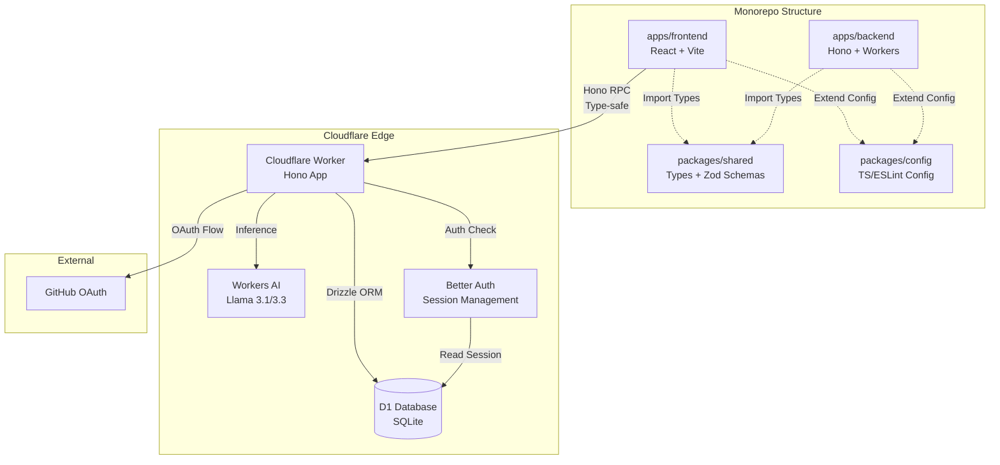
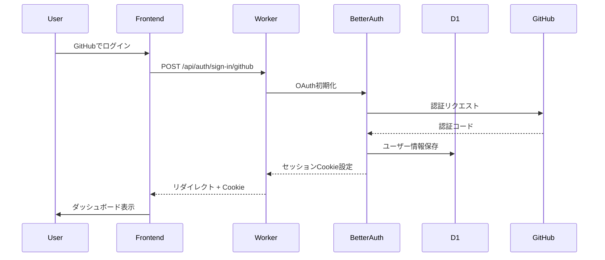
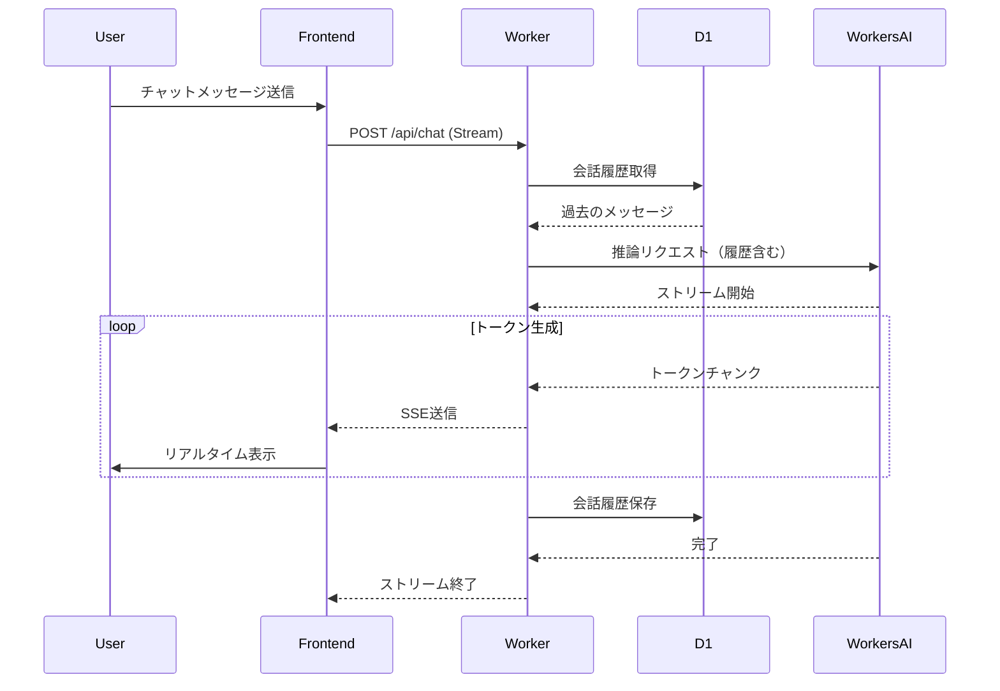
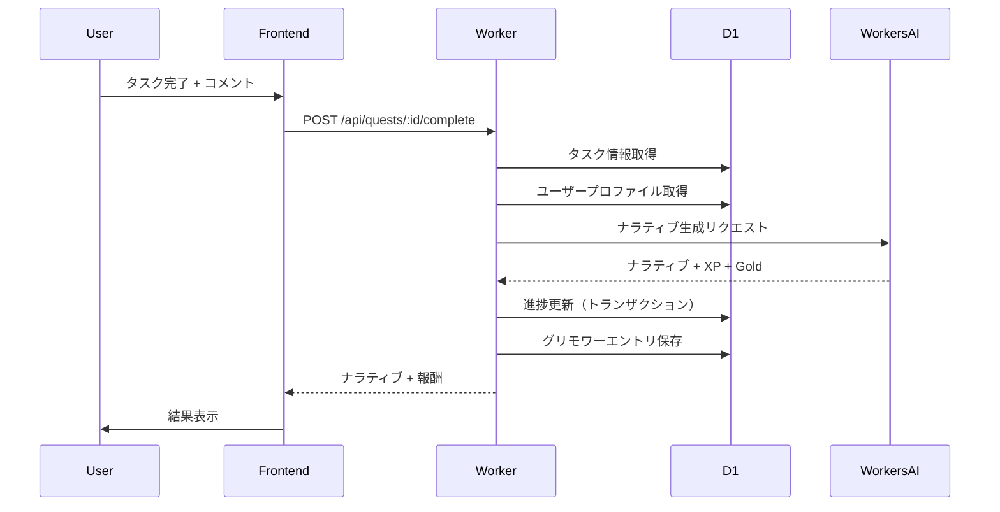
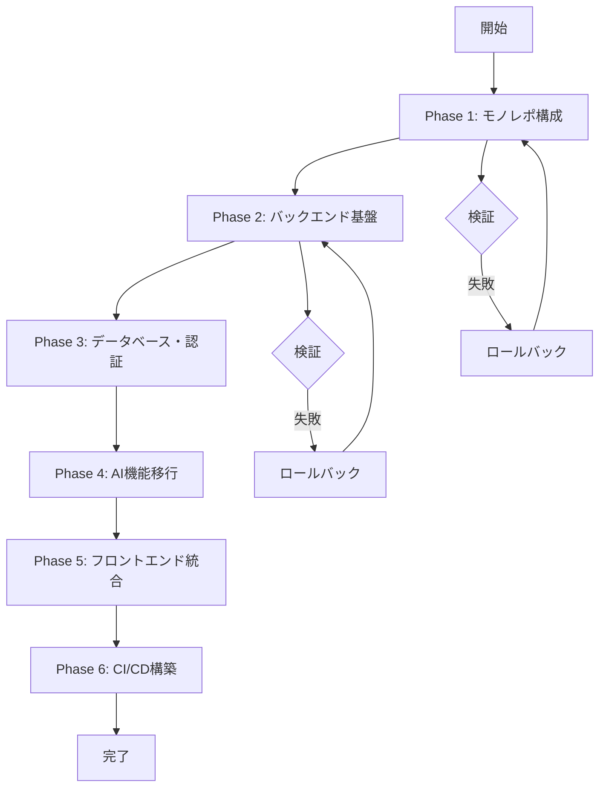

# Design Document

## Overview

本機能は、既存のSkill Quest AIフロントエンドアプリケーションを、Cloudflare Workers + D1 + Workers AIを中核としたエッジファーストの分散型アーキテクチャに拡張することを目的とします。モノレポ構成による型安全な開発環境、Hono RPCによるエンドツーエンドの型共有、Better Authによる認証、Workers AIによるAI機能統合を実現します。

**ユーザー**: 開発者は型安全で効率的な開発環境を利用でき、エンドユーザーは低レイテンシで高品質なAI体験を得られます。

**影響**: 既存のGemini API依存のフロントエンドを、Cloudflareエコシステムに完全移行し、バックエンドAPI、認証、データベース、AI機能を統合した本番環境を構築します。

### Goals
- モノレポ構成による型安全な開発環境の構築
- Cloudflare Workers上でのエッジファーストAPIの実装
- Better Authによる安全な認証システムの統合
- Workers AIによる低コストで高性能なAI機能の実現
- Hono RPCによるエンドツーエンドの型共有
- CI/CDパイプラインによる自動デプロイメント

### Non-Goals
- 既存のフロントエンドUIの大幅な変更（機能は維持しつつ、バックエンド接続を変更）
- 複数のOAuthプロバイダー対応（初期はGitHubのみ）
- RAG（Retrieval-Augmented Generation）機能の実装（将来の拡張として保留）
- リアルタイム通信（WebSocket等）の実装（SSEによるストリーミングのみ）

## Architecture

### Existing Architecture Analysis

**現在の構成**:
- フロントエンド: React + Vite（`apps/frontend`）
- AI統合: Google Gemini API（`geminiService.ts`）
- 状態管理: ローカルステート（`UserState`）
- データ永続化: なし（ブラウザローカルストレージのみ）

**制約と課題**:
- バックエンドが存在せず、APIキーがフロントエンドに露出するリスク
- データ永続化がなく、ユーザーデータが失われる
- 型安全性がフロントエンド内に限定される
- 認証機能が存在しない

**統合ポイント**:
- 既存のUIコンポーネント（`Dashboard`, `QuestBoard`, `Grimoire`等）は維持
- 型定義（`types.ts`）は`packages/shared`に移行し、バックエンドと共有
- `geminiService.ts`の機能はWorkers AIエンドポイントに置き換え

### Architecture Pattern & Boundary Map



**アーキテクチャ統合**:
- **選択パターン**: モノレポ + エッジファーストアーキテクチャ
- **ドメイン境界**: フロントエンド（プレゼンテーション層）、バックエンド（ビジネスロジック層）、共有パッケージ（型定義層）
- **既存パターンの維持**: Reactコンポーネント構造、型定義の命名規則
- **新規コンポーネントの理由**: 
  - `apps/backend`: Cloudflare Workers上でAPIを提供
  - `packages/shared`: 型定義とZodスキーマの共有
  - `packages/config`: 開発環境の統一
- **Steering準拠**: 型安全性、エッジファースト、低コスト運用の原則を維持

### Technology Stack

| Layer | Choice / Version | Role in Feature | Notes |
|-------|------------------|-----------------|-------|
| Frontend | React 19.2.4 + Vite 6.2.0 | UIレンダリング、ユーザーインタラクション | 既存のバージョンを維持 |
| Frontend State | TanStack Query | サーバー状態管理、キャッシュ | 新規導入 |
| Frontend Client | Hono RPC Client | 型安全なAPI通信 | 新規導入 |
| Backend | Hono (latest) | APIルーティング、リクエスト処理 | Cloudflare Workers最適化 |
| Backend Runtime | Cloudflare Workers | エッジ実行環境 | グローバル低レイテンシ |
| Database | Cloudflare D1 (SQLite) | データ永続化 | エッジでの高速読み取り |
| ORM | Drizzle ORM | 型安全なクエリビルダー | 軽量でサーバーレス親和性 |
| Authentication | Better Auth | OAuth認証、セッション管理 | Workers環境対応 |
| AI | Workers AI (Llama 3.1/3.3) | AI推論、チャット機能 | Gemini APIの代替 |
| Monorepo | pnpm workspaces | パッケージ管理 | 型共有の基盤 |
| Build | Turborepo | ビルドパイプライン最適化 | 変更検知による高速ビルド |
| CI/CD | GitHub Actions | 自動テスト、デプロイ | Cloudflare統合 |

## System Flows

### 認証フロー



### AIチャットフロー（ストリーミング）



### クエスト完了フロー



## Requirements Traceability

| Requirement | Summary | Components | Interfaces | Flows |
|-------------|---------|------------|------------|-------|
| 1.1-1.7 | モノレポ構成 | `pnpm-workspace.yaml`, `turbo.json`, `packages/*` | Workspace dependencies | Build pipeline |
| 2.1-2.8 | バックエンド実装 | `apps/backend/src/index.ts`, `apps/backend/src/routes/*` | Hono AppType export | API request/response |
| 3.1-3.8 | データベース実装 | `apps/backend/src/db/schema.ts`, Drizzle migrations | D1 bindings | CRUD operations |
| 4.1-4.8 | 認証実装 | `apps/backend/src/auth.ts`, `apps/backend/src/routes/auth.ts` | Better Auth handler | OAuth flow |
| 5.1-5.8 | AI実装 | `apps/backend/src/routes/chat.ts`, `apps/backend/src/routes/ai/*` | Workers AI bindings | Streaming chat |
| 6.1-6.8 | フロントエンド拡張 | `apps/frontend/src/lib/client.ts`, `apps/frontend/src/hooks/*` | Hono RPC client | Type-safe API calls |
| 7.1-7.8 | インフラ・セキュリティ | `wrangler.toml`, CORS middleware, Rate limiting | Environment bindings | Security checks |
| 8.1-8.8 | CI/CDパイプライン | `.github/workflows/*.yml` | GitHub Actions | Deploy pipeline |

## Components and Interfaces

### モノレポ層

#### pnpm-workspace.yaml
| Field | Detail |
|-------|--------|
| Intent | ワークスペース定義により、apps/とpackages/を統合管理 |
| Requirements | 1.1, 1.2, 1.3, 1.4 |

**Responsibilities & Constraints**
- `apps/`と`packages/`をワークスペースとして定義
- ワークスペース間の依存関係を解決

**Dependencies**
- Outbound: pnpm — パッケージマネージャー (Critical)

**Implementation Notes**
- ルートディレクトリに配置
- `apps/*`と`packages/*`をパターンマッチで指定

#### packages/shared
| Field | Detail |
|-------|--------|
| Intent | 型定義とZodスキーマをバックエンド・フロントエンド間で共有 |
| Requirements | 1.3, 2.5, 6.2 |

**Responsibilities & Constraints**
- 型定義（`CharacterProfile`, `Task`, `GrimoireEntry`等）のエクスポート
- Zodスキーマ（APIバリデーション用）の定義
- バックエンドの実装コードを含めない（型のみ）

**Dependencies**
- Inbound: `apps/backend` — 型の利用 (Critical)
- Inbound: `apps/frontend` — 型の利用 (Critical)
- Outbound: `zod` — スキーマ定義 (Critical)

**Contracts**: Service [ ] / API [ ] / Event [ ] / Batch [ ] / State [✓]

##### State Management
- State model: TypeScript型定義とZodスキーマのエクスポート
- Persistence & consistency: 型定義はビルド時に解決
- Concurrency strategy: 型定義は不変

**Implementation Notes**
- `apps/frontend/types.ts`の内容を`packages/shared/src/index.ts`に移行
- バックエンドから`import type`で型のみインポート

#### packages/config
| Field | Detail |
|-------|--------|
| Intent | TypeScript、ESLintの共有設定を提供 |
| Requirements | 1.4 |

**Responsibilities & Constraints**
- ベースとなる`tsconfig.json`の提供
- ESLint設定の共有

**Dependencies**
- Outbound: TypeScript, ESLint — 設定ツール (P1)

### バックエンド層

#### apps/backend/src/index.ts
| Field | Detail |
|-------|--------|
| Intent | Honoアプリケーションのエントリーポイント、AppTypeのエクスポート |
| Requirements | 2.1, 2.7 |

**Responsibilities & Constraints**
- Honoアプリケーションの初期化
- ルーターのマウント（`/api/auth`, `/api/quests`, `/api/chat`等）
- `AppType`のエクスポート（フロントエンドで型インポート用）
- Cloudflare Workersのエントリーポイントとして機能

**Dependencies**
- Inbound: `apps/backend/src/routes/*` — ルートハンドラ (Critical)
- Inbound: `apps/backend/src/middleware/*` — 共通ミドルウェア (Critical)
- Outbound: `hono` — フレームワーク (Critical)
- External: Cloudflare Workers — 実行環境 (Critical)

**Contracts**: Service [✓] / API [✓] / Event [ ] / Batch [ ] / State [ ]

##### Service Interface
```typescript
type Bindings = {
  DB: D1Database;
  AI: Ai;
  BETTER_AUTH_SECRET: string;
  GITHUB_CLIENT_ID: string;
  GITHUB_CLIENT_SECRET: string;
}

const app = new Hono<{ Bindings: Bindings }>();
export type AppType = typeof app;
export default app;
```

##### API Contract
| Method | Endpoint | Request | Response | Errors |
|--------|----------|---------|----------|--------|
| GET | /api/quests | - | Quest[] | 401, 500 |
| POST | /api/quests | CreateQuestRequest | Quest | 400, 401, 500 |
| POST | /api/quests/:id/complete | CompleteQuestRequest | NarrativeResult | 400, 401, 404, 500 |
| POST | /api/chat | ChatRequest | Stream (SSE) | 400, 401, 429, 500 |
| POST | /api/auth/sign-in/github | - | Redirect | 500 |

**Implementation Notes**
- `wrangler.toml`で`main = "src/index.ts"`を指定
- 開発環境では`wrangler dev`でローカル実行

#### apps/backend/src/db/schema.ts
| Field | Detail |
|-------|--------|
| Intent | Drizzle ORMスキーマ定義（認証テーブル + 業務ドメインテーブル） |
| Requirements | 3.1, 3.2, 3.3, 3.4, 3.5 |

**Responsibilities & Constraints**
- Better Auth用テーブル（`user`, `session`, `account`, `verification`）の定義
- Skill Quest固有テーブル（`skills`, `quests`, `user_progress`, `interaction_logs`）の定義
- 外部キー制約の定義
- JSONカラムの適切な使用

**Dependencies**
- Outbound: `drizzle-orm` — ORMライブラリ (Critical)
- Outbound: `better-auth` — 認証ライブラリ（スキーマ参照） (Critical)

**Contracts**: Service [ ] / API [ ] / Event [ ] / Batch [ ] / State [✓]

##### State Management
- State model: リレーショナルデータモデル（SQLite）
- Persistence & consistency: D1データベースに永続化、外部キー制約で整合性保証
- Concurrency strategy: トランザクションで排他制御

**Implementation Notes**
- `drizzle-kit`でマイグレーションファイル生成
- 外部キー制約は`PRAGMA foreign_keys = ON;`で有効化

#### apps/backend/src/auth.ts
| Field | Detail |
|-------|--------|
| Intent | Better Authのオンデマンド初期化（Workers環境対応） |
| Requirements | 4.1, 4.2, 4.3 |

**Responsibilities & Constraints**
- リクエストごとに`env.DB`からD1バインディングを注入
- GitHub OAuthプロバイダーの設定
- CORSと信頼済みオリジンの設定

**Dependencies**
- Inbound: `apps/backend/src/db/schema.ts` — スキーマ定義 (Critical)
- Outbound: `better-auth` — 認証ライブラリ (Critical)
- Outbound: `drizzle-orm` — ORM (Critical)

**Contracts**: Service [✓] / API [ ] / Event [ ] / Batch [ ] / State [ ]

##### Service Interface
```typescript
export const auth = (env: Bindings) => {
  const db = drizzle(env.DB, { schema });
  return betterAuth({
    database: drizzleAdapter(db, { provider: "sqlite" }),
    secret: env.BETTER_AUTH_SECRET,
    socialProviders: {
      github: {
        clientId: env.GITHUB_CLIENT_ID,
        clientSecret: env.GITHUB_CLIENT_SECRET,
      },
    },
    trustedOrigins: [env.FRONTEND_URL || "http://localhost:5173"],
  });
};
```

**Implementation Notes**
- 静的初期化ではなく、関数として実装（Workers環境の制約対応）

#### apps/backend/src/routes/auth.ts
| Field | Detail |
|-------|--------|
| Intent | Better Authハンドラのマウント |
| Requirements | 4.4, 4.5, 4.6 |

**Responsibilities & Constraints**
- Better Authの全エンドポイント（`/api/auth/*`）を処理
- CORSヘッダーの設定

**Dependencies**
- Inbound: `apps/backend/src/auth.ts` — 認証初期化 (Critical)

**Contracts**: Service [ ] / API [✓] / Event [ ] / Batch [ ] / State [ ]

##### API Contract
| Method | Endpoint | Request | Response | Errors |
|--------|----------|---------|----------|--------|
| GET/POST | /api/auth/* | - | Better Auth Response | 500 |

**Implementation Notes**
- `app.on(["POST", "GET"], "/*", ...)`で全メソッド・パスをハンドル

#### apps/backend/src/routes/chat.ts
| Field | Detail |
|-------|--------|
| Intent | Workers AIを使用したストリーミングチャット機能 |
| Requirements | 5.1, 5.2, 5.3, 5.5, 5.6 |

**Responsibilities & Constraints**
- 会話履歴の取得・保存
- Workers AIへの推論リクエスト
- ストリーミングレスポンスの送信
- レート制限の実装

**Dependencies**
- Inbound: `apps/backend/src/middleware/rateLimit.ts` — レート制限 (P1)
- Outbound: `c.env.AI` — Workers AIバインディング (Critical)
- Outbound: `c.env.DB` — D1データベース (Critical)

**Contracts**: Service [ ] / API [✓] / Event [ ] / Batch [ ] / State [ ]

##### API Contract
| Method | Endpoint | Request | Response | Errors |
|--------|----------|---------|----------|--------|
| POST | /api/chat | { messages: Message[] } | Stream (SSE) | 400, 401, 429, 500 |

**Implementation Notes**
- Honoの`streamText`ヘルパーを使用
- モデル選択は用途に応じて（通常: Llama 3.1 8B、高度な推論: Llama 3.3 70B）

#### apps/backend/src/routes/quests.ts
| Field | Detail |
|-------|--------|
| Intent | クエスト（タスク）のCRUD操作と完了処理 |
| Requirements | 2.6, 5.4 |

**Responsibilities & Constraints**
- クエストの作成・取得・更新・削除
- クエスト完了時のナラティブ生成と報酬付与
- 認証ミドルウェアによる保護

**Dependencies**
- Inbound: `apps/backend/src/middleware/auth.ts` — 認証チェック (Critical)
- Outbound: `c.env.DB` — D1データベース (Critical)
- Outbound: `c.env.AI` — Workers AI（ナラティブ生成用） (Critical)

**Contracts**: Service [ ] / API [✓] / Event [ ] / Batch [ ] / State [ ]

##### API Contract
| Method | Endpoint | Request | Response | Errors |
|--------|----------|---------|----------|--------|
| GET | /api/quests | - | Quest[] | 401, 500 |
| POST | /api/quests | CreateQuestRequest | Quest | 400, 401, 500 |
| POST | /api/quests/:id/complete | { comment?: string } | NarrativeResult | 400, 401, 404, 500 |

**Implementation Notes**
- Zodバリデーションは`packages/shared`のスキーマを使用
- 完了処理はトランザクションで進捗更新とグリモワー保存を原子性保証

### フロントエンド層

#### apps/frontend/src/lib/client.ts
| Field | Detail |
|-------|--------|
| Intent | Hono RPCクライアントの初期化 |
| Requirements | 6.1, 6.2 |

**Responsibilities & Constraints**
- バックエンドの`AppType`を型のみインポート
- 環境変数からAPI URLを取得
- クライアントインスタンスのエクスポート

**Dependencies**
- Inbound: `apps/backend` — AppType型定義 (Critical)
- Outbound: `hono/client` — RPCクライアント (Critical)

**Contracts**: Service [✓] / API [ ] / Event [ ] / Batch [ ] / State [ ]

##### Service Interface
```typescript
import { hc } from 'hono/client';
import type { AppType } from '@skill-quest/backend';

const apiUrl = import.meta.env.VITE_API_URL || '/';
export const client = hc<AppType>(apiUrl);
```

**Implementation Notes**
- `import type`で型のみインポート（バンドルサイズ削減）

#### apps/frontend/src/hooks/useQuests.ts
| Field | Detail |
|-------|--------|
| Intent | TanStack Queryを使用したクエストデータフェッチ |
| Requirements | 6.3, 6.4 |

**Responsibilities & Constraints**
- クエスト一覧の取得とキャッシュ
- 自動リフェッチの設定
- ローディング・エラー状態の管理

**Dependencies**
- Inbound: `apps/frontend/src/lib/client.ts` — RPCクライアント (Critical)
- Outbound: `@tanstack/react-query` — 状態管理 (Critical)

**Contracts**: Service [ ] / API [ ] / Event [ ] / Batch [ ] / State [✓]

##### State Management
- State model: TanStack Queryのキャッシュ
- Persistence & consistency: サーバー状態と同期
- Concurrency strategy: クエリキーによる重複リクエストの抑制

**Implementation Notes**
- `queryKey: ['quests']`でキャッシュ管理

#### apps/frontend/src/hooks/useChat.ts
| Field | Detail |
|-------|--------|
| Intent | ストリーミングチャット機能のカスタムフック |
| Requirements | 6.6 |

**Responsibilities & Constraints**
- メッセージ送信
- SSEストリームの受信と状態更新
- 会話履歴の管理

**Dependencies**
- Inbound: `apps/frontend/src/lib/client.ts` — RPCクライアント (Critical)

**Contracts**: Service [ ] / API [ ] / Event [✓] / Batch [ ] / State [✓]

##### Event Contract
- Subscribed events: SSEストリーム（トークンチャンク）
- Ordering / delivery guarantees: 順序保証（ストリーム順）

##### State Management
- State model: メッセージ配列とストリーミング状態
- Persistence & consistency: ローカル状態（サーバーに保存済み）

**Implementation Notes**
- `EventSource`または`fetch`のストリーミングAPIを使用

## Data Models

### Domain Model

**集約とトランザクション境界**:
- **User Aggregate**: `user` + `session` + `account`（認証ドメイン）
- **Quest Aggregate**: `quests` + `user_progress` + `interaction_logs`（学習ドメイン）

**エンティティ**:
- `User`: ユーザー基本情報
- `Quest`: クエスト定義
- `UserProgress`: ユーザーの進捗状態
- `InteractionLog`: AIとの会話履歴

**ビジネスルール**:
- クエスト完了時、進捗更新とグリモワー保存は同一トランザクションで実行
- ナラティブ生成は外部サービス（Workers AI）に依存するが、失敗時はフォールバック値を返す

### Logical Data Model

**構造定義**:

**認証モジュール**:
- `user` (id, name, email, image, createdAt)
- `session` (id, userId → user.id, token, expiresAt, ipAddress)
- `account` (id, userId → user.id, providerId, accountId)
- `verification` (id, identifier, value, expiresAt)

**学習クエストモジュール**:
- `skills` (id, slug, name, description)
- `quests` (id, skillId → skills.id, title, scenario, difficulty, winCondition)
- `user_progress` (id, userId → user.id, questId → quests.id, status, score, completedAt)
- `interaction_logs` (id, progressId → user_progress.id, role, content [JSON], createdAt)

**整合性と整合性**:
- 外部キー制約により参照整合性を保証
- `user_progress`の更新はトランザクションで実行
- `interaction_logs`の`content`はJSON型で柔軟な構造を許可

### Physical Data Model

**リレーショナルデータベース（D1/SQLite）**:

**テーブル定義**:

```sql
-- Better Authテーブル（標準スキーマに準拠）
CREATE TABLE user (
  id TEXT PRIMARY KEY,
  name TEXT,
  email TEXT UNIQUE,
  image TEXT,
  createdAt INTEGER
);

CREATE TABLE session (
  id TEXT PRIMARY KEY,
  userId TEXT REFERENCES user(id),
  token TEXT UNIQUE,
  expiresAt INTEGER,
  ipAddress TEXT
);

-- Skill Quest固有テーブル
CREATE TABLE quests (
  id TEXT PRIMARY KEY,
  skillId TEXT REFERENCES skills(id),
  title TEXT NOT NULL,
  scenario TEXT,
  difficulty INTEGER CHECK(difficulty BETWEEN 1 AND 5),
  winCondition TEXT
);

CREATE TABLE user_progress (
  id TEXT PRIMARY KEY,
  userId TEXT REFERENCES user(id),
  questId TEXT REFERENCES quests(id),
  status TEXT CHECK(status IN ('pending', 'in_progress', 'completed')),
  score INTEGER,
  completedAt INTEGER
);

CREATE TABLE interaction_logs (
  id TEXT PRIMARY KEY,
  progressId TEXT REFERENCES user_progress(id),
  role TEXT CHECK(role IN ('user', 'assistant')),
  content TEXT, -- JSON型
  createdAt INTEGER
);
```

**インデックス**:
- `user_progress(userId, questId)`: 複合インデックス（ユーザー別クエスト検索）
- `interaction_logs(progressId, createdAt)`: 複合インデックス（会話履歴の時系列取得）
- `session(token)`: ユニークインデックス（セッション検索）

**パーティショニング戦略**: D1は自動的に分散されるため、明示的なパーティショニングは不要

### Data Contracts & Integration

**APIデータ転送**:

**Request Schemas** (Zod):
```typescript
// packages/shared/src/schemas/quest.ts
export const createQuestSchema = z.object({
  title: z.string().min(5).max(200),
  difficulty: z.number().min(1).max(5),
  scenario: z.string().optional(),
});

export const completeQuestSchema = z.object({
  comment: z.string().max(500).optional(),
});
```

**Response Schemas**:
```typescript
export interface Quest {
  id: string;
  skillId: string;
  title: string;
  scenario?: string;
  difficulty: number;
  winCondition?: string;
}

export interface NarrativeResult {
  narrative: string;
  xp: number;
  gold: number;
}
```

**シリアライゼーション形式**: JSON

## Error Handling

### Error Strategy

**エラーカテゴリとレスポンス**:

**User Errors (4xx)**:
- `400 Bad Request`: 入力バリデーションエラー → フィールドレベルのエラーメッセージを返却
- `401 Unauthorized`: 認証失敗 → ログインページへのリダイレクト案内
- `404 Not Found`: リソース不存在 → 適切なナビゲーション案内
- `422 Unprocessable Entity`: ビジネスルール違反 → 条件説明を含むエラーメッセージ

**System Errors (5xx)**:
- `500 Internal Server Error`: インフラ障害 → エラーログ記録、ユーザーには汎用メッセージ
- `503 Service Unavailable`: Workers AIの一時的障害 → リトライ案内
- `429 Too Many Requests`: レート制限超過 → リトライ時間の提示

**Business Logic Errors (422)**:
- クエスト完了条件未達成 → 具体的な不足条件を説明
- 状態競合（例: 既に完了済み） → 現在の状態と遷移可能な状態を提示

### Monitoring

- Cloudflare Dashboardでリクエストログとエラーレートを監視
- Workers AIの使用量とコストを追跡
- D1のクエリパフォーマンスを監視

## Testing Strategy

### Unit Tests
1. **認証ミドルウェア**: セッション検証ロジックのテスト
2. **Zodスキーマバリデーション**: 入力値の検証ルールのテスト
3. **ナラティブ生成フォールバック**: AI失敗時のデフォルト値返却のテスト
4. **レート制限ロジック**: リクエストカウントと制限判定のテスト
5. **Drizzleクエリビルダー**: 複雑なクエリのテスト

### Integration Tests
1. **認証フロー**: GitHub OAuth → セッション作成 → 保護エンドポイントアクセスのE2Eテスト
2. **クエスト完了フロー**: タスク完了 → ナラティブ生成 → 進捗更新の統合テスト
3. **AIチャットフロー**: メッセージ送信 → ストリーミング受信 → 履歴保存のテスト
4. **マイグレーション適用**: D1へのスキーマ適用とロールバックのテスト

### E2E/UI Tests
1. **ログインフロー**: GitHub認証からダッシュボード表示まで
2. **クエスト作成・完了**: UI操作からAPI呼び出し、結果表示まで
3. **AIチャット**: メッセージ送信からストリーミング表示まで

### Performance/Load Tests
1. **同時リクエスト**: 100並行ユーザーでのAPIレスポンス時間測定
2. **ストリーミング負荷**: 複数ユーザーでの同時ストリーミング接続テスト
3. **D1クエリ最適化**: インデックス効果の検証

## Security Considerations

### 認証と認可パターン
- **HttpOnly Cookie**: セッショントークンをJavaScriptからアクセス不可に設定
- **CSRF対策**: Better Authのデフォルト機能 + CORS設定
- **認証ミドルウェア**: 保護エンドポイントでユーザー認証を必須化

### データ保護とプライバシー
- **入力サニタイズ**: Zodバリデーション + 追加のサニタイズ処理
- **プロンプトインジェクション対策**: システムプロンプトの適切な設計、Llama Guardの検討
- **機密情報の保護**: エラーレスポンスにスタックトレースや内部情報を含めない

### レート制限
- **AIエンドポイント**: ユーザーあたり1分間に10リクエストまで
- **認証エンドポイント**: IPアドレスベースのレート制限
- **Cloudflare WAF**: 基本的なDDoS対策を有効化

## Performance & Scalability

### ターゲットメトリクス
- **APIレスポンス時間**: P95 < 200ms（エッジ実行のため）
- **ストリーミング開始時間**: < 500ms（Workers AIの初期化）
- **データベースクエリ**: 単一クエリ < 50ms（D1の読み取り最適化）

### スケーリングアプローチ
- **水平スケーリング**: Cloudflare Workersは自動的にスケール
- **データベース**: D1は自動的に分散、読み取りレプリカで高速化

### キャッシュ戦略
- **TanStack Query**: フロントエンドでのサーバー状態キャッシュ（5分間）
- **Cloudflare CDN**: 静的アセットのキャッシュ
- **Workers AI**: AI Gatewayによるプロンプトキャッシュ（将来の拡張）

## Migration Strategy



### Phase 1: モノレポ構成の構築
- `pnpm-workspace.yaml`の作成
- `packages/shared`への型定義移行
- `packages/config`の設定
- **検証**: `pnpm install`で全パッケージがインストールされる
- **ロールバック**: 既存の`apps/frontend`は独立して動作可能

### Phase 2: バックエンド基盤の実装
- `apps/backend`の作成
- Honoアプリケーションの基本構造
- `wrangler.toml`の設定
- **検証**: `wrangler dev`でローカル実行可能
- **ロールバック**: フロントエンドへの影響なし

### Phase 3: データベース・認証の実装
- D1スキーマの定義とマイグレーション
- Better Authの統合
- **検証**: 認証フローのE2Eテスト
- **ロールバック**: マイグレーションのロールバック手順を準備

### Phase 4: AI機能の移行
- Workers AIエンドポイントの実装
- 既存の`geminiService.ts`の機能を置き換え
- **検証**: AIチャット機能の動作確認
- **ロールバック**: 一時的にGemini APIにフォールバック可能

### Phase 5: フロントエンド統合
- Hono RPCクライアントの統合
- TanStack Queryの導入
- 既存コンポーネントの接続
- **検証**: 全機能のE2Eテスト
- **ロールバック**: 既存のフロントエンドコードを保持

### Phase 6: CI/CDパイプラインの構築
- GitHub Actionsワークフローの実装
- プレビュー環境への自動デプロイ
- **検証**: PR作成時の自動デプロイ確認
- **ロールバック**: 手動デプロイ手順を準備

## Supporting References

- アーキテクチャドキュメント: `docs/architecture/` 配下の全ファイル
- 既存の型定義: `apps/frontend/types.ts`（移行前の参考）
- Cloudflare Workers公式ドキュメント: https://developers.cloudflare.com/workers/
- Hono公式ドキュメント: https://hono.dev/
- Better Auth公式ドキュメント: https://www.better-auth.com/
- Drizzle ORM公式ドキュメント: https://orm.drizzle.team/
