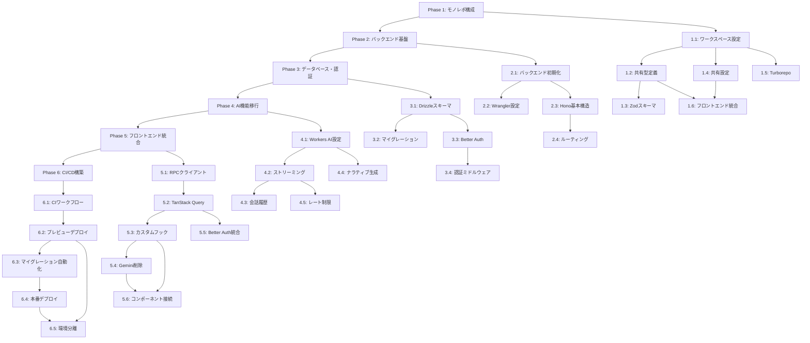

# Implementation Tasks

## Overview

本ドキュメントは、システムアーキテクチャ実装のための具体的な実装タスクを定義します。移行戦略に基づき、6つのフェーズに分けて段階的に実装を進めます。

## Task Phases

### Phase 1: モノレポ構成の構築

#### Task 1.1: ルートワークスペース設定
**目的**: pnpm workspacesの基本設定を実装する

**作業内容**:
1. ルートディレクトリに`pnpm-workspace.yaml`を作成
   - `apps/*`と`packages/*`をワークスペースとして定義
2. ルートに`package.json`を作成
   - `name`, `version`, `private: true`を設定
   - `scripts`に`dev`, `build`, `test`を定義
3. ルートに`pnpm-lock.yaml`が生成されることを確認

**受け入れ基準**:
- `pnpm install`でエラーなく実行される
- ワークスペースが正しく認識される

**依存関係**: なし

**推定工数**: 0.5時間

---

#### Task 1.2: 共有型定義パッケージの作成
**目的**: バックエンドとフロントエンドで共有する型定義パッケージを構築する

**作業内容**:
1. `packages/shared`ディレクトリを作成
2. `packages/shared/package.json`を作成
   - `name: "@skill-quest/shared"`
   - `version: "0.0.0"`
   - `main: "src/index.ts"`
   - `types: "src/index.ts"`
3. `packages/shared/src/index.ts`を作成
   - `apps/frontend/types.ts`の内容を移行
   - 既存の型定義（`CharacterProfile`, `Task`, `GrimoireEntry`等）をエクスポート
4. `packages/shared/tsconfig.json`を作成
   - ルートの`tsconfig.json`を継承

**受け入れ基準**:
- `apps/frontend`から`import { CharacterProfile } from '@skill-quest/shared'`で型をインポートできる
- TypeScriptの型チェックが通る

**依存関係**: Task 1.1

**推定工数**: 1時間

---

#### Task 1.3: Zodスキーマの追加
**目的**: APIバリデーション用のZodスキーマを共有パッケージに追加する

**作業内容**:
1. `packages/shared/package.json`に`zod`を依存関係として追加
2. `packages/shared/src/schemas/quest.ts`を作成
   - `createQuestSchema`, `completeQuestSchema`を定義
3. `packages/shared/src/schemas/user.ts`を作成
   - ユーザー関連のスキーマを定義
4. `packages/shared/src/index.ts`からスキーマをエクスポート

**受け入れ基準**:
- バックエンドとフロントエンドの両方でスキーマをインポートできる
- スキーマのバリデーションが正常に動作する

**依存関係**: Task 1.2

**推定工数**: 1時間

---

#### Task 1.4: 共有設定パッケージの作成
**目的**: TypeScriptとESLintの共有設定を提供する

**作業内容**:
1. `packages/config`ディレクトリを作成
2. `packages/config/package.json`を作成
   - `name: "@skill-quest/config"`
3. `packages/config/tsconfig.base.json`を作成
   - ベースとなるTypeScript設定
   - `strict: true`, `target: "ES2022"`等を設定
4. `packages/config/eslint.config.js`を作成（オプション）
   - 共有ESLint設定

**受け入れ基準**:
- 各パッケージが`extends: "@skill-quest/config/tsconfig.base.json"`で設定を継承できる

**依存関係**: Task 1.1

**推定工数**: 1時間

---

#### Task 1.5: Turborepo設定
**目的**: ビルドパイプラインの最適化を実装する

**作業内容**:
1. ルートに`turbo.json`を作成
2. `turbo.json`にパイプラインを定義
   - `build`, `dev`, `test`タスクを定義
   - キャッシュ設定を追加
3. ルートの`package.json`に`turbo`を依存関係として追加

**受け入れ基準**:
- `pnpm turbo build`で全パッケージがビルドされる
- 変更のないパッケージはキャッシュから実行される

**依存関係**: Task 1.1, Task 1.2, Task 1.4

**推定工数**: 1時間

---

#### Task 1.6: フロントエンドのワークスペース統合
**目的**: 既存のフロントエンドをワークスペースに統合する

**作業内容**:
1. `apps/frontend/package.json`を更新
   - `@skill-quest/shared`を依存関係として追加
2. `apps/frontend/src/types.ts`を削除（`@skill-quest/shared`からインポートに変更）
3. `apps/frontend/tsconfig.json`を更新
   - `@skill-quest/config/tsconfig.base.json`を継承
   - パスエイリアスを設定

**受け入れ基準**:
- フロントエンドが正常にビルドされる
- 型エラーが発生しない

**依存関係**: Task 1.2, Task 1.4

**推定工数**: 1時間

---

### Phase 2: バックエンド基盤の実装

#### Task 2.1: バックエンドプロジェクトの初期化
**目的**: Cloudflare Workers用のバックエンドプロジェクトを作成する

**作業内容**:
1. `apps/backend`ディレクトリを作成
2. `apps/backend/package.json`を作成
   - `name: "@skill-quest/backend"`
   - `hono`, `@hono/zod-validator`, `drizzle-orm`, `@cloudflare/workers-types`を依存関係として追加
3. `apps/backend/tsconfig.json`を作成
   - `@skill-quest/config/tsconfig.base.json`を継承
   - `types: ["@cloudflare/workers-types"]`を追加
4. `apps/backend/src/index.ts`を作成（空のHonoアプリ）

**受け入れ基準**:
- `pnpm install`で依存関係がインストールされる
- TypeScriptのコンパイルが通る

**依存関係**: Task 1.1, Task 1.4

**推定工数**: 1時間

---

#### Task 2.2: Wrangler設定
**目的**: Cloudflare Workersの環境設定を行う

**作業内容**:
1. `apps/backend/wrangler.toml`を作成
   - `name = "skill-quest-backend"`
   - `main = "src/index.ts"`
   - `compatibility_date = "2024-01-01"`
2. D1データベースバインディングを設定（ローカル用）
   - `[[d1_databases]]`セクションを追加
3. Workers AIバインディングを設定
   - `[[ai]]`セクションを追加
4. 環境変数のプレースホルダーを定義

**受け入れ基準**:
- `wrangler dev`でローカル開発サーバーが起動する

**依存関係**: Task 2.1

**推定工数**: 1時間

---

#### Task 2.3: Honoアプリケーションの基本構造
**目的**: Honoアプリケーションの基本構造を実装する

**作業内容**:
1. `apps/backend/src/index.ts`を実装
   - `Bindings`型を定義（`DB`, `AI`, 環境変数）
   - Honoアプリケーションを初期化
   - `AppType`をエクスポート
2. `apps/backend/src/middleware/logger.ts`を作成
   - リクエストロギングミドルウェア
3. `apps/backend/src/middleware/errorHandler.ts`を作成
   - エラーハンドリングミドルウェア
4. `apps/backend/src/index.ts`にミドルウェアを適用

**受け入れ基準**:
- `wrangler dev`でアプリケーションが起動する
- リクエストがログに記録される
- エラーが適切にハンドリングされる

**依存関係**: Task 2.1, Task 2.2

**推定工数**: 2時間

---

#### Task 2.4: ルーティング構造の実装
**目的**: モジュール化されたルーティング構造を実装する

**作業内容**:
1. `apps/backend/src/routes/`ディレクトリを作成
2. `apps/backend/src/routes/health.ts`を作成
   - ヘルスチェックエンドポイント（`GET /health`）
3. `apps/backend/src/index.ts`にルーターをマウント
4. ルートハンドラのテンプレート構造を確立

**受け入れ基準**:
- `GET /health`エンドポイントが動作する
- ルーターが正しくマウントされる

**依存関係**: Task 2.3

**推定工数**: 1時間

---

### Phase 3: データベース・認証の実装

#### Task 3.1: Drizzleスキーマの定義
**目的**: データベーススキーマをDrizzle ORMで定義する

**作業内容**:
1. `apps/backend/src/db/schema.ts`を作成
2. Better Auth用テーブルを定義
   - `user`, `session`, `account`, `verification`テーブル
3. Skill Quest固有テーブルを定義
   - `skills`, `quests`, `user_progress`, `interaction_logs`テーブル
4. 外部キー制約を定義
5. JSONカラムを適切に使用

**受け入れ基準**:
- スキーマがTypeScriptの型チェックを通る
- 外部キー制約が正しく定義される

**依存関係**: Task 2.1

**推定工数**: 3時間

---

#### Task 3.2: マイグレーション設定
**目的**: Drizzle Kitを使用したマイグレーション環境を構築する

**作業内容**:
1. `apps/backend/package.json`に`drizzle-kit`を追加
2. `apps/backend/drizzle.config.ts`を作成
   - D1データベースへの接続設定
3. `apps/backend/package.json`にスクリプトを追加
   - `db:generate`: マイグレーションファイル生成
   - `db:migrate:local`: ローカル環境への適用
4. 初回マイグレーションファイルを生成

**受け入れ基準**:
- `pnpm db:generate`でマイグレーションファイルが生成される
- `wrangler d1 migrations apply`でマイグレーションが適用される

**依存関係**: Task 3.1, Task 2.2

**推定工数**: 2時間

---

#### Task 3.3: Better Authの統合
**目的**: Better AuthをCloudflare Workers環境に統合する

**作業内容**:
1. `apps/backend/package.json`に`better-auth`と`better-auth/adapters/drizzle`を追加
2. `apps/backend/src/auth.ts`を作成
   - オンデマンド初期化パターンを実装
   - GitHub OAuthプロバイダーを設定
   - CORSと信頼済みオリジンを設定
3. `apps/backend/src/routes/auth.ts`を作成
   - Better Authハンドラをマウント
   - 全メソッド・パスをハンドル
4. `apps/backend/src/index.ts`に認証ルーターをマウント

**受け入れ基準**:
- `POST /api/auth/sign-in/github`エンドポイントが動作する
- セッションCookieが設定される

**依存関係**: Task 3.1, Task 2.4

**推定工数**: 3時間

---

#### Task 3.4: 認証ミドルウェアの実装
**目的**: 保護されたエンドポイントで認証を検証するミドルウェアを実装する

**作業内容**:
1. `apps/backend/src/middleware/auth.ts`を作成
   - Better Authからセッションを取得
   - ユーザー情報をコンテキストに注入
   - 未認証時は401を返す
2. テスト用の保護エンドポイントを作成
3. ミドルウェアの動作を確認

**受け入れ基準**:
- 認証済みユーザーは保護エンドポイントにアクセスできる
- 未認証ユーザーは401エラーを受け取る

**依存関係**: Task 3.3

**推定工数**: 2時間

---

### Phase 4: AI機能の移行

#### Task 4.1: Workers AIバインディングの設定
**目的**: Workers AIをバックエンドに統合する

**作業内容**:
1. `apps/backend/wrangler.toml`にWorkers AIバインディングを確認
2. `apps/backend/src/routes/chat.ts`を作成
   - 基本的なチャットエンドポイント（非ストリーミング）
3. Llama 3.1 8B Instructモデルを使用したテスト実装
4. レスポンスが正常に返ることを確認

**受け入れ基準**:
- `POST /api/chat`エンドポイントが動作する
- Workers AIからレスポンスが返る

**依存関係**: Task 2.4, Task 3.4

**推定工数**: 2時間

---

#### Task 4.2: ストリーミングレスポンスの実装
**目的**: SSEによるストリーミングチャット機能を実装する

**作業内容**:
1. `apps/backend/src/routes/chat.ts`を更新
   - Honoの`streamText`ヘルパーを使用
   - Workers AIのストリーミング機能を統合
2. トークンチャンクを逐次送信するロジックを実装
3. エラーハンドリングを追加

**受け入れ基準**:
- ストリーミングレスポンスが正常に送信される
- クライアント側でトークンが逐次表示される

**依存関係**: Task 4.1

**推定工数**: 2時間

---

#### Task 4.3: 会話履歴の保存と取得
**目的**: AIとの会話履歴をD1に保存し、コンテキストとして利用する

**作業内容**:
1. `apps/backend/src/routes/chat.ts`を更新
   - 会話履歴をD1から取得
   - 新しいメッセージを履歴に追加
   - 会話履歴をD1に保存
2. `interaction_logs`テーブルを使用
3. コンテキストとして履歴をLLMに渡す

**受け入れ基準**:
- 会話履歴がD1に保存される
- 過去の会話がコンテキストとして利用される

**依存関係**: Task 4.2, Task 3.1

**推定工数**: 2時間

---

#### Task 4.4: ナラティブ生成機能の実装
**目的**: クエスト完了時のナラティブ生成機能を実装する

**作業内容**:
1. `apps/backend/src/routes/quests.ts`を作成
2. `POST /api/quests/:id/complete`エンドポイントを実装
   - タスク情報とユーザープロファイルを取得
   - Workers AIでナラティブ生成
   - XPとGoldを計算
3. フォールバックロジックを実装（AI失敗時）

**受け入れ基準**:
- クエスト完了時にナラティブが生成される
- 報酬（XP, Gold）が正しく計算される

**依存関係**: Task 4.1, Task 3.1

**推定工数**: 3時間

---

#### Task 4.5: レート制限の実装
**目的**: AIエンドポイントへの過剰なリクエストを防ぐ

**作業内容**:
1. `apps/backend/src/middleware/rateLimit.ts`を作成
   - ユーザーIDベースのレート制限
   - 1分間に10リクエストまで
2. `apps/backend/src/routes/chat.ts`にレート制限ミドルウェアを適用
3. レート制限超過時は429エラーを返す

**受け入れ基準**:
- レート制限が正常に動作する
- 制限超過時に適切なエラーメッセージが返る

**依存関係**: Task 4.2

**推定工数**: 2時間

---

### Phase 5: フロントエンド統合

#### Task 5.1: Hono RPCクライアントの実装
**目的**: フロントエンドにHono RPCクライアントを統合する

**作業内容**:
1. `apps/frontend/package.json`に`hono/client`を追加
2. `apps/frontend/src/lib/client.ts`を作成
   - バックエンドの`AppType`を型のみインポート
   - RPCクライアントを初期化
   - 環境変数からAPI URLを取得
3. 型推論が機能することを確認

**受け入れ基準**:
- `client.api.health.$get()`で型推論が効く
- API呼び出しが正常に動作する

**依存関係**: Task 2.3, Task 1.6

**推定工数**: 1.5時間

---

#### Task 5.2: TanStack Queryの導入
**目的**: サーバー状態管理のためにTanStack Queryを導入する

**作業内容**:
1. `apps/frontend/package.json`に`@tanstack/react-query`を追加
2. `apps/frontend/src/App.tsx`に`QueryClientProvider`を追加
3. `QueryClient`を初期化
4. 基本的な設定（キャッシュ時間等）を実装

**受け入れ基準**:
- TanStack Queryが正常に動作する
- プロバイダーが正しく設定される

**依存関係**: Task 5.1

**推定工数**: 1時間

---

#### Task 5.3: カスタムフックの実装
**目的**: 型安全なデータフェッチ用のカスタムフックを実装する

**作業内容**:
1. `apps/frontend/src/hooks/useQuests.ts`を作成
   - `useQuery`を使用してクエスト一覧を取得
2. `apps/frontend/src/hooks/useUser.ts`を作成
   - ユーザー情報を取得
3. `apps/frontend/src/hooks/useChat.ts`を作成
   - ストリーミングチャット機能
   - SSE接続の管理

**受け入れ基準**:
- 各フックが正常に動作する
- 型推論が機能する

**依存関係**: Task 5.1, Task 5.2

**推定工数**: 3時間

---

#### Task 5.4: Gemini API依存の削除
**目的**: 既存のGemini API依存をWorkers AIエンドポイントに置き換える

**作業内容**:
1. `apps/frontend/services/geminiService.ts`を確認
2. `generateCharacter`機能をバックエンドエンドポイントに置き換え
3. `generateTaskNarrative`機能をバックエンドエンドポイントに置き換え
4. `generatePartnerMessage`機能をバックエンドエンドポイントに置き換え
5. `geminiService.ts`を削除
6. 既存コンポーネントの更新

**受け入れ基準**:
- 既存の機能が正常に動作する
- Gemini APIへの依存が完全に削除される

**依存関係**: Task 5.3, Task 4.4

**推定工数**: 3時間

---

#### Task 5.5: Better Authクライアントの統合
**目的**: フロントエンドに認証機能を統合する

**作業内容**:
1. `apps/frontend/package.json`に`better-auth`クライアントライブラリを追加
2. `apps/frontend/src/lib/auth-client.ts`を作成
   - Better Authクライアントを初期化
   - ログイン、ログアウト、セッション取得メソッドを実装
3. 認証状態に応じたルーティング制御を実装
4. ログインページコンポーネントを作成

**受け入れ基準**:
- GitHub認証が正常に動作する
- 認証状態に応じてページが表示される

**依存関係**: Task 3.3, Task 5.2

**推定工数**: 3時間

---

#### Task 5.6: 既存コンポーネントの接続
**目的**: 既存のUIコンポーネントを新しいバックエンドに接続する

**作業内容**:
1. `Dashboard.tsx`を更新
   - TanStack Queryフックを使用
2. `QuestBoard.tsx`を更新
   - クエスト作成・完了APIを呼び出す
3. `Grimoire.tsx`を更新
   - グリモワーエントリをAPIから取得
4. 各コンポーネントの動作を確認

**受け入れ基準**:
- 既存のUIが正常に動作する
- データがバックエンドから取得される

**依存関係**: Task 5.3, Task 5.4

**推定工数**: 4時間

---

### Phase 6: CI/CDパイプラインの構築

#### Task 6.1: 基本的なCIワークフローの実装
**目的**: PR作成時の自動チェックを実装する

**作業内容**:
1. `.github/workflows/`ディレクトリを作成
2. `.github/workflows/ci.yml`を作成
   - ESLintチェック
   - TypeScript型チェック
   - 単体テスト（将来の拡張用）
3. ワークフローが正常に動作することを確認

**受け入れ基準**:
- PR作成時に自動チェックが実行される
- チェックが失敗するとPRに表示される

**依存関係**: Task 1.5

**推定工数**: 2時間

---

#### Task 6.2: プレビュー環境へのデプロイ
**目的**: PR作成時にプレビュー環境へ自動デプロイする

**作業内容**:
1. `.github/workflows/preview.yml`を作成
2. Cloudflare Pagesへのプレビューデプロイを実装
3. Cloudflare Workersへのプレビューデプロイを実装
4. 環境変数の設定
5. デプロイURLをPRにコメント

**受け入れ基準**:
- PR作成時に自動デプロイが実行される
- プレビュー環境でアプリケーションが動作する

**依存関係**: Task 6.1

**推定工数**: 3時間

---

#### Task 6.3: マイグレーション適用の自動化
**目的**: バックエンドデプロイ前にマイグレーションを自動適用する

**作業内容**:
1. `.github/workflows/preview.yml`を更新
   - デプロイ前にマイグレーション適用ステップを追加
2. `.github/workflows/deploy.yml`を作成（本番用）
   - 本番環境へのマイグレーション適用
3. マイグレーション失敗時のロールバック手順を文書化

**受け入れ基準**:
- デプロイ前にマイグレーションが適用される
- マイグレーション失敗時にデプロイが停止する

**依存関係**: Task 6.2, Task 3.2

**推定工数**: 2時間

---

#### Task 6.4: 本番環境へのデプロイ
**目的**: mainブランチへのマージ時に本番環境へ自動デプロイする

**作業内容**:
1. `.github/workflows/deploy.yml`を実装
   - mainブランチへのマージをトリガー
   - 本番環境へのデプロイ
2. Turborepoを使用した最適化
   - 変更されたパッケージのみをビルド
3. デプロイ成功・失敗の通知を実装

**受け入れ基準**:
- mainへのマージ時に自動デプロイが実行される
   - 変更のないパッケージはスキップされる

**依存関係**: Task 6.3

**推定工数**: 2時間

---

#### Task 6.5: 環境分離の設定
**目的**: プレビュー環境と本番環境で異なる設定を使用する

**作業内容**:
1. `apps/backend/wrangler.toml`を更新
   - `[env.preview]`セクションを追加
   - プレビュー環境用のD1データベースバインディング
2. 環境変数の管理
   - Cloudflare Dashboardで設定
   - GitHub Secretsで管理
3. 環境ごとの設定を確認

**受け入れ基準**:
- プレビュー環境と本番環境で異なるデータベースが使用される
- 環境変数が正しく設定される

**依存関係**: Task 6.2, Task 6.4

**推定工数**: 1.5時間

---

## Task Dependencies Summary

## Implementation Order

実装は以下の順序で進めることを推奨します：

1. **Phase 1** (5.5時間): モノレポ構成の構築
2. **Phase 2** (5時間): バックエンド基盤の実装
3. **Phase 3** (10時間): データベース・認証の実装
4. **Phase 4** (11時間): AI機能の移行
5. **Phase 5** (15.5時間): フロントエンド統合
6. **Phase 6** (10.5時間): CI/CDパイプラインの構築

**合計推定工数**: 約57.5時間

## Notes

- 各タスクは独立して実装可能な粒度に分解されています
- 依存関係に注意して実装順序を決定してください
- 各フェーズの完了時に動作確認とテストを実施してください
- 問題が発生した場合は、前のフェーズにロールバックできる設計になっています
