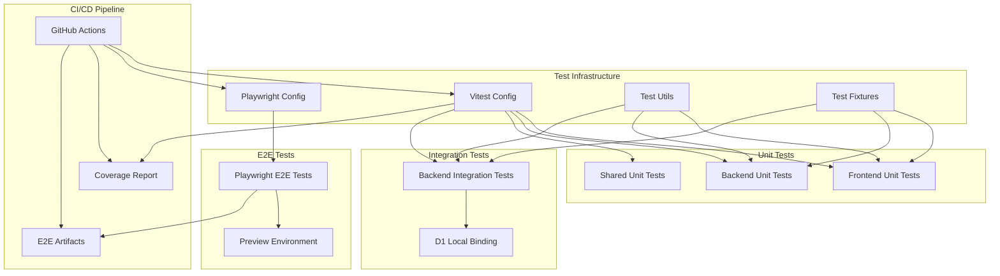

# Design Document

---
**Purpose**: Provide sufficient detail to ensure implementation consistency across different implementers, preventing interpretation drift.

**Approach**:
- Include essential sections that directly inform implementation decisions
- Omit optional sections unless critical to preventing implementation errors
- Match detail level to feature complexity
- Use diagrams and tables over lengthy prose
---

## Overview

本設計は、`docs/architecture/11_テスト戦略.md`で定義されたテスト戦略を既存のコードベースに対して自動テストとして実現するための技術設計です。モノレポ構成（apps/frontend, apps/backend, packages/shared）において、単体テスト（70-80%）、統合テスト（15-25%）、E2Eテスト（5-10%）のテストピラミッドを構築し、CI/CDパイプラインに統合します。

**Purpose**: 開発チームが既存コードに対して包括的なテストスイートを実装し、CI/CDパイプラインで自動実行できるようにする。

**Users**: 開発者、QAエンジニア、DevOpsエンジニアがテストの作成、実行、保守を行う。

**Impact**: 既存のテスト実装を拡張し、統合テストとE2Eテストの新規インフラを追加することで、テストカバレッジを向上させ、リグレッションを早期に発見できるようにする。

### Goals

- 単体テスト、統合テスト、E2Eテストの包括的な実装
- テストカバレッジ70-80%の達成（単体テスト）
- CI/CDパイプラインへの自動統合
- テストの保守性と再利用性の向上
- mainブランチへのPR時のE2Eテスト自動実行

### Non-Goals

- 既存のテストファイルの大規模なリファクタリング（段階的移行）
- テストフレームワークの変更（VitestからJestへの移行など）
- カバレッジ100%の達成（70-80%を目標）
- 本番環境でのE2Eテスト実行（プレビュー環境のみ）

## Architecture

### Existing Architecture Analysis

既存のテスト実装は以下のパターンに従っている：

- **テストファイル配置**: Co-located pattern（対象ファイルと同階層）
- **テストフレームワーク**: Vitest（frontend: jsdom環境、backend: node環境）
- **モックパターン**: 各テストファイル内にモック関数を定義
- **CI統合**: GitHub ActionsでLint → Type Check → Build → Testの順序で実行

**統合ポイント**:
- 既存のVitest設定を拡張してカバレッジ設定を追加
- 既存のCIワークフローにE2Eテストステップを追加
- 既存のモック関数を共通ユーティリティに集約

**技術的負債への対応**:
- テストユーティリティの分散を段階的に解消
- 統合テストの未実装を新規実装で対応

### Architecture Pattern & Boundary Map



**Architecture Integration**:
- **Selected pattern**: Layered Testing Architecture（単体テスト層、統合テスト層、E2Eテスト層）
- **Domain/feature boundaries**: テスト種別ごとに明確に分離（単体/統合/E2E）
- **Existing patterns preserved**: Co-locatedテスト配置、Vitest設定構造、モックパターン
- **New components rationale**: 
  - テストユーティリティ集約により保守性向上
  - E2Eテストインフラによりユーザーフローの検証が可能
  - カバレッジ設定によりテスト品質の可視化が可能
- **Steering compliance**: モノレポ構成、TypeScript strict、既存のテストパターンを維持

### Technology Stack

| Layer | Choice / Version | Role in Feature | Notes |
|-------|------------------|-----------------|-------|
| Test Runner (Unit/Integration) | Vitest ^2.0.0 | 単体テスト・統合テストの実行 | 既存設定を拡張 |
| Test Runner (E2E) | @playwright/test ^1.57.0+ | E2Eテストの実行 | 新規導入 |
| Coverage Provider | @vitest/coverage-v8 ^3.2.0+ | カバレッジ測定 | v8プロバイダーを使用 |
| Testing Library | @testing-library/react ^16.0.0 | フロントエンドコンポーネントテスト | 既存 |
| Database (Integration) | Cloudflare D1 (Local) | 統合テスト用データベース | `wrangler d1 execute --local` |
| CI/CD | GitHub Actions | テスト自動実行 | 既存ワークフローを拡張 |

## Requirements Traceability

| Requirement | Summary | Components | Interfaces | Flows |
|-------------|---------|------------|------------|-------|
| 1.1 | ビジネスロジックの単体テスト | UnitTestInfrastructure | TestFilePattern | TestExecutionFlow |
| 1.2 | Zodスキーマのバリデーションテスト | SharedTestInfrastructure | SchemaValidationTest | ValidationTestFlow |
| 1.3 | ミドルウェアの単体テスト | UnitTestInfrastructure | MiddlewareTest | TestExecutionFlow |
| 1.4 | ユーティリティ関数の単体テスト | UnitTestInfrastructure | UtilityTest | TestExecutionFlow |
| 1.5 | テストの独立性保証 | TestInfrastructure | TestIsolation | TestExecutionFlow |
| 1.6 | 外部依存のモック/スタブ | TestUtilities | MockFactory | MockSetupFlow |
| 2.1 | Reactコンポーネントテスト | FrontendTestInfrastructure | ComponentTest | ComponentTestFlow |
| 2.2 | カスタムフックテスト | FrontendTestInfrastructure | HookTest | HookTestFlow |
| 2.3 | APIクライアントのモック | TestUtilities | APIMockFactory | MockSetupFlow |
| 2.4 | jsdom環境設定 | FrontendTestInfrastructure | TestEnvironment | TestExecutionFlow |
| 2.5 | 外部APIのモック | TestUtilities | APIMockFactory | MockSetupFlow |
| 3.1 | Honoルートハンドラテスト | BackendTestInfrastructure | RouteHandlerTest | RouteTestFlow |
| 3.2 | サービス層テスト | BackendTestInfrastructure | ServiceTest | ServiceTestFlow |
| 3.3 | 認証エンドポイントテスト | BackendTestInfrastructure | AuthTest | AuthTestFlow |
| 3.4 | Workers AIのスタブ | TestUtilities | AIMockFactory | MockSetupFlow |
| 3.5 | node環境設定 | BackendTestInfrastructure | TestEnvironment | TestExecutionFlow |
| 4.1 | 認証フローの統合テスト | IntegrationTestInfrastructure | AuthIntegrationTest | IntegrationTestFlow |
| 4.2 | D1統合テスト | IntegrationTestInfrastructure | D1IntegrationTest | D1TestFlow |
| 4.3 | クエストCRUD統合テスト | IntegrationTestInfrastructure | QuestIntegrationTest | IntegrationTestFlow |
| 4.4 | データベースリセット | IntegrationTestInfrastructure | DatabaseReset | DatabaseSetupFlow |
| 4.5 | AIエンドポイントのスタブ | TestUtilities | AIMockFactory | MockSetupFlow |
| 5.1 | Zodスキーマテスト | SharedTestInfrastructure | SchemaValidationTest | ValidationTestFlow |
| 5.2 | 型エクスポート検証 | SharedTestInfrastructure | TypeExportTest | TypeCheckFlow |
| 5.3 | バリデーションエラーテスト | SharedTestInfrastructure | ErrorValidationTest | ValidationTestFlow |
| 6.1 | Vitestカバレッジ設定 | CoverageInfrastructure | CoverageConfig | CoverageReportFlow |
| 6.2 | CIカバレッジレポート | CIIntegration | CoverageArtifact | CoverageReportFlow |
| 6.3 | カバレッジ閾値なし | CoverageInfrastructure | CoverageConfig | CoverageReportFlow |
| 6.4 | カバレッジ閾値設定 | CoverageInfrastructure | CoverageThreshold | CoverageReportFlow |
| 6.5 | パッケージ単位カバレッジ | CoverageInfrastructure | PackageCoverage | CoverageReportFlow |
| 7.1 | PR時のテスト実行 | CIIntegration | PRTestWorkflow | CIFlow |
| 7.2 | mainブランチマージ時のテスト実行 | CIIntegration | MainBranchWorkflow | CIFlow |
| 7.3 | Turbo並列実行 | CIIntegration | TurboParallel | CIFlow |
| 7.4 | テスト失敗時のブロック | CIIntegration | TestFailureBlock | CIFlow |
| 7.5 | カバレッジレポートアップロード | CIIntegration | CoverageArtifact | CIFlow |
| 7.6 | PR時のE2Eテスト | CIIntegration | PreviewE2EWorkflow | E2ECIFlow |
| 12.1 | PR時のE2Eテスト実行 | CIIntegration | PreviewE2EWorkflow | E2ECIFlow |
| 7.7 | E2Eテスト失敗時の通知 | CIIntegration | E2EFailureNotification | E2ECIFlow |
| 8.1 | テストデータファクトリ | TestFixtures | DataFactory | TestDataSetupFlow |
| 8.2 | データベースリセット | IntegrationTestInfrastructure | DatabaseReset | DatabaseSetupFlow |
| 8.3 | Workers AIモック | TestUtilities | AIMockFactory | MockSetupFlow |
| 8.4 | 認証モック | TestUtilities | AuthMockFactory | MockSetupFlow |
| 8.5 | 外部サービス呼び出し禁止 | TestInfrastructure | ExternalServicePolicy | TestExecutionFlow |
| 9.1 | jsdom環境設定 | FrontendTestInfrastructure | TestEnvironment | TestExecutionFlow |
| 9.2 | node環境設定 | BackendTestInfrastructure | TestEnvironment | TestExecutionFlow |
| 9.3 | ウォッチモード | TestInfrastructure | WatchMode | TestExecutionFlow |
| 9.4 | CIヘッドレスモード | TestInfrastructure | HeadlessMode | TestExecutionFlow |
| 9.5 | Miniflare設定 | IntegrationTestInfrastructure | MiniflareConfig | IntegrationTestFlow |
| 9.6 | Playwrightブラウザ環境 | E2ETestInfrastructure | BrowserEnvironment | E2ETestFlow |
| 9.7 | Playwrightヘッドレスモード | E2ETestInfrastructure | HeadlessMode | E2ETestFlow |
| 9.8 | Playwright UIモード | E2ETestInfrastructure | UIMode | E2ETestFlow |
| 10.1 | 単体テストファイル命名 | TestInfrastructure | TestFileNaming | TestFileManagement |
| 10.2 | 統合テストファイル命名 | TestInfrastructure | IntegrationTestNaming | TestFileManagement |
| 10.3 | E2Eテストファイル命名 | E2ETestInfrastructure | E2ETestNaming | TestFileManagement |
| 10.4 | Co-located配置 | TestInfrastructure | CoLocatedPattern | TestFileManagement |
| 10.5 | Vitest include設定 | TestInfrastructure | VitestInclude | TestFileManagement |
| 10.6 | E2Eテスト配置 | E2ETestInfrastructure | E2EDirectory | TestFileManagement |
| 11.1 | Playwright導入 | E2ETestInfrastructure | PlaywrightSetup | E2ESetupFlow |
| 11.2 | 認証フローE2Eテスト | E2ETestInfrastructure | AuthE2ETest | E2ETestFlow |
| 11.3 | クエスト操作E2Eテスト | E2ETestInfrastructure | QuestE2ETest | E2ETestFlow |
| 11.4 | AIチャットE2Eテスト | E2ETestInfrastructure | ChatE2ETest | E2ETestFlow |
| 11.5 | キャラクター生成E2Eテスト | E2ETestInfrastructure | GenesisE2ETest | E2ETestFlow |
| 11.6 | ブラウザ環境実行 | E2ETestInfrastructure | BrowserEnvironment | E2ETestFlow |
| 11.7 | スクリーンショット・動画保存 | E2ETestInfrastructure | ArtifactStorage | E2ETestFlow |
| 11.8 | テストデータセットアップ | E2ETestInfrastructure | TestDataSetup | E2ETestFlow |
| 11.9 | テスト独立性 | E2ETestInfrastructure | TestIsolation | E2ETestFlow |
| 11.10 | Workers AIの扱い | E2ETestInfrastructure | AIStubPolicy | E2ETestFlow |
| 12.2 | CIヘッドレスモード | E2ETestInfrastructure | HeadlessMode | E2ETestFlow |
| 12.3 | 失敗時の成果物保存 | CIIntegration | E2EArtifactStorage | E2ECIFlow |
| 12.4 | 失敗時の通知 | CIIntegration | E2EFailureNotification | E2ECIFlow |
| 12.5 | デプロイ完了待機 | CIIntegration | DeployWait | E2ECIFlow |
| 12.6 | タイムアウト設定 | E2ETestInfrastructure | TimeoutConfig | E2ETestFlow |
| 12.7 | リトライ機能 | E2ETestInfrastructure | RetryConfig | E2ETestFlow |

## Components and Interfaces

| Component | Domain/Layer | Intent | Req Coverage | Key Dependencies (P0/P1) | Contracts |
|-----------|--------------|--------|--------------|--------------------------|-----------|
| UnitTestInfrastructure | Test Infrastructure | 単体テストの実行環境と設定 | 1.1-1.6, 2.1-2.5, 3.1-3.5 | Vitest (P0), TestUtilities (P1) | Service |
| IntegrationTestInfrastructure | Test Infrastructure | 統合テストの実行環境と設定 | 4.1-4.5 | Vitest (P0), D1Local (P0), TestUtilities (P1) | Service |
| E2ETestInfrastructure | Test Infrastructure | E2Eテストの実行環境と設定 | 9.6-9.8, 11.1-11.10, 12.1-12.7 | Playwright (P0), PreviewEnv (P0) | Service |
| SharedTestInfrastructure | Test Infrastructure | 共有パッケージのテスト環境 | 1.2, 5.1-5.3 | Vitest (P0) | Service |
| CoverageInfrastructure | Test Infrastructure | カバレッジ測定とレポート生成 | 6.1-6.5 | Vitest (P0), CoverageProvider (P0) | Service |
| TestUtilities | Test Infrastructure | 共通テストユーティリティとモック | 1.6, 2.3, 2.5, 3.4, 4.5, 8.3-8.4 | Vitest (P0) | Service |
| TestFixtures | Test Infrastructure | テストデータファクトリ | 8.1 | TestUtilities (P1) | Service |
| CIIntegration | CI/CD | CI/CDパイプラインへの統合 | 6.2, 7.1-7.7, 12.1-12.7 | GitHubActions (P0), CoverageInfrastructure (P0), E2ETestInfrastructure (P0) | Service |

### Test Infrastructure Layer

#### UnitTestInfrastructure

| Field | Detail |
|-------|--------|
| Intent | 単体テストの実行環境と設定を提供する |
| Requirements | 1.1-1.6, 2.1-2.5, 3.1-3.5 |
| Owner / Reviewers | (optional) |

**Responsibilities & Constraints**
- フロントエンド、バックエンド、共有パッケージの単体テストを実行
- jsdom環境（frontend）とnode環境（backend）を提供
- テストファイルの命名規則（`*.test.ts`, `*.test.tsx`）を強制
- Co-located patternでテストファイルを配置

**Dependencies**
- Inbound: TestUtilities — モック関数とヘルパー (P1)
- Outbound: Vitest — テストランナー (P0)
- External: @testing-library/react — フロントエンドテストライブラリ (P0)

**Contracts**: Service [✓]

##### Service Interface
```typescript
interface UnitTestInfrastructure {
  configureFrontend(config: FrontendTestConfig): VitestConfig;
  configureBackend(config: BackendTestConfig): VitestConfig;
  configureShared(config: SharedTestConfig): VitestConfig;
  executeTests(package: 'frontend' | 'backend' | 'shared'): TestResults;
}
```

- Preconditions: Vitestがインストールされている、テストファイルが存在する
- Postconditions: テスト結果が返される、カバレッジデータが収集される（設定時）
- Invariants: テストの独立性が保証される、外部サービスが呼び出されない

**Implementation Notes**
- Integration: 既存の`vitest.config.ts`を拡張してカバレッジ設定を追加
- Validation: テストファイルの命名規則を`include`パターンで検証
- Risks: 既存テストへの影響を最小化するため、段階的に設定を追加

#### IntegrationTestInfrastructure

| Field | Detail |
|-------|--------|
| Intent | 統合テストの実行環境と設定を提供する |
| Requirements | 4.1-4.5 |
| Owner / Reviewers | (optional) |

**Responsibilities & Constraints**
- API・DB・外部サービス境界の統合テストを実行
- D1ローカルバインディングを使用したデータベース統合テスト
- 各テスト前にデータベースをリセットし、テストの独立性を保証
- Workers AIはスタブして実行

**Dependencies**
- Inbound: TestUtilities — モック関数とヘルパー (P1)
- Outbound: Vitest — テストランナー (P0), D1Local — ローカルデータベース (P0)
- External: wrangler — D1コマンド実行 (P0)

**Contracts**: Service [✓]

##### Service Interface
```typescript
interface IntegrationTestInfrastructure {
  configureD1Integration(config: D1IntegrationConfig): VitestConfig;
  setupDatabase(migrations: Migration[]): Promise<void>;
  resetDatabase(): Promise<void>;
  executeIntegrationTests(): TestResults;
}
```

- Preconditions: D1ローカルバインディングが設定されている、マイグレーションファイルが存在する
- Postconditions: データベースがリセットされる、テスト結果が返される
- Invariants: 各テストが独立して実行される、本番データベースが影響を受けない

**Implementation Notes**
- Integration: `wrangler d1 execute --local`を使用してマイグレーション適用とデータリセット
- Validation: テスト実行前にデータベースの状態を確認
- Risks: D1ローカルバインディングの設定複雑性、マイグレーション適用のタイミング

#### E2ETestInfrastructure

| Field | Detail |
|-------|--------|
| Intent | E2Eテストの実行環境と設定を提供する |
| Requirements | 9.6-9.8, 11.1-11.10, 12.1-12.7 |
| Owner / Reviewers | (optional) |

**Responsibilities & Constraints**
- Playwrightを使用したE2Eテストの実行環境を提供
- 認証、クエスト操作、AIチャット、キャラクター生成のフローをテスト
- ブラウザ環境（Chromium、Firefox、WebKit）で実行
- スクリーンショット、動画、トレースファイルを保存

**Dependencies**
- Inbound: TestFixtures — テストデータセットアップ (P1)
- Outbound: Playwright — E2Eテストフレームワーク (P0), PreviewEnv — プレビュー環境 (P0)
- External: @playwright/test — Playwrightテストランナー (P0)

**Contracts**: Service [✓]

##### Service Interface
```typescript
interface E2ETestInfrastructure {
  configurePlaywright(config: PlaywrightConfig): PlaywrightConfig;
  setupTestData(): Promise<void>;
  cleanupTestData(): Promise<void>;
  executeE2ETests(environment: 'local' | 'ci'): TestResults;
  captureArtifacts(testResult: TestResult): Artifacts;
}
```

- Preconditions: Playwrightがインストールされている、プレビュー環境が利用可能（CI時）
- Postconditions: E2Eテストが実行される、成果物が保存される（失敗時）
- Invariants: テスト間で状態を共有しない、各テストが独立して実行される

**Implementation Notes**
- Integration: `playwright.config.ts`でプロジェクト設定、タイムアウト、リトライを設定
- Validation: プレビュー環境のデプロイ完了を確認してからテスト実行
- Risks: プレビュー環境の可用性、テストの不安定性、タイムアウト処理

#### SharedTestInfrastructure

| Field | Detail |
|-------|--------|
| Intent | 共有パッケージのテスト環境を提供する |
| Requirements | 1.2, 5.1-5.3 |
| Owner / Reviewers | (optional) |

**Responsibilities & Constraints**
- `packages/shared`のZodスキーマのバリデーションテストを実行
- 型エクスポートの検証（型チェックで間接的に検証）
- バリデーションエラーの構造を検証

**Dependencies**
- Inbound: (none)
- Outbound: Vitest — テストランナー (P0)
- External: zod — スキーマバリデーション (P0)

**Contracts**: Service [✓]

##### Service Interface
```typescript
interface SharedTestInfrastructure {
  configureSharedTests(config: SharedTestConfig): VitestConfig;
  testSchemaValidation(schema: ZodSchema, testCases: ValidationTestCase[]): TestResults;
  testTypeExports(): TypeCheckResults;
}
```

- Preconditions: `packages/shared`にZodスキーマが定義されている
- Postconditions: スキーマのバリデーションテストが実行される
- Invariants: すべてのスキーマがテストされる

**Implementation Notes**
- Integration: `packages/shared`に`vitest.config.ts`とテストファイルを追加
- Validation: 各スキーマの`parse`と`safeParse`をテスト
- Risks: スキーマの追加時にテストの更新が必要

#### CoverageInfrastructure

| Field | Detail |
|-------|--------|
| Intent | テストカバレッジの測定とレポート生成を提供する |
| Requirements | 6.1-6.5 |
| Owner / Reviewers | (optional) |

**Responsibilities & Constraints**
- Vitestのカバレッジ機能を使用してカバレッジレポートを生成
- パッケージ単位（frontend, backend, shared）でカバレッジを測定
- 初期段階では閾値なしでレポートのみ取得、後で閾値を設定可能

**Dependencies**
- Inbound: UnitTestInfrastructure — テスト実行 (P0)
- Outbound: Vitest — カバレッジプロバイダー (P0)
- External: @vitest/coverage-v8 — v8カバレッジプロバイダー (P0)

**Contracts**: Service [✓]

##### Service Interface
```typescript
interface CoverageInfrastructure {
  configureCoverage(config: CoverageConfig): VitestConfig;
  generateCoverageReport(package: 'frontend' | 'backend' | 'shared'): CoverageReport;
  setCoverageThreshold(threshold: CoverageThreshold): void;
}
```

- Preconditions: Vitestがカバレッジモードで実行される
- Postconditions: カバレッジレポートが生成される
- Invariants: カバレッジデータが正確に収集される

**Implementation Notes**
- Integration: `vitest.config.ts`に`coverage`設定を追加、v8プロバイダーを使用
- Validation: カバレッジレポートの形式と内容を検証
- Risks: カバレッジ測定のパフォーマンス影響、閾値設定のタイミング

#### TestUtilities

| Field | Detail |
|-------|--------|
| Intent | 共通テストユーティリティとモック関数を提供する |
| Requirements | 1.6, 2.3, 2.5, 3.4, 4.5, 8.3-8.4 |
| Owner / Reviewers | (optional) |

**Responsibilities & Constraints**
- D1データベースのモック関数を提供
- Workers AIのスタブ関数を提供
- 認証のモック関数を提供
- APIクライアントのモック関数を提供

**Dependencies**
- Inbound: (none)
- Outbound: Vitest — モック機能 (P0)
- External: (none)

**Contracts**: Service [✓]

##### Service Interface
```typescript
interface TestUtilities {
  createMockD1(overrides?: D1MockOverrides): D1Database;
  createMockAI(overrides?: AIMockOverrides): AIBinding;
  createMockAuth(user?: AuthUser): AuthContext;
  createMockAPIClient(overrides?: APIMockOverrides): APIClient;
}
```

- Preconditions: テスト実行環境が設定されている
- Postconditions: モックオブジェクトが返される
- Invariants: モックが外部サービスを呼び出さない

**Implementation Notes**
- Integration: `tests/utils/`ディレクトリに共通モック関数を集約
- Validation: モック関数の動作を検証
- Risks: 既存テストのリファクタリングが必要、モック関数の保守性

#### TestFixtures

| Field | Detail |
|-------|--------|
| Intent | テストデータファクトリを提供する |
| Requirements | 8.1 |
| Owner / Reviewers | (optional) |

**Responsibilities & Constraints**
- テストデータを生成するファクトリ関数を提供
- テストの意図を明確にする最小限のデータを生成
- テスト間で状態を共有しない

**Dependencies**
- Inbound: (none)
- Outbound: TestUtilities — モック関数 (P1)
- External: (none)

**Contracts**: Service [✓]

##### Service Interface
```typescript
interface TestFixtures {
  createTestUser(overrides?: UserOverrides): AuthUser;
  createTestQuest(overrides?: QuestOverrides): Quest;
  createTestCharacterProfile(overrides?: ProfileOverrides): CharacterProfile;
  createTestGrimoireEntry(overrides?: EntryOverrides): GrimoireEntry;
}
```

- Preconditions: テストデータの型定義が存在する
- Postconditions: テストデータオブジェクトが返される
- Invariants: テストデータが一貫性を持つ

**Implementation Notes**
- Integration: `tests/fixtures/`ディレクトリにファクトリ関数を配置
- Validation: ファクトリ関数が正しいデータ構造を生成することを検証
- Risks: テストデータの保守性、型安全性の確保

#### CIIntegration

| Field | Detail |
|-------|--------|
| Intent | CI/CDパイプラインへのテスト統合を提供する |
| Requirements | 6.2, 7.1-7.7, 12.1-12.7 |
| Owner / Reviewers | (optional) |

**Responsibilities & Constraints**
- PR作成時とmainブランチマージ時にテストを自動実行
- mainブランチへのPR時にE2Eテストを実行
- カバレッジレポートを成果物として保存
- プレビュー環境デプロイ後にE2Eテストを実行
- テスト失敗時にPRマージをブロック

**Dependencies**
- Inbound: CoverageInfrastructure — カバレッジレポート (P0), E2ETestInfrastructure — E2Eテスト (P0)
- Outbound: GitHubActions — CI/CDプラットフォーム (P0)
- External: (none)

**Contracts**: Service [✓]

##### Service Interface
```typescript
interface CIIntegration {
  configurePRWorkflow(): GitHubWorkflow;
  configureMainBranchWorkflow(): GitHubWorkflow;
  configurePreviewE2EWorkflow(): GitHubWorkflow;
  uploadCoverageReport(report: CoverageReport): void;
  uploadE2EArtifacts(artifacts: E2EArtifacts): void;
}
```

- Preconditions: GitHub Actionsが設定されている、テストが実行可能、プレビュー環境が利用可能（E2Eテスト時）
- Postconditions: CIワークフローが実行される、成果物が保存される
- Invariants: テストの実行順序が保証される、失敗時に適切にブロックされる

**Implementation Notes**
- Integration: `.github/workflows/check.yml`を拡張してE2Eテストステップを追加、mainブランチへのPR時にE2Eテストを実行
- Validation: ワークフローの実行順序と条件を検証、プレビュー環境のデプロイ完了を確認
- Risks: プレビュー環境の可用性、E2Eテストの実行時間、タイムアウト処理、PR時のE2Eテスト実行によるCI時間の増加

## Error Handling

### Error Strategy

テスト実行時のエラーは以下のように処理する：

- **テスト失敗**: テスト結果として記録し、CIではPRマージをブロック
- **カバレッジ測定エラー**: 警告を出力し、テスト実行は継続
- **E2Eテストタイムアウト**: タイムアウトエラーとして記録し、成果物を保存
- **データベースセットアップエラー**: エラーを出力し、テスト実行を中止

### Error Categories and Responses

**Test Execution Errors**:
- **テスト失敗**: テスト結果に記録、CIではPRマージをブロック
- **タイムアウト**: タイムアウトエラーとして記録、成果物を保存（E2Eテスト）

**Infrastructure Errors**:
- **カバレッジ測定エラー**: 警告を出力、テスト実行は継続
- **データベースセットアップエラー**: エラーを出力、テスト実行を中止
- **プレビュー環境の可用性エラー**: エラーを出力、E2Eテストをスキップ

**Configuration Errors**:
- **設定ファイルの不正**: エラーを出力、テスト実行を中止
- **依存関係の不足**: エラーを出力、インストールを促す

### Monitoring

- テスト実行時間を記録し、パフォーマンスの問題を特定
- カバレッジレポートを定期的に確認し、テストカバレッジの傾向を追跡
- E2Eテストの失敗率を監視し、不安定性の原因を調査

## Testing Strategy

### Unit Tests

- **ビジネスロジック関数**: 入力と出力の関係を検証
- **Zodスキーマ**: `parse`と`safeParse`のバリデーションをテスト
- **ミドルウェア関数**: リクエスト/レスポンスの振る舞いを検証
- **ユーティリティ関数**: 入力と出力の関係を検証
- **Reactコンポーネント**: UIの振る舞いを`@testing-library/react`で検証
- **カスタムフック**: フックの振る舞いを検証

### Integration Tests

- **認証フロー**: ログインからログアウトまでの一連の操作を検証
- **クエストCRUD操作**: データベース操作を含む統合テスト
- **AIエンドポイント**: Workers AIをスタブした統合テスト

### E2E Tests

- **認証フロー**: ログインからログアウトまでのE2Eテスト
- **クエスト操作**: クエストの作成、編集、完了、削除のE2Eテスト
- **AIチャット**: チャット入力からストリーミングレスポンス表示までのE2Eテスト
- **キャラクター生成**: サインアップからキャラクター生成完了までのE2Eテスト

### Performance/Load Tests

- テスト実行時間の監視と最適化
- カバレッジ測定のパフォーマンス影響の評価
