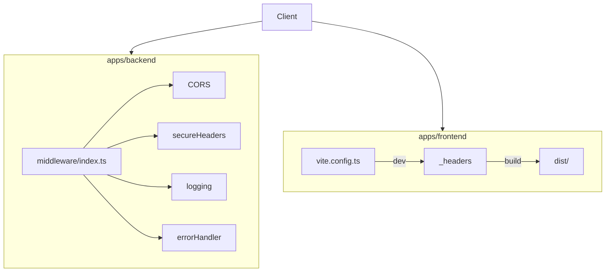

# 技術設計書: ZAP セキュリティ対策

## Overview

ZAPテストレポート（2026-02-14）で検出されたセキュリティ課題に対応する。バックエンド（Hono + Cloudflare Workers）およびフロントエンド（Vite / Cloudflare Pages）にセキュリティヘッダーを付与し、CORS の許可リスト検証を強化する。

**Users**: オペレーターおよびエンドユーザー。直接の UI 変更はなく、HTTP レスポンスヘッダーと設定の変更を通じてセキュリティを向上させる。

**Impact**: 既存の middleware/index.ts、vite.config.ts を拡張し、フロントエンドに `public/_headers` を新規追加する。認証（Better Auth）の Cookie 属性は既に適切に設定されているため変更なし。

### Goals

- バックエンド・フロントエンドの全レスポンスに X-Content-Type-Options, X-Frame-Options を付与
- 本番環境で HSTS を有効化し、開発環境では無効化
- CORS の Origin を許可リストで検証
- ZAP 対策状況を文書化し、再スキャンで検証可能にする

### Non-Goals

- 第三者の CDN（bing.com, fonts.googleapis.com 等）に起因するアラートへの対応
- SRI の外部 CDN への自動適用（文書化のみ）
- 認証・認可ロジックの変更（要件 6 は既存実装で充足）

---

## Architecture

### Existing Architecture Analysis

- **ミドルウェア適用順序**: CORS → ロギング → エラーハンドリング（middleware/index.ts）
- **CORS**: `hono/cors` 使用。`origin || '*'` により許可リスト検証が不十分
- **認証**: Better Auth が auth.ts で初期化。trustedOrigins, defaultCookieAttributes で Cookie を制御
- **フロントエンド**: Vite 開発サーバー（port 3000）、本番は Cloudflare Pages で静的配信

### Architecture Pattern & Boundary Map



**Architecture Integration**:
- パターン: 既存ミドルウェアチェーンの拡張
- 境界: セキュリティヘッダーはミドルウェア層、フロントエンドは Vite/Pages の設定
- 既存パターン: middleware の適用順序、Bindings 経由の環境変数参照を維持
- 新規: secureHeaders の追加、CORS origin の検証ロジック変更、`_headers` ファイル
- Steering 準拠: security.md の「Headers & Transport」に沿った実装

### Technology Stack

| Layer | Choice | Role | Notes |
|-------|--------|------|-------|
| Backend | Hono secure-headers | セキュリティヘッダー付与 | `hono/secure-headers` 組み込み |
| Backend | hono/cors | CORS 制御 | origin コールバックで許可リスト検証 |
| Frontend | Vite server.headers | 開発時ヘッダー | vite.config.ts |
| Frontend | Cloudflare Pages _headers | 本番時ヘッダー | public/_headers |
| Docs | Markdown | ZAP 対策状況の文書化 | docs/ 配下 |

---

## Requirements Traceability

| Req | Summary | Components | Notes |
|-----|---------|------------|-------|
| 1.1 | X-Content-Type-Options: nosniff | secureHeaders | バックエンド |
| 1.2 | X-Frame-Options | secureHeaders | バックエンド |
| 1.3 | CSP（API が HTML を返す場合） | secureHeaders | バックエンドは主に JSON のため report-only または省略可 |
| 2.1 | X-Frame-Options（フロント） | Vite server.headers, _headers | 開発・本番 |
| 2.2 | X-Content-Type-Options（フロント） | Vite server.headers, _headers | 開発・本番 |
| 2.3 | CSP（フロント本番） | _headers | script-src, style-src, font-src |
| 3.1 | SRI（同一オリジン） | — | Vite ビルドでハッシュ付きファイル名により実質対応。明示的 integrity は優先度低 |
| 3.2 | SRI 文書化 | ZAP_REMEDIATION.md | 外部 CDN の方針を記載 |
| 4.1 | CORS Origin 許可リスト | cors origin コールバック | FRONTEND_URL + localhost 系 |
| 4.2 | credentials 時は * 禁止 | cors | 許可リストに含まれる場合のみ Origin を返す |
| 4.3 | exposeHeaders の最小化 | cors | 既存の Content-Length のみ維持 |
| 5.1 | HSTS（バックエンド本番） | secureHeaders | HTTPS 時のみ有効 |
| 5.2 | HSTS（フロント本番） | _headers | 本番パスに設定 |
| 5.3 | 開発環境で HSTS 無効 | secureHeaders, Vite | 開発では HSTS を付けない |
| 6.x | Cookie 属性 | — | Better Auth で既に充足。変更なし |
| 7.1 | ヘッダー検証可能 | curl / DevTools / テスト | 実装後 curl で確認手順を記載 |
| 7.2 | ZAP 対策状況の文書化 | ZAP_REMEDIATION.md | 対象アラート種別と対策状況 |

---

## Components and Interfaces

| Component | Layer | Intent | Req | Dependencies | Contracts |
|-----------|-------|--------|-----|--------------|-----------|
| setupMiddleware | Backend | セキュリティヘッダー・CORS・ロギング・エラー処理の適用 | 1.x, 4.x, 5.x | Bindings (P0), hono/secure-headers (P0), hono/cors (P0) | — |
| vite.config.ts | Frontend | 開発サーバーにヘッダーを付与 | 2.1, 2.2 | Vite (P0) | Config |
| public/_headers | Frontend | 本番配信時のヘッダー定義 | 2.1, 2.2, 2.3, 5.2 | Cloudflare Pages (P0) | Static config |
| ZAP_REMEDIATION.md | Docs | 対策状況の文書化 | 3.2, 7.2 | — | Doc |

### Backend / Middleware

#### setupMiddleware（拡張）

| Field | Detail |
|-------|--------|
| Intent | CORS、セキュリティヘッダー、ロギング、エラーハンドリングを適用する |
| Requirements | 1.1, 1.2, 1.3, 4.1, 4.2, 4.3, 5.1, 5.3 |

**Responsibilities & Constraints**
- secureHeaders を CORS の直後に適用（適用順序: CORS → secureHeaders → logging → errorHandler）
- HSTS はリクエスト URL が HTTPS の場合のみ有効化。開発（localhost）では無効
- CORS の origin は `(origin, c) => ...` 形式で、`c.env.FRONTEND_URL` および localhost 許可リストと照合

**Dependencies**
- Inbound: なし
- Outbound: hono/secure-headers, hono/cors, ./logging, ./error-handler
- External: Bindings.FRONTEND_URL（オプション）

**Implementation Notes**
- secureHeaders の `strictTransportSecurity` を、`new URL(c.req.url).protocol === 'https:'` のときのみ有効な文字列に設定
- CORS の origin コールバックで、許可リスト: `[c.env.FRONTEND_URL, 'http://localhost:3000', 'http://localhost:5173', 'http://localhost:8787']` をフィルタして生成。リクエストの Origin が含まれる場合にその値を返す

### Frontend

#### vite.config.ts（拡張）

| Field | Detail |
|-------|--------|
| Intent | 開発サーバーに X-Frame-Options, X-Content-Type-Options を付与する |
| Requirements | 2.1, 2.2 |

**Responsibilities**
- `server.headers` に `X-Frame-Options: SAMEORIGIN`, `X-Content-Type-Options: nosniff` を追加

#### public/_headers（新規）

| Field | Detail |
|-------|--------|
| Intent | Cloudflare Pages 本番配信時にセキュリティヘッダーを付与する |
| Requirements | 2.1, 2.2, 2.3, 5.2 |

**Responsibilities**
- パス `/*` に X-Frame-Options, X-Content-Type-Options, Strict-Transport-Security, Content-Security-Policy を設定
- CSP は index.html の外部リソース（cdn.tailwindcss.com, esm.sh, fonts.googleapis.com, fonts.gstatic.com）を許可するディレクティブ

**Configuration Contract**

_headers の構文（Cloudflare Pages）:
```
/*
  X-Frame-Options: SAMEORIGIN
  X-Content-Type-Options: nosniff
  Strict-Transport-Security: max-age=31536000; includeSubDomains
  Content-Security-Policy: [ディレクティブ]
```

CSP ディレクティブ案（要件 2.3 に基づく）:
- default-src 'self'
- script-src 'self' https://cdn.tailwindcss.com https://esm.sh
- style-src 'self' 'unsafe-inline' https://fonts.googleapis.com
- font-src 'self' https://fonts.gstatic.com
- 必要に応じて img-src, connect-src を追加。初回は report-only で検証を推奨（research.md 参照）

### Documentation

#### ZAP_REMEDIATION.md（新規）

| Field | Detail |
|-------|--------|
| Intent | ZAP 対象アラート種別の対策状況および例外を文書化する |
| Requirements | 3.2, 7.2 |

**Content**
- 対象アラート種別: CSP, X-Frame-Options, X-Content-Type-Options, SRI, CORS, HSTS, Cookie 属性
- 各項目の対策状況（実装済み / 文書化のみ / 対象外）
- 外部 CDN の SRI 方針（Tailwind CDN はバージョン非固定のため SRI 未適用、理由を記載）
- 検証手順（curl によるヘッダー確認、ZAP 再スキャン）

---

## Error Handling

本機能は設定・ミドルウェアの追加であり、新規のエラーパスは限定的。

- **CORS で Origin が拒否された場合**: ブラウザが CORS エラーを返す。許可リストにフロントエンドの Origin が含まれていることを確認する
- **CSP によるリソースブロック**: report-only で検証し、問題があればディレクティブを緩和。本番 CSP 適用後はブロックされたリソースを許可リストに追加

---

## Testing Strategy

- **Unit**: middleware の secureHeaders 適用順序、CORS origin コールバックの戻り値（許可リストに含まれる / 含まれない）をテスト
- **Integration**: バックエンドへのリクエストで X-Content-Type-Options, X-Frame-Options がレスポンスに含まれることを確認
- **E2E**: 既存 E2E が CORS 変更後もパスすることを確認（フロント・バック間の API 呼び出し）
- **手動**: curl でレスポンスヘッダーを確認。ZAP 再スキャンでアラート削減を検証

---

## Security Considerations

- 本機能はセキュリティ強化が目的。steering の security.md「Headers & Transport」に準拠
- HSTS の preload 登録は任意。max-age を 1 年以上に設定した場合、将来的に preload を検討可能
- CSP の 'unsafe-inline' は Tailwind CDN 等で必要になる可能性あり。可能な範囲で nonce や hash に移行することを将来的に検討
