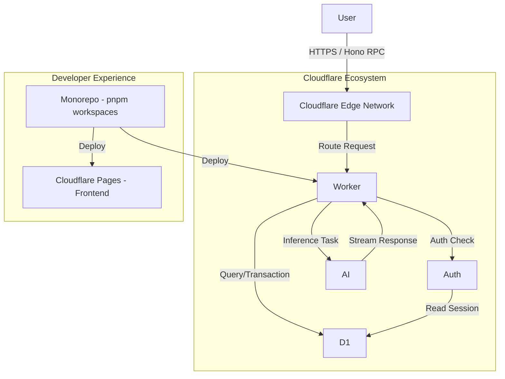

# アーキテクチャ概要

## ハイレベル・アーキテクチャ図

本システムは、Cloudflareのグローバルエッジネットワーク上に構築される分散型アーキテクチャである。

## データフローの設計

システム内のデータフローは、Honoを中心としたリクエスト/レスポンスサイクルと、AIによる非同期ストリーミングの2パターンに大別される。

### 同期的なAPIリクエスト（CRUD）

1. クライアント（React）がHono RPCクライアントを通じて関数呼び出しのようにリクエストを送信
2. Worker上のHonoがリクエストを受信し、Zodバリデーターで入力を検証
3. Better AuthミドルウェアがD1内のセッションテーブルを参照し、ユーザー権限を確認
4. Drizzle ORMを通じてD1からデータを取得・更新し、JSONとして返却

### AIインタラクション（ストリーミング）

1. ユーザーがチャットメッセージを送信
2. Workerが過去の会話履歴（Context）をD1から取得
3. Llama 3モデル（Workers AI）に対して、プロンプトと履歴を入力として推論を実行
4. 生成されたトークンをServer-Sent Events (SSE) またはReadableStreamを用いて、リアルタイムにクライアントへプッシュ送信
