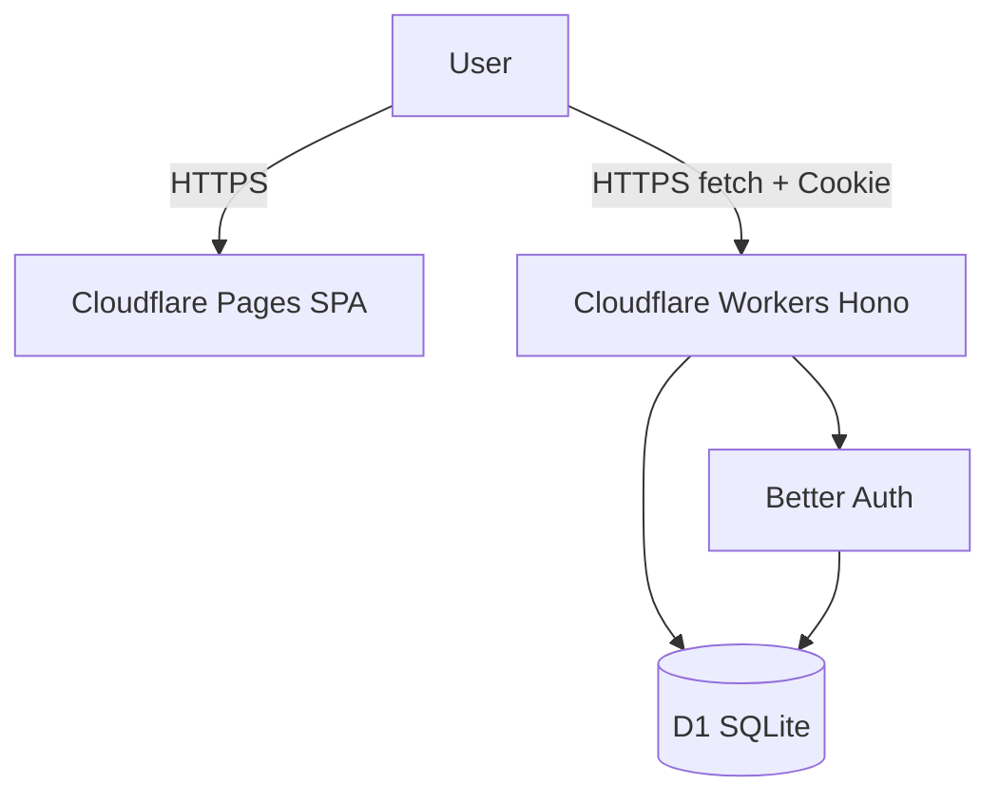

# アーキテクチャ概要

## フェーズ1（現状）

Skill Quest 由来のゲーム・AI・ガチャ機能は撤去済み。構成は次のとおり。

```mermaid
graph TD
    User[User] -->|HTTPS| Pages[Cloudflare Pages SPA]
    User -->|HTTPS fetch + Cookie| Worker[Cloudflare Workers Hono]
    Worker --> Auth[Better Auth]
    Worker --> D1[(D1 SQLite)]
    Auth --> D1
```

- **フロント**: React + Vite。ルートは `/`（仮トップ）、`/login`、`/account`（認証後）。旧 `/app/*`・`/genesis/*` はリダイレクト。
- **API**: `/api/auth/*`、`/api/profile`、`/api/health`、`/api/ops`、アカウント削除。Workers AI バインディングは削除済み。
- **D1**: Better Auth 用テーブル（`user`, `session`, `account`, `verification`）のみ。レガシーテーブルはマイグレーション `0012_drop_legacy_app_tables.sql` で DROP。

## 次フェーズ（予定）

ポータル（アプリ一覧）とミニアプリ（例: クラウドアーキテクチャパズル）をフロントに追加する想定。
