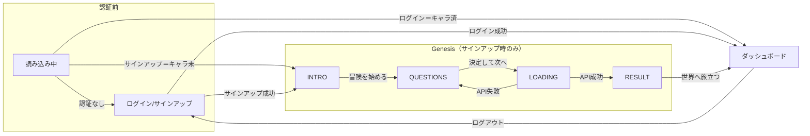
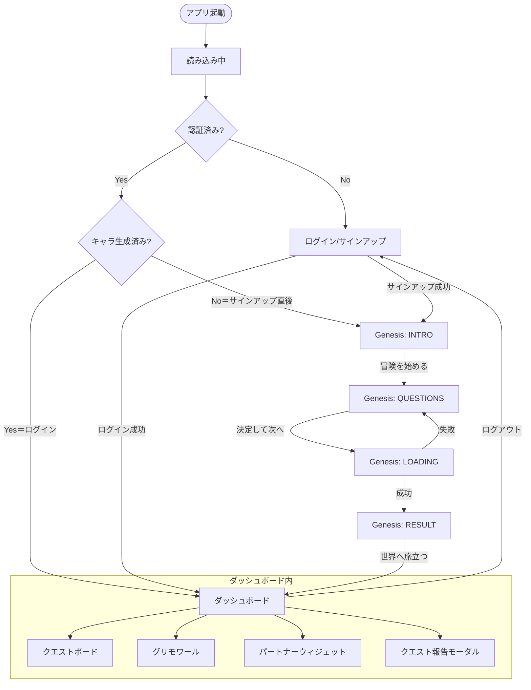
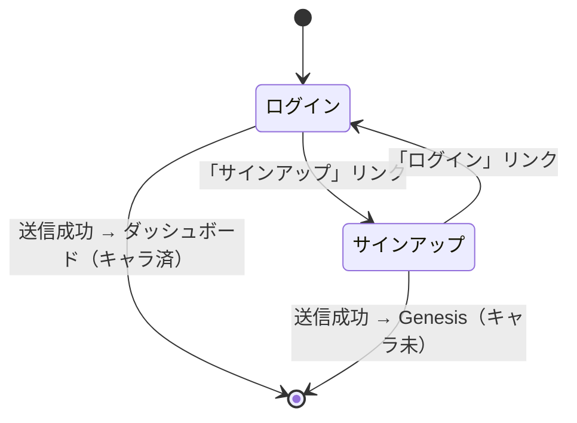
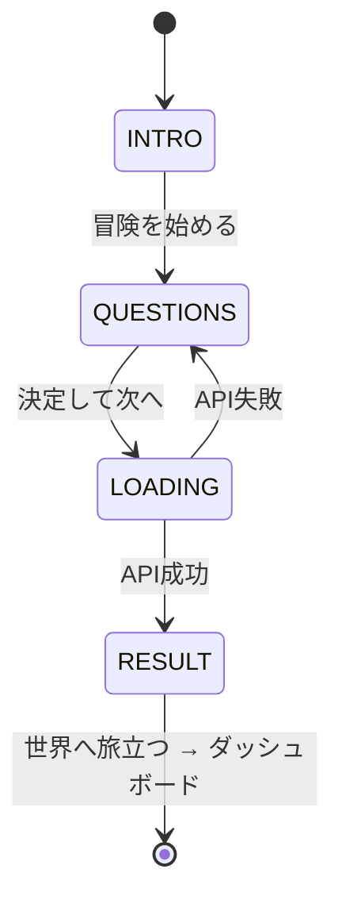
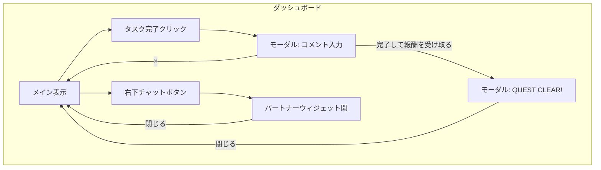

# 画面遷移図（現状）

既存フロントエンドの画面・状態と遷移を整理したドキュメント。  
ルーティングは未導入で、`App.tsx` の認証状態と **キャラクター生成済みフラグ**（`useGenesisOrProfile`）による条件レンダリングで切り替えている。

**方針: キャラクター生成（Genesis）はサインアップ時のみ実行可能。**  
- **サインアップ** → 認証後はキャラ未生成のため **Genesis** を表示 → 完了後にダッシュボード。  
- **ログイン** → キャラ生成済みのため保存済みプロフィールを取得し **ダッシュボード** を表示。

---

## 1. 画面・状態一覧

| 識別子 | 説明 | コンポーネント / 条件 |
|--------|------|------------------------|
| **読み込み中** | 認証 or キャラ状態取得中 | `authLoading` or `genesisOrProfile.kind === 'loading'` |
| **ログイン/サインアップ** | 未認証時の認証画面 | `!isAuthenticated` → `LoginSignupForm` |
| **Genesis INTRO** | オープニング（サインアップ時のみ） | `genesisOrProfile.kind === 'genesis'` かつ `genesisStep === 'INTRO'` → `IntroStep` |
| **Genesis QUESTIONS** | プロフィール入力（名前・目標・ジャンル） | `genesisStep === 'QUESTIONS'` → `QuestionStep` |
| **Genesis LOADING** | キャラクター生成中 | `genesisStep === 'LOADING'` → `LoadingStep` |
| **Genesis RESULT** | キャラ結果表示 | `genesisStep === 'RESULT'` → `ResultStep` |
| **ダッシュボード** | メイン画面（クエスト・グリモワール等） | `genesisOrProfile.kind === 'dashboard'` または `justCompletedProfile` → `Dashboard` |

### 同一画面内のサブ状態（遷移ではないがUIが変わるもの）

| 画面 | サブ状態 | 説明 |
|------|----------|------|
| ログイン/サインアップ | `mode: 'login'` / `'signup'` | フォーム下の「サインアップ」「ログイン」で切り替え |
| ダッシュボード | クエストタブ | デイリー / 習慣 / To-Do（`QuestBoard` 内 `activeTab`） |
| ダッシュボード | タスク追加フォーム | 「+」で開閉（`QuestBoard` 内 `isAdding`） |
| ダッシュボード | クエスト報告モーダル | タスク完了押下でオープン。コメント入力 → 結果表示の2段階（`completedTask` / `narrativeResult`） |
| ダッシュボード | パートナーウィジェット | 右下ボタンで開閉（`PartnerWidget` 内 `isOpen`） |

---

## 2. 画面間の遷移（トリガー）

- **読み込み中**  
  - → **ログイン/サインアップ**: 認証完了かつ `!isAuthenticated`  
  - → **Genesis INTRO**: 認証完了かつ `isAuthenticated` かつ **キャラ未生成**（`GET /api/ai/usage` の `characterGenerated === false`）。**サインアップ直後のみ**。  
  - → **ダッシュボード**: 認証完了かつ **キャラ生成済み**（`characterGenerated === true`）で `GET /api/ai/character` からプロフィール取得成功。**ログイン時**。
- **ログイン/サインアップ**  
  - → **Genesis INTRO**: **サインアップ**成功 → refetch → キャラ未生成のため Genesis 表示。  
  - → **ダッシュボード**: **ログイン**成功 → refetch → キャラ生成済みのためプロフィール取得 → ダッシュボード表示。
- **Genesis INTRO**  
  - → **Genesis QUESTIONS**: 「冒険を始める」クリック → `setGenesisStep('QUESTIONS')`。
- **Genesis QUESTIONS**  
  - → **Genesis LOADING**: 「決定して次へ」クリック → `handleGenerate` → `setGenesisStep('LOADING')`。  
  - （API 失敗時）→ **Genesis QUESTIONS**: `setGenesisStep('QUESTIONS')`。
- **Genesis LOADING**  
  - → **Genesis RESULT**: API 成功 → バックエンドがプロフィール保存 → `setProfile(result)` → `setGenesisStep('RESULT')`。  
  - → **Genesis QUESTIONS**: API 失敗時。
- **Genesis RESULT**  
  - → **ダッシュボード**: 「世界へ旅立つ」クリック → `handleCompleteGenesis` → `setJustCompletedProfile(profile)` → ダッシュボード表示。
- **ダッシュボード**  
  - → **ログイン/サインアップ**: 「ログアウト」クリック → `signOut()` → セッション解除 → `isAuthenticated === false`。

※ キャラクター生成は **サインアップ時のみ**。ログイン時は Genesis には進まず、保存済みプロフィールでダッシュボードを表示。ダッシュボードから Genesis へ戻る導線はない。

---

## 3. Mermaid 図

### 3.1 メイン画面遷移（サインアップ時のみ Genesis）

### 3.2 全体フロー（縦方向・サインアップ vs ログイン）

### 3.3 ログイン/サインアップ画面のモード切替

### 3.4 Genesis ステップ詳細

### 3.5 ダッシュボード内のモーダル・ウィジェット

---

## 4. 補足（実装上の注意）

- **URL なし**: すべて状態で制御しているため、ブックマーク・共有・戻るで画面を復元できない。
- **サインアップ時**: 認証後はキャラ未生成のため Genesis を表示。完了時にバックエンドがプロフィールを保存し、フロントは `justCompletedProfile` でダッシュボード表示。リロード時は `GET /api/ai/character` で取得。
- **ログイン時**: `GET /api/ai/usage` で `characterGenerated === true` なら `GET /api/ai/character` でプロフィール取得し、ダッシュボードを表示。Genesis は表示しない。
- **ダッシュボード → Genesis**: 導線はない（キャラ生成はサインアップ時のみ）。

---

## 5. 参照コード

| 役割 | ファイル |
|------|----------|
| 認証・Genesis/Dashboard 分岐 | `apps/frontend/src/App.tsx` |
| キャラ有無・プロフィール取得（認証後分岐） | `apps/frontend/src/hooks/useGenesisOrProfile.ts` |
| AI 利用状況（characterGenerated） | `apps/frontend/src/hooks/useAiUsage.ts` |
| 保存済みプロフィール取得 API | `apps/frontend/src/lib/api-client.ts`（`getCharacterProfile`） |
| ログイン/サインアップ・mode 切替 | `apps/frontend/src/components/LoginSignupForm.tsx` |
| Genesis 各ステップ | `apps/frontend/src/components/GenesisStep.tsx`, `ResultStep.tsx` |
| ダッシュボード・モーダル・ログアウト | `apps/frontend/src/components/Dashboard.tsx` |
| 認証状態 | `apps/frontend/src/hooks/useAuth.ts` |
| バックエンド: キャラ保存・GET | `apps/backend/src/routes/ai.ts`（POST generate-character で保存、GET /character） |
| バックエンド: プロフィール永続化 | `apps/backend/src/services/ai-usage.ts`（saveCharacterProfile, getCharacterProfile） |
