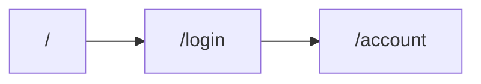

# 画面遷移図（フェーズ1）

React Router（`createBrowserRouter`）によるパスベースの遷移。

## 画面一覧

| パス | 内容 | 認証 |
|------|------|------|
| `/` | 仮ランディング（ポータル準備中の案内） | 不要 |
| `/login` | ログイン・サインアップ | 不要 |
| `/account` | 表示名・画像 URL の編集、ログアウト、アカウント削除 | 必須 |
| `*` | 404 | 不要 |

## リダイレクト

| 旧パス | 先 |
|--------|-----|
| `/genesis`, `/genesis/*` | `/` |
| `/app`, `/app/*` | 未認証: `/login?returnUrl=...` へ誘導の前に、ルータ上は `/app` → **`/account` へ replace**。未ログインで `/account` が要求されるため結果的にログインへ。実際: `/app` にアクセス → `Navigate` で `/account` → `RequireAuth` で `/login?returnUrl=%2Faccount` |

## Mermaid

```mermaid
flowchart LR
  L["/"]
  Login["/login"]
  Acc["/account"]
  L --> Login
  Login --> Acc
```
